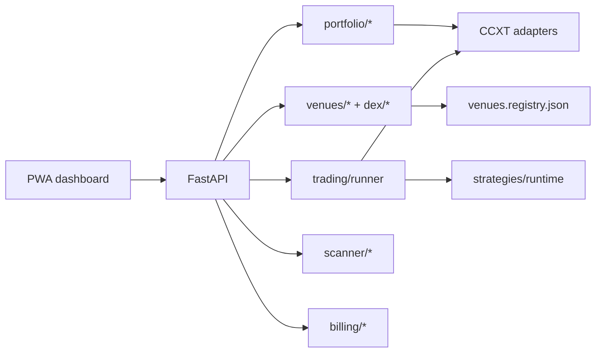

# TrendAlgo Bot


**TrendAlgo Bot** is a self-hosted cryptocurrency trading platform you run on your own VPS. It combines algorithmic spot trading, a CoinStats-style portfolio tracker, opportunity scanning, and research tools behind a single progressive web app — without custodial accounts, proprietary SDKs, or default telemetry.

You own the stack, the keys, and the data. Dry-run is the default; live trading requires an explicit go-live approval for each exchange.

## What it does

| Capability | Description |
|------------|-------------|
| **Portfolio tracking** | Read-only sync across **9 CEX venues** (Kraken, Binance.US, Coinbase Advanced, Gemini, Bitstamp, Crypto.com, Binance, Bybit, OKX) — see [exchange roadmap](docs/EXCHANGE_ROADMAP.md) |
| **Algo trading** | Native [CCXT runner](docs/NATIVE_TRADING.md) with strategy templates, risk limits, trade journal, and multi-bot orchestration |
| **Opportunity scanner** | LTS pipeline and pair forager to surface liquid listings before they hit your bot whitelist |
| **Research** | Backtest library, walk-forward optimization, Monte Carlo, and export — wired to the native engine |
| **Web dashboard** | Offline-capable PWA for portfolio, bots, billing, scanner, and ops |
| **Billing** | Performance-based software license with user-initiated settlement only (no Stripe, no custodial fees) |
| **Alerts** | Telegram notifications for trades, risk events, and daily P/L |
| **Platform extensions** | On-chain multi-chain wallet read, Uniswap V3 LP, DEX dry-run/live swaps (Base Phase 1) — [DEX roadmap](docs/DEX_ROADMAP.md) |

## How it is built



| Layer | Technology |
|-------|------------|
| Trading engine | Native CCXT runner ([ADR-0010](docs/adr/0010-ccxt-native-engine.md)) |
| Domain logic | Python 3.11+ — `src/trendalgo/` |
| API | FastAPI + WebSocket |
| Web UI | Vite + TypeScript PWA — `examples/web/` |
| Data | SQLite on VPS; optional Postgres dual-write |
| Exchanges | CCXT — 9 CEX venues; DEX via ADR-0011 venue plugins ([DEX roadmap](docs/DEX_ROADMAP.md)) |

Architecture detail: [`docs/ARCHITECTURE.md`](docs/ARCHITECTURE.md) · ADRs: [`docs/adr/`](docs/adr/) · Decision log: [`DECISION_LOG.md`](DECISION_LOG.md)

## Safety & compliance

- **Dry-run default** — no live orders until `go-live-gate.sh --approve`
- **External VPS only** for production — never on local dev hardware ([ADR-0002](docs/adr/0002-production-hosting.md))
- **Trade + query API keys** — withdraw permission never required
- **No KYC, no custodial funds, no MSB path** — calculation-only license; user-initiated payment ([ADR-0008](docs/adr/0008-legal-safe-monetization.md))
- **Opt-in telemetry only** — no tracking by default
- **Risk Register Zero** achieved — ongoing controls documented in [`docs/RISK_REGISTER.md`](docs/RISK_REGISTER.md)

## Quick start

### Local preview (recommended first step)

```powershell
# Windows
.\scripts\dev-local.ps1
```

```bash
# Linux / macOS / WSL
bash scripts/dev-local.sh
```

Open **http://localhost:5173** — see [`docs/LOCAL_DEV.md`](docs/LOCAL_DEV.md) for L1/L2/L3 tiers and troubleshooting.

### Project bootstrap

1. Read [`docs/START_HERE.md`](docs/START_HERE.md) and [`BUILD_PLAN.md`](BUILD_PLAN.md)
2. Copy env template: `cp .env.example .env` (never commit `.env`)
3. Apply founder defaults: `bash scripts/apply-founder-defaults.sh`
4. Sprint 0 sign-off: `python scripts/founder_gate.py preflight-sprint --sprint 0`

**Pre-Sprint-1:** `python scripts/founder_gate.py approve-bundle pre-sprint-1` after H-001/H-005/H-007 preflights pass.

## Repository layout

```
src/trendalgo/       # Core modules — portfolio, trading, scanner, billing, risk, API
examples/web/        # PWA dashboard (Vite + TypeScript)
config/              # Founder defaults, exchange registry (S13+)
docker/              # Compose dev + prod templates
docs/                # ADRs, roadmaps, runbooks, feature specs
scripts/             # Gates, deploy, dev-local, validation
tests/               # Python test suite (~86% coverage on trendalgo)
```

## Development

```bash
# Full Python suite
python scripts/run-trendalgo-tests.py

# Web unit tests
cd examples/web && npm ci && npm test

# Founder gate status
python scripts/founder_gate.py status
```

Founder gates: [`docs/FOUNDER_GATES.md`](docs/FOUNDER_GATES.md) · Human backlog: [`docs/HUMAN_BACKLOG.md`](docs/HUMAN_BACKLOG.md)

## Roadmap

| Phase | Status | Focus |
|-------|--------|-------|
| S0–S12 | Complete | MVP engine, PWA, portfolio, billing, platform extensions |
| Post-delivery | Active | Founder gates, VPS deploy, go-live |
| S13–S20 | Complete | Registry, native US + worldwide trading, Phase 2, N-exchange ops |
| S21–S24 | Complete | DEX plugin engine — wallet read, LP, dry-run swaps, live ops (Base Phase 1) |

Active board: [`BUILD_PLAN.md`](BUILD_PLAN.md) · Exchange: [`docs/EXCHANGE_ROADMAP.md`](docs/EXCHANGE_ROADMAP.md) · DEX: [`docs/DEX_ROADMAP.md`](docs/DEX_ROADMAP.md)

## License

MIT — see [`LICENSE`](LICENSE). Performance license terms for official builds: [`docs/LICENSE_MODEL.md`](docs/LICENSE_MODEL.md).

## Contributing

See [`CONTRIBUTING.md`](CONTRIBUTING.md). AGPL applies to combined work; billing module licensing per ADR-0005.
