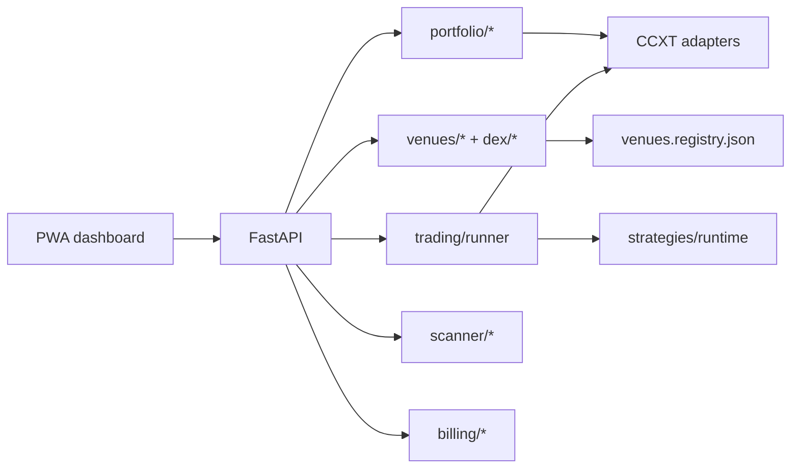

# TrendAlgo Bot


**TrendAlgo Bot** is a self-hosted cryptocurrency trading platform you run on your own VPS. It combines algorithmic spot trading, a CoinStats-style portfolio tracker, opportunity scanning, and research tools behind a single progressive web app — without custodial accounts, proprietary SDKs, or default telemetry.

You own the stack, the keys, and the data. Dry-run is the default; live trading requires an explicit go-live approval for each exchange.

> **Tip:** Sections below are collapsible — click a heading to expand or collapse it.

---

<details open>
<summary><strong>Self-hosted setup guide (start here)</strong></summary>

This guide walks you through running **your own** TrendAlgo Bot instance from clone to daily use. For deeper runbooks, see [`docs/LOCAL_DEV.md`](docs/LOCAL_DEV.md), [`docs/START_HERE.md`](docs/START_HERE.md), and [`docs/ARCHITECTURE.md`](docs/ARCHITECTURE.md).

### 1. What you need

| Requirement | Minimum | Recommended |
|-------------|---------|-------------|
| **OS** | Windows 10+, macOS 12+, or Linux | Ubuntu 22.04 LTS on a VPS for production |
| **Python** | 3.12 (not 3.13+ yet) | 3.12.x with [uv](https://github.com/astral-sh/uv) or `pip` |
| **Node.js** | 20 LTS | 20+ for the PWA dashboard |
| **RAM** | 2 GB (local dev) | 4 GB+ on VPS |
| **Disk** | 2 GB free | 10 GB+ for logs, SQLite, backtests |
| **Network** | Outbound HTTPS | Static IP or domain for production PWA |
Optional: Docker (production parity), WSL2 (Windows bash scripts), Telegram account (alerts).

### 2. Clone and install dependencies

```bash
git clone https://github.com/YOUR_ORG/trendalgo-bot.git
cd trendalgo-bot

```

**Python (pick one):**

```bash
# uv (recommended)
uv sync --extra dev

# or pip editable install
pip install -e ".[dev]"

```

**Web dashboard:**

```bash
cd examples/web
npm ci
cd ../..

```

### 3. Configure environment

Never commit secrets. Copy the template and edit locally:

```bash
cp .env.example .env

```

**Essential variables for local dry-run:**

| Variable | Example | Purpose |
|----------|---------|---------|
| `TRENDALGO_MODE` | `dry-run` | Blocks live orders (keep this until go-live) |
| `TRENDALGO_DATA_DIR` | `./data/dev` | SQLite, bots, portfolio DB location |
| `TRENDALGO_API_PORT` | `8000` | FastAPI listen port |
| `DATABASE_URL` | `sqlite:///./data/dev/trendalgo.db` | Optional; defaults under data dir |
| `TZ` | `UTC` | Scheduler timezone (portfolio sync uses **00:00 UTC**) |
**Windows PowerShell:**

```powershell
$env:TRENDALGO_DATA_DIR = "$PWD\data\dev"
$env:TRENDALGO_MODE = "dry-run"
$env:TRENDALGO_API_PORT = "8000"

```

### 4. Start local instance (dry-run, no API keys)

**One command:**

```powershell
# Windows
.\scripts\dev-local.ps1

```

```bash
# Linux / macOS / WSL
bash scripts/dev-local.sh

```

**Manual (two terminals):**

```bash
# Terminal 1 — API
export TRENDALGO_DATA_DIR=./data/dev
export TRENDALGO_MODE=dry-run
uv run python -m trendalgo.api.main

# Terminal 2 — PWA
cd examples/web && npm run dev

```

Open **http://localhost:5173**. Vite proxies `/api` → `http://127.0.0.1:8000`.

**Verify:**

```bash
curl http://127.0.0.1:8000/api/v1/health
uv run python scripts/smoke-portfolio-graph.py   # portfolio chart smoke

```

Dry-run uses synthetic portfolio data (1 BTC history, multi-exchange sample balances) — no exchange keys required.

### 5. Connect exchange API keys (read-only portfolio)

TrendAlgo syncs **read-only** balances from registry-enabled venues. Keys must have **trade + query** permissions; **never enable withdraw**.

Uncomment and fill in `.env` for each exchange you use (see [`.env.example`](.env.example)):

| Exchange | Env keys |
|----------|----------|
| Kraken | `KRAKEN_API_KEY`, `KRAKEN_API_SECRET` |
| Binance.US | `BINANCEUS_API_KEY`, `BINANCEUS_API_SECRET` |
| Coinbase Advanced | `COINBASEADVANCED_API_KEY`, `COINBASEADVANCED_API_SECRET` |
| Gemini, Bitstamp, Crypto.com | Same pattern in `.env.example` |
| Binance / Bybit / OKX (worldwide) | Requires `WORLDWIDE_TRADING_ACK=1` for live |
In the PWA: **Portfolio → Refresh portfolio** syncs **all** configured exchanges. Without keys, dry-run fixtures still populate the UI.

### 6. Portfolio sync schedule

| Trigger | When | Scope |
|---------|------|-------|
| **Automatic** | Every day **00:00 UTC** | All registry exchanges + daily P/L aggregate |
| **Manual** | **Refresh portfolio** button | Same full multi-exchange sync |
Optional: `TRENDALGO_SYNC_STAGGER_SEC=0` for instant dev sync; use `15`+ in production to respect rate limits.

### 7. Enable algo trading (still dry-run)

1. Open **Bot**, **Strategies**, or **Backtest** tabs in the PWA.
2. Pick a strategy template (e.g. `multi-tf-example`, `macd-kraken-1h`).
3. Run backtests from the **Backtest** tab — native engine, no keys needed in dry-run.
4. Add bots via **Bot** dashboard; they simulate against the dry-run runner.

### 8. Go live on a VPS (production)

Production must run on an **external VPS**, not your laptop ([ADR-0002](docs/adr/0002-production-hosting.md)).

**Preflight:**

```bash
bash scripts/deploy-preflight.sh
python scripts/founder_gate.py status

```

**Deploy (example):**

```bash
export DEPLOY_HOST=user@your-vps.example
bash scripts/deploy-vps.sh

```

**Before live orders:**

1. Set `TRENDALGO_MODE=live` on the VPS (not locally).
2. Run `bash scripts/go-live-gate.sh --approve` per exchange.
3. Set `GO_LIVE_APPROVED=1` and exchange keys on the VPS only.
4. Restrict `TRENDALGO_CORS_ORIGINS` to your PWA URL.

**Production compose:** `docker/docker-compose.prod.yml` — API on port 8080 behind your reverse proxy (Caddy/nginx + TLS).

### 9. Optional integrations

| Feature | Configuration |
|---------|----------------|
| **Telegram alerts** | `TELEGRAM_BOT_TOKEN`, `TELEGRAM_CHAT_ID` |
| **Daily P/L hour** | `NOTIFICATION_DAILY_HOUR` (UTC; separate from midnight sync) |
| **On-chain / DEX read** | `ETH_RPC_URL`, `BASE_RPC_URL`, `ONCHAIN_SYNC_ENABLED=1` — see [DEX roadmap](docs/DEX_ROADMAP.md) |
| **Postgres dual-write** | Experimental — Platform tab shows status; not production-default |
| **License / billing** | Default calculation-only; see [`docs/LICENSE_MODEL.md`](docs/LICENSE_MODEL.md) |
### 10. Troubleshooting

| Symptom | Fix |
|---------|-----|
| PWA shows "API offline" | Start API on `:8000`; check firewall |
| Empty portfolio chart | Delete `data/dev/portfolio.db` and reload (re-seeds 1Y history in dry-run) |
| Sync slow / timeout | Set `TRENDALGO_SYNC_STAGGER_SEC=0` locally; reduce enabled exchanges |
| Windows bash gates fail | Use PowerShell scripts or WSL; CI is source of truth |
| Live orders blocked | Expected until go-live gate passes |
**Health checks:** `GET /api/v1/health` · **Logs:** Debug tab or `GET /api/v1/debug/logs`

### 11. Upgrade and backup

- **Data:** Back up `$TRENDALGO_DATA_DIR` (SQLite files, `portfolio.db`, `bots.db`, journals).
- **Updates:** `git pull`, `uv sync`, `cd examples/web && npm ci`, restart API.
- **Hygiene:** `bash scripts/check-repo-hygiene.sh` before pushing custom forks.

</details>

<details>
<summary><strong>What it does</strong></summary>

| Capability | Description |
|------------|-------------|
| **Portfolio tracking** | Read-only sync across **9 CEX venues** — [exchange roadmap](docs/EXCHANGE_ROADMAP.md) |
| **Performance charts** | 1Y/6M/3M/1M/14D/7D/24H views vs equal-weight **top-10 crypto index** |
| **Algo trading** | Native [CCXT runner](docs/NATIVE_TRADING.md) (dry-run default), strategy templates, risk limits, multi-bot |
| **Opportunity scanner** | LTS pipeline with live OHLCV (cached/degraded fallback); pair forager prototype |
| **Research** | Backtest library, walk-forward, Monte Carlo, TA catalog |
| **Web dashboard** | Offline-capable PWA shell — portfolio, bots, billing, scanner, ops (live data needs API) |
| **Billing** | Performance-based license; user-initiated on-chain settlement; TERMS draft pending attorney (H-006) |
| **Alerts** | Telegram for trades, risk events, daily P/L (requires H-008 tokens) |
| **Platform extensions** | On-chain wallet read; Uniswap V3 LP; DEX dry-run; **DEX live = Base Phase 1 + human gates** — [DEX roadmap](docs/DEX_ROADMAP.md) |
</details>

<details>
<summary><strong>Architecture</strong></summary>



| Layer | Technology |
|-------|------------|
| Trading engine | Native CCXT runner ([ADR-0010](docs/adr/0010-ccxt-native-engine.md)) |
| Domain logic | Python 3.12+ — `src/trendalgo/` |
| API | FastAPI + WebSocket |
| Web UI | Vite + TypeScript PWA — `examples/web/` |
| Data | SQLite on VPS; Postgres dual-write experimental (not default) |
| Exchanges | CCXT — 9 CEX venues; DEX via ADR-0011 plugins |
Detail: [`docs/ARCHITECTURE.md`](docs/ARCHITECTURE.md) · ADRs: [`docs/adr/`](docs/adr/) · [`DECISION_LOG.md`](DECISION_LOG.md)

</details>

<details>
<summary><strong>Safety & compliance</strong></summary>

- **Dry-run default** — no live orders until `go-live-gate.sh --approve`
- **External VPS only** for production ([ADR-0002](docs/adr/0002-production-hosting.md))
- **Trade + query API keys** — withdraw permission never required
- **No KYC, no custodial funds** — calculation-only license ([ADR-0008](docs/adr/0008-legal-safe-monetization.md))
- **Opt-in telemetry only**
- **Risk Register Zero** — [`docs/RISK_REGISTER.md`](docs/RISK_REGISTER.md)

</details>

<details>
<summary><strong>Quick local preview</strong></summary>

```powershell
.\scripts\dev-local.ps1          # Windows

```

```bash
bash scripts/dev-local.sh        # Linux / macOS / WSL

```

→ **http://localhost:5173** · Full tiers: [`docs/LOCAL_DEV.md`](docs/LOCAL_DEV.md)

**Bootstrap checklist:**

1. [`docs/START_HERE.md`](docs/START_HERE.md) + [`BUILD_PLAN.md`](BUILD_PLAN.md)
2. `cp .env.example .env`
3. `bash scripts/apply-founder-defaults.sh` (optional founder tooling)
4. `python scripts/founder_gate.py preflight-sprint --sprint 0`

</details>

<details>
<summary><strong>Repository layout</strong></summary>

```
src/trendalgo/       # Core — portfolio, trading, scanner, billing, risk, API
examples/web/        # PWA dashboard (Vite + TypeScript)
config/              # Founder defaults, exchange registry
docker/              # Compose dev + prod templates
docs/                # ADRs, roadmaps, runbooks
scripts/             # Gates, deploy, dev-local, validation
tests/               # Python test suite

```

</details>

<details>
<summary><strong>Development</strong></summary>

```bash
uv sync --extra dev
python scripts/run-trendalgo-tests.py

cd examples/web && npm ci && npm test

python scripts/founder_gate.py status

```

Founder gates: [`docs/FOUNDER_GATES.md`](docs/FOUNDER_GATES.md) · Human backlog: [`docs/HUMAN_BACKLOG.md`](docs/HUMAN_BACKLOG.md)

</details>

<details>
<summary><strong>Roadmap</strong></summary>

| Phase | Status | Focus |
|-------|--------|-------|
| S0–S12 | Complete | MVP engine, PWA, portfolio, billing |
| Post-delivery | Active | Founder gates, VPS deploy, go-live |
| S13–S20 | Complete | Registry, worldwide trading, N-exchange ops |
| S21–S24 | Complete | DEX plugin engine (Base Phase 1) |
Board: [`BUILD_PLAN.md`](BUILD_PLAN.md) · [Exchange roadmap](docs/EXCHANGE_ROADMAP.md) · [DEX roadmap](docs/DEX_ROADMAP.md)

</details>

<details>
<summary><strong>License</strong></summary>

MIT — see [`LICENSE`](LICENSE). Performance license terms: [`docs/LICENSE_MODEL.md`](docs/LICENSE_MODEL.md).

</details>

<details>
<summary><strong>Contributing</strong></summary>

See [`CONTRIBUTING.md`](CONTRIBUTING.md). AGPL applies to combined work; billing module licensing per ADR-0005.

</details>
