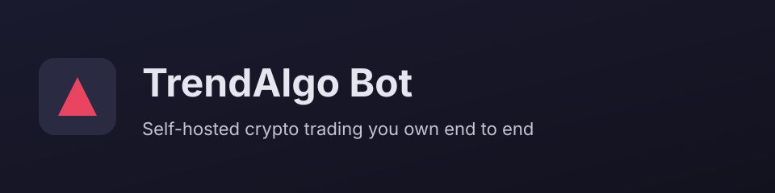

<!-- GENERATED by scripts/generate-project-readme.py — edit branding/product.json -->

  

<h1 align="center">TrendAlgo Bot</h1>

<strong>Self-hosted crypto trading you own end to end</strong>

  
  
  

  
  

## Pitch

TrendAlgo Bot is a self-hosted cryptocurrency trading platform you run on your own VPS. It combines algorithmic spot trading, a CoinStats-style portfolio tracker, opportunity scanning, and research tools behind a single progressive web app — without custodial accounts, proprietary SDKs, or default telemetry.

## Demo

  

> Add screenshots or a short demo GIF under `docs/images/` and link them here when available.

## Features

- Read-only portfolio sync across 9 CEX venues with performance charts vs a top-10 crypto index
- Native CCXT algo trading with dry-run default and explicit per-exchange go-live gates
- Opportunity scanner, backtests, and research tools in one offline-capable PWA
- You own the stack, the keys, and the data — MIT FOSS, no tracking by default
- Agent-ready BUILD_PLAN sprints, design tokens, and CI guardrails from the bootstrap template

## Quick start

1. Clone the repo and run `uv sync --extra dev` plus `cd examples/web && npm ci`.
2. Copy `.env.example` to `.env` and keep `TRENDALGO_MODE=dry-run`.
3. Start with `.\scripts\dev-local.ps1` (Windows) or `bash scripts/dev-local.sh`, then open http://localhost:5173.

## Install

Python 3.12 (not 3.13+ yet) with uv or pip, and Node.js 20+ for the PWA. See the Self-hosted setup guide in the root README and docs/LOCAL_DEV.md.

## Usage

Dry-run is the default. Connect read-only exchange keys for portfolio sync, run backtests from the PWA, and only go live on an external VPS after `scripts/go-live-gate.sh --approve`. Edit colors in `design-tokens/design-tokens.json` and logos in `branding/assets/`, then run `python3 scripts/sync-design-tokens.py`.

## Configuration

Copy [`.env.example`](../../.env.example) to `.env` for local secrets (never commit `.env`). Stack-specific config lives in the active `examples/` or app root after prune.

## Contributing

See [`../../CONTRIBUTING.md`](../../CONTRIBUTING.md). Prefer small PRs; follow Conventional Commits and the BUILD_PLAN labels (`AGENT` / `HUMAN` / `ADB` / `AUTO`). Status markers: 🔲 open · ✅ done · ❌ blocked.

## Security

See [`../../SECURITY.md`](../../SECURITY.md). Enable Dependabot alerts and follow [`docs/SECURITY_TRIAGE.md`](../../docs/SECURITY_TRIAGE.md) for weekly CVE triage.

## License

[MIT License](../../LICENSE) — see the license file for terms.

## Acknowledgments

Scaffolded with [agent-project-bootstrap](https://github.com/edwardlthompson/agent-project-bootstrap). Brand assets: [`../BRANDING.md`](../BRANDING.md). Design system: [`../../docs/DESIGN_GUIDE.md`](../../docs/DESIGN_GUIDE.md).
