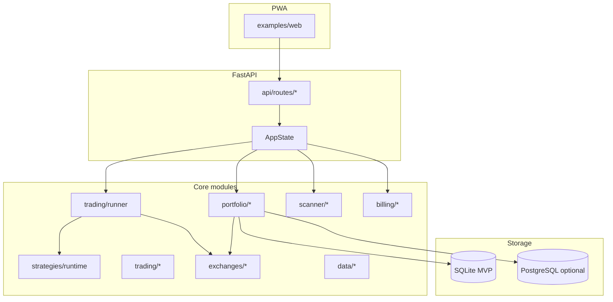

# TrendAlgo Architecture

> System overview for the TrendAlgo bot, API, PWA, and platform extensions (Sprint 12+). **Engine:** native CCXT runner ([ADR-0010](adr/0010-ccxt-native-engine.md)).

## Layers

## Module map

| Area | Path | Role |
|------|------|------|
| API | `src/trendalgo/api/` | HTTP + WebSocket surface |
| Exchanges | `src/trendalgo/exchanges/` | Registry + CCXT adapters (S13+) |
| Portfolio | `src/trendalgo/portfolio/` | CoinStats-style tracker, multi-exchange, on-chain read-only sync |
| Scanner | `src/trendalgo/scanner/` | LTS pipeline, dynamic pair forager |
| Billing | `src/trendalgo/billing/` | Performance license, settlement, on-chain receipt stubs |
| Trading | `src/trendalgo/trading/` | Native runner, multi-exchange router, funding display |
| Strategies | `src/trendalgo/strategies/runtime/` | Strategy runtime contract (CM-2, S15) |
| Data | `src/trendalgo/data/` | On-chain / sentiment stubs (no paid indexers) |
| DB adapters | `src/trendalgo/db/` | Postgres dual-write path |

## Platform extensions (Sprint 12)

- **On-chain sync** (`portfolio/onchain.py`) — read-only EVM wallet balances via public RPC or dry-run; no paid indexers.
- **Pair forager** (`scanner/forager.py`) — ranks Kraken-listed pairs by volume + momentum heuristics.
- **Funding rates** (`trading/funding.py`) — perpetual funding display and profit estimate hooks (informational).
- **Unified trading** (`trading/multi_exchange.py`) — routes orders to exchange adapters; dry-run unless `GO_LIVE_APPROVED=1`.
- **Fee receipts** (`billing/onchain_receipts.py`) — optional manual on-chain settlement receipts.
- **Postgres path** (`db/postgres_adapter.py`, `docker/postgres/`) — dual-write when `TRENDALGO_POSTGRES_DUAL_WRITE=1`.

API prefix: `/api/v1/platform/*`

## Horizontal scaling

TrendAlgo targets **self-hosted** deployments. Scale-out pattern:

1. **Single writer** — one Postgres primary holds portfolio, billing, and scanner state.
2. **Multiple bot workers** — each native runner instance uses unique bot labels; unified trading router coordinates exchange keys per worker.
3. **API tier** — stateless FastAPI replicas behind reverse proxy; shared `AppState` stores on Postgres/SQLite via connection pool.
4. **Read replicas** — optional for dashboard and portfolio overview queries.
5. **Job isolation** — scanner scheduler and billing settlement run on one designated worker to avoid duplicate fee jobs (see R-014 mitigation).

SQLite remains valid for single-user VPS; migrate per `docker/postgres/README.md` before adding second bot host.

## Security boundaries

- Live trading requires go-live gate + license gate + dry-run off.
- On-chain sync is **read-only**; no private keys in portfolio path.
- AGPL billing modules stay in production path; forks may remove billing (accepted risk R-012).

## Related docs

- ADR-0010 — Native CCXT engine (supersedes ADR-0001 forward path)
- `docs/NATIVE_TRADING.md` — runner and strategy contract
- `docs/EXCHANGE_ROADMAP.md` — multi-exchange program
- `docs/DEPLOYMENT.md` — VPS layout
- `docs/RISK_REGISTER.md` — active vs closed risks
- `docker/postgres/README.md` — migration cutover
