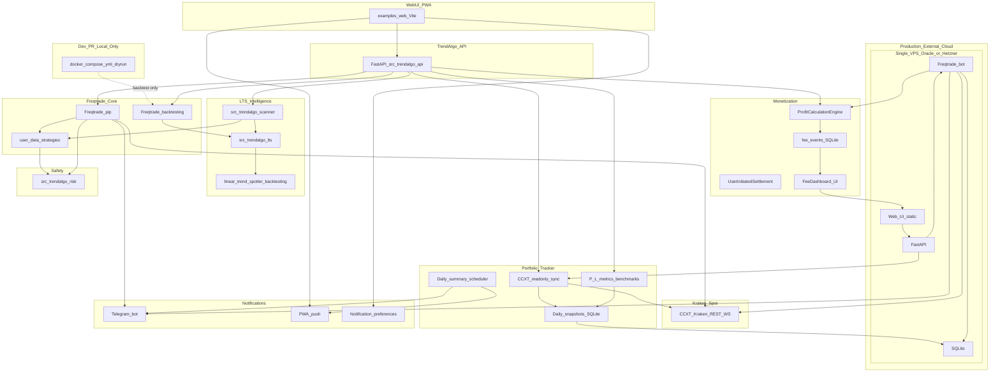
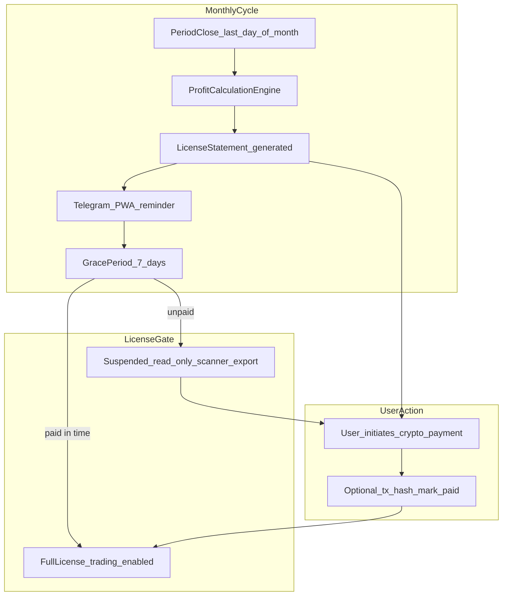
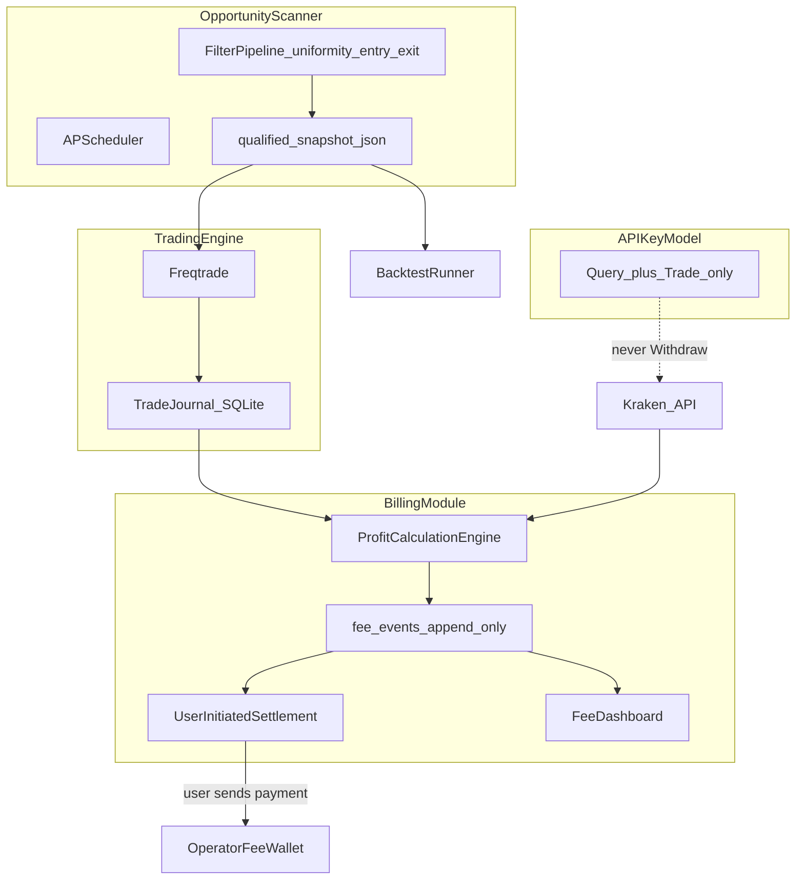
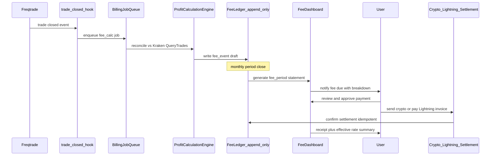
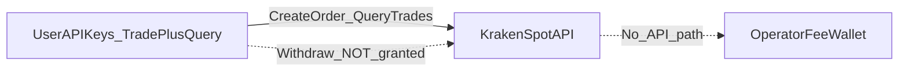
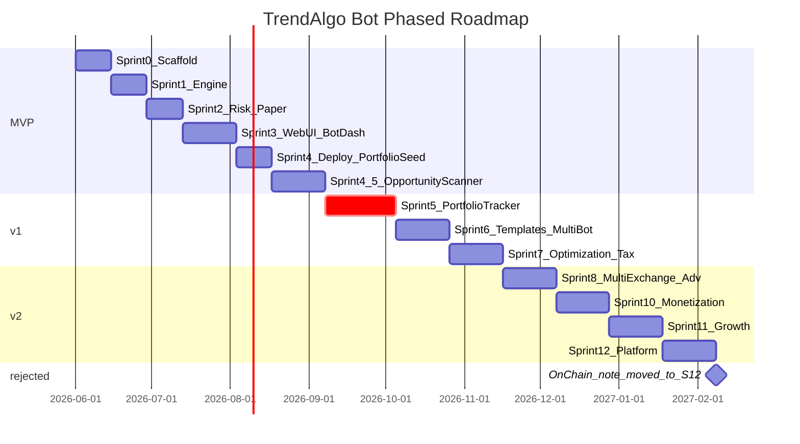

# TrendAlgo Bot — Bootstrap & Sprint 0 Plan

> **Canonical plan:** All prompts (1–**8**). **Prompt 8 legal safety overrides** conflicting earlier recommendations.

## Priority Stack (Non-Negotiable Order)

**#0 — Legal safety (Prompt 8, overrides all):** Local LLC sells **software only**. No KYC. No custodial funds. No money-transmitter behavior. Operator never touches user money. Minimize stored sensitive data.

1. **MVP (S1–4):** Freqtrade Kraken bot + risk + web UI + VPS deploy
2. **v1 core (S4.5 + S5):** **LTS Opportunity Scanner** + **CoinStats-class portfolio + daily P/L**
3. **v1 extended (S6–8):** Templates, analytics, multi-exchange portfolio
4. **Product (S10–11):** **Performance-based software license** + user-initiated crypto settlement + anonymous growth
5. **Platform (S12):** On-chain, perps, PostgreSQL (self-hosted scale only)

## Executive Summary (Prompts 5–8)

| Dimension | Verdict |
|-----------|---------|
| LTS → Opportunity Scanner merge | **Highly feasible** |
| Profit calculation from closed trades | **Highly feasible** |
| Auto fee collection | **Not feasible** technically; **rejected** legally |
| **Legally safest monetization** | **Performance-based software license + user-initiated settlement** |
| Operator as money transmitter | **Must avoid** — never hold or route user funds |
| KYC | **Never** |
| Primary deployment | **Self-hosted** (user's VPS, user's keys) |

**Operator model:** Local LLC sells **AGPL software** under a **variable performance-based license**. Fee engine **calculates monthly license amounts** from closed-trade PnL. User **initiates payment** from their own wallet/exchange to operator's **public crypto address**. **Unpaid after grace → license suspended** (bot paused; scanner read-only). Language: **software license fee**, not payment processing or profit-sharing.

### Confirmed Strategic Decisions

| Decision | Choice |
|----------|--------|
| Legal structure | **Local LLC — software vendor only** (not MSB, not custodian) |
| KYC | **Never** — no identity data collected or stored |
| User identity | **Pseudonymous** — install UUID only; no email required |
| LTS integration | Full absorption into `src/trendalgo/scanner/` |
| Monetization | **Performance-based software license** — **10–15%** of winning closed-trade profit (default **12%**); **$0 if net-loss period** |
| Fee collection | **Monthly license statement** + user-initiated external crypto payment; **mandatory after grace** |
| License enforcement | Unpaid after grace → **read-only + trading paused** (software only; never blocks exchange) |
| Operator touches user funds | **Never** |
| API keys | On **user's VPS**; encrypted; trade+query only; never Withdraw |
| Product shape | **Self-hosted** primary; operator-hosted custodial SaaS **rejected** |
| Licensing | AGPL-3.0 core; billing module = calculator only |
| Freemium | Limited scanner + paper-only |
| Drawdown handling | Pause fee accrual; carry-forward credits |

## Context & Constraints

- **Template source:** Local clone at [`C:\Users\edwar\agent-project-bootstrap`](C:\Users\edwar\agent-project-bootstrap) (v0.11.1)
- **Target repo:** [`C:\Users\edwar\trendalgo-bot`](C:\Users\edwar\trendalgo-bot) (new directory)
- **MVP scope (confirmed):** **Kraken spot**, TA-based custom strategies, dry-run first
- **Core engine:** Extend [Freqtrade](https://github.com/freqtrade/freqtrade) — do **not** fork; use `user_data/` + pip dependency + thin extension layer
- **Intelligence source:** Absorb [linear-trend-spotter](https://github.com/edwardlthompson/linear-trend-spotter) into **`src/trendalgo/scanner/`** (Opportunity Scanner module); archive standalone repo after Sprint 4.5 parity. Backtesting via `src/trendalgo/lts/` adapter during phased merge.
- **Plan mode gate:** Sprint 0 scaffolding + research only; **no significant trading code** until you confirm Sprint 0 `[HUMAN]` items

### Operational Constraints (Equal Priority — Non-Negotiable)

| Constraint | Rule |
|------------|------|
| **Puerto Rico reliability** | **Live/production trading must NEVER run on local PR hardware** |
| **Legal safety (Prompt 8)** | **No KYC. No custodial funds. No money-transmitter behavior. Software vendor only.** |
| **Cost** | Production **< $10/mo**; Oracle Always Free → Hetzner fallback |
| **Combined decision rule** | Cheapest option that meets always-on + external cloud; a few extra $/mo acceptable for reliability; reject free tiers that sleep or have poor uptime |

**Explicitly rejected for production:** local PR hardware, sleeping free tiers, high-latency/unreliable providers.

**Development vs production split:**

| Environment | Where | Cost |
|-------------|-------|------|
| Dev / backtest / dry-run | Local Docker Compose on PR workstation | $0 |
| Production (live or always-on dry-run) | External cloud VPS only | $0–7/mo target |

---

## Phase 1 — Template Bootstrap (Sprint 0 Sequential, steps 1–3)

### 0. Preserve planning progress + connect GitHub (Sprint 0 — automated)

> **Progress is never lost:** full canonical plan copied to `docs/CANONICAL_PLAN.md`; BUILD_PLAN + HUMAN_BACKLOG + RISK_REGISTER extracted at scaffold.

```powershell
# AGENT executes after user approves Sprint 0 execution
$src = "C:\Users\edwar\agent-project-bootstrap"
$dst = "C:\Users\edwar\trendalgo-bot"
robocopy $src $dst /E /XD .git node_modules .venv dist build target coverage .pytest_cache .gradle /NFL /NDL /NJH /NJS
cd $dst
git init
pwsh scripts/init-project.ps1 -NonInteractive -Stack multi -Prune -KeepOptional `
  -ProjectName "TrendAlgo Bot" `
  -ProjectPurpose "Self-hosted Kraken spot algo bot: Freqtrade, LTS Scanner, CoinStats portfolio, AI-recommended strategies."
# Copy canonical plan (preserves all prompt 1–9 decisions)
Copy-Item "C:\Users\edwar\.cursor\plans\trendalgo_bot_bootstrap_d7aedd8c.plan.md" "docs\CANONICAL_PLAN.md"
# Create GitHub repo + connect (requires gh auth — H-001)
gh repo create edwardlthompson/trendalgo-bot --public --source=. --remote=origin --description "Self-hosted crypto algo bot: Freqtrade, LTS Scanner, portfolio tracker, AI-recommended strategies. AGPL."
git add -A
git commit -m "chore: Sprint 0 scaffold from agent-project-bootstrap"
git push -u origin main
```

**H-001 partial automation:** AGENT runs `gh repo create` if `gh auth status` succeeds; otherwise stops with instructions for founder.

### 1. Copy template → new repo

Copy bootstrap source files (exclude `.git/`, build artifacts, `node_modules/`, `.venv/`, `examples/web/dist/`, `examples/web/coverage/`):

```powershell
# Conceptual — executed after plan approval
robocopy C:\Users\edwar\agent-project-bootstrap C:\Users\edwar\trendalgo-bot /E /XD .git node_modules .venv dist build target coverage .pytest_cache .gradle
cd C:\Users\edwar\trendalgo-bot
git init
```

### 2. Run init script (non-interactive)

```powershell
pwsh scripts/init-project.ps1 `
  -NonInteractive `
  -Stack multi `
  -Prune `
  -KeepOptional `
  -ProjectName "TrendAlgo Bot" `
  -ProjectPurpose "Production-grade self-hosted Kraken spot algo trading bot: Freqtrade core, multi-timeframe TA strategies, LTS backtest intelligence, rich web UI, Telegram + PWA notifications."
```

Then **prune inactive stacks** manually (keep `python` + `web` only):

- Remove: `examples/android`, `examples/node`, `modules/android`, `modules/node`
- Optionally remove: `examples/rust`, `examples/go`, `examples/lightroom`, matching `modules/*`

This produces [`.cursor/stack-selection.json`](.cursor/stack-selection.json) via `scripts/init-stack-sync.py`:

```json
{
  "stack": "multi",
  "active_modules": ["python", "web"],
  "parallel_scope_note": "Sprint 1 Parallel: one agent per active stack; no overlapping paths"
}
```

### 3. Customize bootstrap memory docs

| File | Key updates |
|------|-------------|
| [`AGENT_MEMORY.md`](AGENT_MEMORY.md) | Stack = **Python 3.11+ (uv)** + **Web PWA (Vite/TS)**; constraints: dry-run default, no secrets in VCS, **production external cloud only (no PR local hardware)**, cost target < $10/mo |
| [`docs/INITIALIZATION_PROMPT.md`](docs/INITIALIZATION_PROMPT.md) | Fill platform + purpose (init script replaces placeholders) |
| [`DECISION_LOG.md`](DECISION_LOG.md) | ADR-0001: Freqtrade-as-engine, Kraken spot MVP, SQLite MVP DB; **ADR-0002: deployment + cost/reliability policy** (see below) |
| [`KNOWLEDGE_BASE.md`](KNOWLEDGE_BASE.md) | Empty project-specific section (no generic filler) |
| [`README.md`](README.md) | TrendAlgo Bot overview, safety warning, **dev-local / prod-cloud** note, quick-start pointer to `docs/START_HERE.md` |
| [`.env.example`](.env.example) | Kraken API keys, Telegram token, Freqtrade RPC, DB URL placeholders |
| [`docs/DEPLOYMENT.md`](docs/DEPLOYMENT.md) | **NEW** — hosting decision tree, cost table, Oracle/Hetzner setup outline, Render dev-only note |

### DECISION_LOG.md — ADR-0002 Draft (to write at scaffold)

**ADR-0002: Production Hosting — Cost + Puerto Rico Reliability**

- **Status:** Proposed
- **Context:** Operator in Puerto Rico; utilities/internet unreliable; must not depend on local hardware for live trading. Budget target < $10/mo.
- **Decision:**
  1. **Production** runs on external always-on cloud only (Docker Compose on single VPS).
  2. **Preferred host:** Oracle Cloud Always Free ARM (Ampere A1, 4 OCPU / 24 GB) — **$0/mo** if eligible.
  3. **Fallback host:** Hetzner Cloud CX22/CPX11 — **~€4–7/mo (~$5–8)**.
  4. **Render.com:** dev/staging and optional relay only; not primary 24/7 bot unless paid Always On and cheaper than Hetzner (unlikely).
  5. **Co-locate** Freqtrade + FastAPI + static Web UI + SQLite on **one instance** (no extra hosting).
  6. **AI/LLM:** Ollama locally for dev; on VPS use rule-based summaries first; paid API only with hard token/rate caps.
  7. **Monitoring:** Telegram alerts + self-hosted health checks; no paid APM.
- **Rejected:** PR local hardware for production; sleeping free tiers; separate DB host for MVP.
- **Consequences:** Single-instance architecture; ARM-compatible Docker images; SSH/systemd or compose restart policies for resilience.

---

## Phase 2 — TrendAlgo-Specific Layout (Sprint 0 Sequential)

Extend the bootstrap Golden Path with a **domain layout** (additive — bootstrap CI still passes):

```
trendalgo-bot/
├── src/trendalgo/              # Extension layer (risk, LTS bridge, FastAPI)
│   ├── __init__.py
│   ├── risk/                   # Position sizing, daily loss, circuit breaker
│   ├── lts/                    # linear-trend-spotter adapter (import boundary)
│   ├── portfolio/              # CoinStats-class tracker (sync, snapshots, P/L, export)
│   ├── notifications/          # Daily P/L summary, alert prefs, Telegram/PWA dispatch
│   ├── signals/                # TradingView + general webhook handlers (sidecar)
│   ├── templates/              # Strategy template registry (DCA, grid, multi-TF)
│   ├── analytics/              # Sharpe/Sortino/Calmar computation
│   ├── optimize/               # Walk-forward, Monte Carlo wrappers
│   └── api/                    # FastAPI routes for UI (Sprint 3)
├── user_data/                  # Freqtrade convention (NOT forked)
│   ├── config/                 # dry-run + live configs (Kraken spot)
│   ├── strategies/             # Multi-timeframe TA strategies
│   └── data/                   # OHLCV cache (gitignored)
├── docker/
│   ├── Dockerfile.freqtrade    # Freqtrade + trendalgo deps (ARM64-compatible)
│   ├── docker-compose.yml      # LOCAL DEV ONLY (PR workstation, dry-run)
│   └── docker-compose.prod.yml # PRODUCTION template (external VPS, always-on)
├── docs/
│   ├── ARCHITECTURE.md         # NEW — system diagram + integration boundaries
│   ├── DEPLOYMENT.md           # NEW — Oracle/Hetzner/Render, cost + reliability
│   ├── FEATURE_ROADMAP.md      # Full feature matrix incl. portfolio tracker
│   ├── PORTFOLIO_TRACKER.md    # NEW — CoinStats replacement spec, data model, UI wireframes
│   ├── FREQTRADE_INTEGRATION.md
│   ├── LTS_INTEGRATION.md
│   └── features/               # Per-feature specs (Sprint 2+)
└── examples/
    ├── python/                 # Bootstrap golden path (evolve → src/trendalgo)
    └── web/                    # Custom dashboard UI (Sprint 3+)
```

**Package strategy:** Root [`pyproject.toml`](pyproject.toml) in `examples/python/` evolves to workspace root `pyproject.toml` with `src/trendalgo` as the installable package; Freqtrade + CCXT as pinned dependencies. Keeps uv/ruff/mypy/pytest CI from bootstrap.

---

## Phase 3 — BUILD_PLAN.md (complete draft — copy to repo at scaffold)

> **This section IS the `BUILD_PLAN.md` body** for TrendAlgo Bot. On scaffold, copy from `# Build Plan` through `## Archived Sprints` into [`BUILD_PLAN.md`](BUILD_PLAN.md), replacing the template Child Repo Playbook. Keep bootstrap legend + Ongoing Maintenance from template.

---

# Build Plan

> **TrendAlgo Bot** — Freqtrade + portfolio tracker + rich web UI. **Completed sprints:** `COMPLETED_TASKS.md`. **Feature index:** `docs/FEATURE_ROADMAP.md`. **Current sprint:** Sprint 0.

## Owner Label Legend

| Label | Owner | When to use |
|-------|-------|-------------|
| `AGENT` | Cursor Agent | Code, docs, scaffolding, tests, CI config |
| `HUMAN` | Human developer | Approvals, credentials, GitHub settings, product decisions |
| `AUTO` | CI/scripts/bots | GitHub Actions, Dependabot, pre-commit, gate scripts |

## Status markers

| Marker | State | Agent action |
|--------|-------|--------------|
| 🔲 | Open | Default for new tasks |
| ✅ | Done | Replace 🔲; archive sprint to `COMPLETED_TASKS.md` |
| ❌ | Blocked | Replace 🔲; add brief reason |

**Task format:** `🔲 [OWNER] Description`

**Agent rule:** Execute all `[AGENT]` **Sequential** items first, then **Parallel** with isolated scopes (`docs/PARALLEL_AGENT_SCOPES.md`). After every `[AGENT]` step → `bash scripts/watch-agent-gates.sh --once --autofix --step <scaffold|tests|wire>`.

## Project constraints (non-negotiable)

| Constraint | Rule |
|------------|------|
| Cost | Production **< $10/mo**; prefer Oracle Always Free ($0) → Hetzner (~$5–8) |
| Puerto Rico reliability | **Never** run live/production on local PR hardware |
| Engine | Extend **Freqtrade** (pip + `user_data/`) — do not fork |
| Exchange MVP | **Kraken spot**; multi-exchange Sprint 8 |
| Portfolio | Self-hosted CoinStats replacement; Sprint 5 core |
| LTS absorption | Full scanner + alerts → **Opportunity Scanner** module; deprecate standalone repo |
| Monetization | **Calculation-only** voluntary performance fee; **no custodial** collection; trade-only API keys |
| Stack | Python 3.11+ (uv) + Web PWA (Vite/TS); see `.cursor/stack-selection.json` |

## ADR index (see `DECISION_LOG.md`)

| ADR | Topic |
|-----|-------|
| ADR-0001 | Freqtrade-as-engine, Kraken spot, extension layout, strategy interface |
| ADR-0002 | Production hosting — Oracle/Hetzner, PR reliability, single VPS |
| ADR-0003 | Competitive feature adoption — extend Freqtrade, defer MM/arb |
| ADR-0004 | Portfolio tracker — CoinStats replacement, CCXT sync, daily P/L |
| ADR-0005 | Monetization — profit-share settlement model, security, licensing (AGPL + billing module) |
| ADR-0006 | LTS absorption — Opportunity Scanner module, deprecation path for standalone repo |
| ADR-0007 | Legal framework — no KYC, pseudonymous, software-only disclaimers, data minimization |
| ADR-0008 | **Legal-safe monetization** — calculation-only, voluntary payment, non-custodial, anti-MSB |

## Feature ID index (detail in `docs/FEATURE_ROADMAP.md`)

| IDs | Domain | Sprint |
|-----|--------|--------|
| **U1–U11** | UX, onboarding & design polish | S3, S4.5, S5, S7, S10 |
| **UX1–UX6** | Design system & delight (Prompt 9) | S3, S5, S7 |
| **P1–P22** | Portfolio tracker | S4 seed, **S5 core** ← priority |
| T1–T36 | Trading bot & analytics | S1–S4 MVP, S6–S8 v1 |
| **O1–O15** | **Opportunity Scanner (LTS)** | **S4.5 core** ← priority |
| **M1–M22** | Monetization / performance license | S10–S11 |
| **G1–G4** | Growth / community | S11 |
| **X1–X10** | Platform extensions | S11–S12 |
| **L1–L5** | Legal & compliance | S0, S10, S12 |
| **IX1–IX2** | ~~Community imports~~ | — | **Rejected** — use **AI5–AI8** instead |
| **SC1–SC4** | Scalability / multi-user | S11, S12 |
| **CM1–CM4** | Community & open-source governance | S0, S11 |
| **AI1–AI8** | AI analytics + **AI-recommended strategies** (core value) | S4, S6, S7, **S11** |
| **NT1–NT4** | Notification upgrades | S4.5, S5, S4, S3 |
| **OPS1–OPS5** | Ops, backup, health, updates | S4, S3, S5 |
| **B1** | Boost Mode (premium tier) | S11 |

---

### Sprint 0 — Initialization & Research (CURRENT)

**Goal:** Bootstrap repo, ADRs, architecture docs, feature roadmap, Docker skeleton. **No trading code.**

**Exit criteria:** Bootstrap gates green; ADR-0001–**0008** drafted; `docs/LEGAL_SAFETY.md` exists.

#### Sequential

1. 🔲 [HUMAN] Confirm project name (**TrendAlgo Bot**) and create GitHub repo
2. 🔲 [HUMAN] Pick Cursor mode per [`docs/CURSOR_MODES.md`](docs/CURSOR_MODES.md)
3. 🔲 [AGENT] Copy `agent-project-bootstrap` → `C:\Users\edwar\trendalgo-bot`; `git init`
4. 🔲 [AGENT] Run `scripts/init-project.ps1 -NonInteractive -Stack multi -Prune -KeepOptional -ProjectName "TrendAlgo Bot" -ProjectPurpose "..."`
5. 🔲 [AGENT] Prune inactive stacks (keep `python` + `web` only)
6. 🔲 [AGENT] Customize `AGENT_MEMORY.md`, `README.md`, `.env.example`, `KNOWLEDGE_BASE.md`, `PROMPT_LIBRARY.md` (stub)
7. 🔲 [AGENT] Write ADR-0001–**0008** in `DECISION_LOG.md`; initialize `COMPLETED_TASKS.md`
8. 🔲 [AGENT] Create docs incl. **`docs/LEGAL.md`**, **`docs/LEGAL_SAFETY.md`**, **`docs/DATA_MINIMIZATION.md`**, **`docs/HUMAN_BACKLOG.md`**, `CONTRIBUTING.md`, `docs/RISK_REGISTER.md`
9. 🔲 [AGENT] Create `docs/FREQTRADE_INTEGRATION.md` (Kraken spot dry-run research)
10. 🔲 [AGENT] Create `docs/LTS_INTEGRATION.md` (linear-trend-spotter `backtesting/` boundary)
11. 🔲 [AGENT] Scaffold domain layout: `src/trendalgo/{risk,lts,scanner,portfolio,notifications,signals,templates,analytics,optimize,billing,api}/`, `user_data/`, `docker/`
12. 🔲 [AGENT] Scaffold `docker/docker-compose.yml` (local dev) + `docker-compose.prod.yml` (VPS template)
13. 🔲 [AGENT] Feature spec stubs: `docs/features/{...,opportunity-scanner,trendspotter-boost,fee-settlement,fee-dashboard,fee-onboarding,security-onboarding,ai-strategy-recommender}.md`
14. 🔲 [AGENT] Document **Prompt 8 legal-safe monetization** in `docs/LEGAL_SAFETY.md` + `docs/MONETIZATION.md`
15. 🔲 [AGENT] Draft **CONTRIBUTING.md**, **`docs/DATA_MINIMIZATION.md`**, **`docs/ROADMAP_PUBLIC.md`**
16. 🔲 [HUMAN] Optional: `scripts/setup-github-repo.sh`
17. 🔲 [HUMAN] Attempt Oracle Cloud Always Free ARM provisioning
18. 🔲 [HUMAN] Confirm: SQLite MVP, Ollama-first AI, TZ `America/Puerto_Rico`
19. 🔲 [HUMAN] **One-time attorney consult** + approve **ADR-0008** (no KYC, no custodial)
20. 🔲 [AGENT] Populate BUILD_PLAN (Sprints 0–12) + master checklist (prompts 1–**8**)
21. 🔲 [AUTO] Sprint 0 sign-off: validate-bootstrap, feature-gate, check-repo-hygiene

#### Parallel (safe after Sequential step 8)

| Task | Owner | Isolated scope | Feature IDs |
|------|-------|----------------|-------------|
| Threat model + **RISK_REGISTER.md** draft | AGENT | `docs/RISK_REGISTER.md`, `docs/THREAT_MODEL.md` | — |
| Security onboarding outline | AGENT | `docs/SECURITY.md` § Onboarding | M11 |
| RUNBOOK (secrets, VPS recovery) | AGENT | `docs/RUNBOOK.md` | — |
| Oracle setup checklist | AGENT | `docs/DEPLOYMENT.md` § Oracle | T22 |
| CoinStats parity checklist | AGENT | `docs/PORTFOLIO_TRACKER.md` § Parity | P1–P11 |
| Portfolio SQLite schema draft | AGENT | `docs/PORTFOLIO_TRACKER.md` § Data Model | P3–P4 |
| Competitive analysis summary | AGENT | `docs/FEATURE_ROADMAP.md` § Analysis | — |

---

### Sprint 1 — Core Engine Foundation

**Goal:** Freqtrade running Kraken spot dry-run; multi-TF example strategy; LTS adapter stub.

**Exit criteria:** Dry-run + backtest pass on `BTC/USD`; Python CI green.

#### Sequential

1. 🔲 [HUMAN] Approve ADR-0001 and Sprint 1 scope
2. 🔲 [AGENT] Root `pyproject.toml` — pin Freqtrade, CCXT, pandas_ta; `uv lock`
3. 🔲 [AGENT] Kraken spot dry-run config: `user_data/config/config.dryrun.json`
4. 🔲 [AGENT] Multi-timeframe TA strategy: `user_data/strategies/MultiTFExample.py`
5. 🔲 [AGENT] Verify Freqtrade dry-run + backtest CLI on Kraken (`BTC/USD`)
6. 🔲 [AGENT] LTS adapter stub: `src/trendalgo/lts/` (import-safe boundary)
7. 🔲 [AGENT] LTS trend/uniformity mixin for strategies (T22)
8. 🔲 [AGENT] Strategy factory / plugin pattern — registry for adding new strategies (ADR-0001)
9. 🔲 [AGENT] Document Kraken WebSocket + Freqtrade real-time data path in `docs/FREQTRADE_INTEGRATION.md`
10. 🔲 [AUTO] Python CI green (ruff, mypy, pytest smoke)

#### Parallel (safe after Sequential step 3)

| Task | Owner | Isolated scope | Feature IDs |
|------|-------|----------------|-------------|
| Historical data download script | AGENT | `src/trendalgo/data/` | — |
| Backtest result JSON schema | AGENT | `src/trendalgo/schemas/` | T11 |
| WebSocket / Kraken capabilities doc | AGENT | `docs/FREQTRADE_INTEGRATION.md` | T2 |

---

### Sprint 2 — Risk, Execution & Paper Trading

**Goal:** Risk manager, trade journal, Telegram; foundation for portfolio cost basis.

**Exit criteria:** Dry-run with risk caps; trade journal logging; Telegram status commands.

#### Sequential

1. 🔲 [AGENT] Risk manager: fixed USD + % sizing, daily loss cap, circuit breaker (`src/trendalgo/risk/`)
2. 🔲 [AGENT] Wire risk into Freqtrade (`custom_exit`, protections, pre-live validation)
3. 🔲 [AGENT] Trade journal + audit log (signal source, decision rationale) — SQLite; **fee ledger hook on close** with **idempotency key** design (M2 seed, risk: duplicate fees)
4. 🔲 [AGENT] Risk metrics API (exposure, daily PnL, drawdown vs peak)
5. 🔲 [AGENT] Telegram commands (status, start/stop dry-run, trade alerts)
6. 🔲 [HUMAN] Provide Telegram bot token + chat ID (`.env` only)

#### Parallel (safe after Sequential step 1)

| Task | Owner | Isolated scope | Feature IDs |
|------|-------|----------------|-------------|
| Risk manager unit tests | AGENT | `tests/test_risk/` | T3, T23 |
| Trade journal unit tests | AGENT | `tests/test_journal/` | T23 |
| Freqtrade protections config doc | AGENT | `docs/FREQTRADE_INTEGRATION.md` | — |

---

### Sprint 3 — Web UI + Unified Bot Dashboard (MVP)

**Goal:** Rich web UI — backtest viz, live bot dashboard, risk panel, dark PWA shell.

**Exit criteria:** Local stack UX smoke test; Lightweight Charts equity curve; pause-all-trading works.

#### Sequential

1. 🔲 [AGENT] FastAPI backend: pairs, strategy params, backtest trigger, results API
2. 🔲 [AGENT] Web UI **design system** — tokens, typography, chart theme, **dark + light mode** (U3, U6, UX1)
3. 🔲 [AGENT] **Health & risk status widget** in global shell — drawdown, open risk, bot count (U7, UX2)
3. 🔲 [AGENT] **Lightweight Charts** wrapper — equity curve, trade markers (T5)
4. 🔲 [AGENT] Backtest visualization + **interactive trade timeline + drawdown overlay** (U4 seed)
5. 🔲 [AGENT] Unified bot dashboard: positions, open orders, bot equity, dry-run status (T2, P9 seed)
6. 🔲 [AGENT] Advanced performance metrics: Sharpe, Sortino, Calmar, profit factor, win rate, max DD (T1, T13)
7. 🔲 [AGENT] Risk dashboard + **one-click Pause All Trading** (T3, T14; tracker keeps running)
8. 🔲 [AGENT] Live dashboard WebSocket (Freqtrade RPC + Kraken prices)
9. 🔲 [AGENT] **Strategy debug log viewer** for development (OPS3)
10. 🔲 [HUMAN] UX smoke test on local stack

#### Parallel (safe after Sequential step 2)

| Task | Owner | Isolated scope | Feature IDs |
|------|-------|----------------|-------------|
| Design system tokens | AGENT | `examples/web/src/design-system/` | U6, UX1 |
| Health status widget | AGENT | `examples/web/src/shell/HealthWidget.tsx` | U7, UX2 |
| Metrics computation | AGENT | `src/trendalgo/analytics/metrics.py` | T1, T13 |
| PWA manifest + mobile nav | AGENT | `examples/web/public/`, `examples/web/src/shell/` | T10, T17 |
| Config form UI | AGENT | `examples/web/src/config/` | — |

---

### Sprint 4 — Notifications, Deploy & Portfolio Foundation (MVP)

**Goal:** VPS deploy, notification infra, portfolio DB seed, TradingView webhooks, AI backtest summary.

**Exit criteria:** Bot running on external VPS (dry-run); portfolio schema + Kraken sync working; webhooks secured.

#### Sequential

1. 🔲 [AGENT] PWA push notification infrastructure (service worker)
2. 🔲 [AGENT] Notification preferences schema + API — **granular matrix** (trades, P/L swings, fees, scanner) (T6, NT3)
3. 🔲 [AGENT] Portfolio SQLite schema: `portfolio_accounts`, `portfolio_snapshots`, `portfolio_holdings`, `notification_preferences`
4. 🔲 [AGENT] CCXT read-only Kraken balance sync (`src/trendalgo/portfolio/sync.py`) (P4, P3 seed)
5. 🔲 [AGENT] TradingView webhook handler — HMAC, rate limit, IP allowlist, audit log (T4)
6. 🔲 [AGENT] Document Freqtrade leverage (trailing stop, ROI, protections) — expose in UI where applicable (T29)
7. 🔲 [AGENT] **Automated backup** — config, trade DB, portfolio snapshots to encrypted archive (OPS1)
8. 🔲 [AGENT] **One-click restore** from backup script + runbook (OPS2)
9. 🔲 [AGENT] **Health checks + auto-restart** for Freqtrade/API containers (OPS4)
10. 🔲 [AGENT] AI backtest analysis — Ollama local dev; rule-based on VPS (T12, AI1 seed)
11. 🔲 [AGENT] Production deploy: `docker-compose.prod.yml`, systemd, health-check cron, Telegram down-alert (T23)
12. 🔲 [AGENT] Deploy to **external VPS only** (Oracle or Hetzner); verify PR disconnect survival
13. 🔲 [HUMAN] Live-trading approval gate: separate `config.live.json`, Kraken IP whitelist
14. 🔲 [HUMAN] Kraken read-only API keys for portfolio sync
15. 🔲 [HUMAN] Confirm monthly cost ≤ budget
16. 🔲 [AUTO] CI + deploy smoke green on VPS

#### Parallel (safe after Sequential step 3)

| Task | Owner | Isolated scope | Feature IDs |
|------|-------|----------------|-------------|
| Webhook unit tests | AGENT | `tests/test_signals/` | T4 |
| Portfolio sync unit tests | AGENT | `tests/test_portfolio/sync.py` | P4 |
| VPS deploy script | AGENT | `scripts/deploy-vps.sh` | T22 |
| Ollama backtest prompt templates | AGENT | `src/trendalgo/ai/` | T12, AI1 |
| Backup cron + restore test | AGENT | `scripts/backup-restore.sh` | OPS1, OPS2 |
| Version checker stub | AGENT | `src/trendalgo/ops/version_check.py` | OPS5 |

---

### Sprint 4.5 — Opportunity Scanner (LTS Full Absorption)

**Goal:** Merge linear-trend-spotter scanning, uniformity scoring, and alerting into TrendAlgo as the **Opportunity Scanner** module. Standalone repo enters deprecation path.

**Exit criteria:** Scheduled scan produces qualified snapshot; UI shows ranked opportunities; watchlist/backtest/bot can consume scanner output; LTS deprecation checklist published.

#### Sequential

1. 🔲 [HUMAN] Approve ADR-0006 and LTS absorption scope
2. 🔲 [AGENT] Vendor LTS as git submodule or pinned dep; map modules → `src/trendalgo/scanner/` (O1)
3. 🔲 [AGENT] Migrate scanner pipeline stages (volume, gain, uniformity, entry/exit) — preserve import boundaries (O2)
4. 🔲 [AGENT] Unify SQLite schemas: `scanner.db` / snapshots → TrendAlgo DB or namespaced tables (O3)
5. 🔲 [AGENT] Scanner scheduler (APScheduler) on VPS — replaces standalone `main.py` / Render worker (O4)
6. 🔲 [AGENT] Qualified snapshot API + schema (`qualified_snapshot.json` contract preserved) (O5)
7. 🔲 [AGENT] Opportunity Scanner UI — ranked table, sparklines, uniformity score, watchlist pins (O6)
8. 🔲 [AGENT] Feed scanner output → backtest runner (LTS `BacktestDataLoader`) + Freqtrade pair whitelist (O7)
9. 🔲 [AGENT] Feed scanner output → live bot signals (`OpportunityScannerMixin` + **TrendSpotter Boost** toggle per strategy) (O8, O13)
10. 🔲 [AGENT] Scanner settings UI — configurable **scan frequency** + **coin universe filters** (O15)
11. 🔲 [AGENT] Expose LTS backtesting as reusable library (`src/trendalgo/scanner/backtest.py` + `src/trendalgo/lts/`) (O14)
12. 🔲 [AGENT] Merge LTS alerting tiers + **LTS-powered price/volume anomaly alerts** (O9, NT2)
13. 🔲 [AGENT] **LTS preset strategy templates** — e.g. "Strong Uptrend Scanner" (U5, O13)
14. 🔲 [AGENT] Publish `docs/LTS_ABSORPTION.md` + standalone repo deprecation README template (O10)
15. 🔲 [HUMAN] Approve archiving `linear-trend-spotter` after parity validation (O11)
16. 🔲 [AUTO] CI green; `check_scanner_imports` boundary test

#### Parallel (safe after Sequential step 3)

| Task | Owner | Isolated scope | Feature IDs |
|------|-------|----------------|-------------|
| Exchange listing verification | AGENT | `src/trendalgo/scanner/listings.py` | O2 |
| Uniformity score module | AGENT | `src/trendalgo/scanner/uniformity.py` | O2 |
| API credit strategy doc | AGENT | `docs/LTS_ABSORPTION.md` § APIs | O4 |
| Scanner → watchlist bridge | AGENT | `src/trendalgo/scanner/watchlist_bridge.py` | O8 |

---

### Sprint 5 — Portfolio Tracker Core (HIGH PRIORITY — CoinStats replacement)

**Goal:** Self-hosted portfolio tracker + daily P/L notifications. **Cancel CoinStats after validation.**

**Exit criteria:** Daily 8 AM Telegram + PWA summary; full portfolio dashboard on Kraken; snapshots accumulating.

#### Sequential

1. 🔲 [HUMAN] Approve Sprint 5 scope + UI quality bar (CoinStats/Delta level)
2. 🔲 [AGENT] **Portfolio Overview as default landing page** — net worth hero, daily P/L, allocation, quick actions (U2, P1)
3. 🔲 [AGENT] Portfolio dashboard UI — net worth, design system, mobile layout (P1, U6)
4. 🔲 [AGENT] Net worth / equity curve — Lightweight Charts + historical data (P1, P3, T5)
5. 🔲 [AGENT] **Interactive historical portfolio viewer** — timeline scrubber to any past snapshot date (P19)
6. 🔲 [AGENT] **Asset performance heatmap** — return/volatility grid, top movers (P20)
7. 🔲 [AGENT] Holdings table: qty, price, cost basis, unrealized P/L, % change (P4)
8. 🔲 [AGENT] Asset allocation — pie chart + table (P5)
9. 🔲 [AGENT] Realized vs unrealized P/L breakdown — UI + daily report (P7)
10. 🔲 [AGENT] Daily / weekly / monthly P/L views + period comparison (P6, P16 seed)
11. 🔲 [AGENT] Automated daily portfolio snapshots — APScheduler on VPS (P3)
12. 🔲 [AGENT] **Daily P/L notification** with **personalized insights** (P2, NT1)
13. 🔲 [AGENT] Benchmark overlay vs BTC and ETH (P8, T5)
14. 🔲 [AGENT] Unified nav — bot positions + full exchange holdings (P9, T2)
15. 🔲 [AGENT] **Notification center** — unified inbox for trades, P/L, scanner alerts (U8, NT4)
16. 🔲 [AGENT] **PWA quick-glance widgets** — installable home-screen portfolio cards (U10, UX6)
17. 🔲 [AGENT] Portfolio event alerts — drop X%, allocation breach (P10)
18. 🔲 [AGENT] Portfolio health score + drawdown tracking (P11, U7)
19. 🔲 [AGENT] **Educational tooltips** on portfolio + bot screens (U9, UX4)
20. 🔲 [AGENT] Portfolio CSV export + version update checker (T20 seed, OPS5)
21. 🔲 [HUMAN] Configure notification time; smoke test Telegram + PWA on VPS
22. 🔲 [HUMAN] Validate vs CoinStats; confirm ready to cancel subscription
23. 🔲 [AUTO] CI green

#### Parallel (safe after Sequential step 2)

| Task | Owner | Isolated scope | Feature IDs |
|------|-------|----------------|-------------|
| Portfolio metrics engine | AGENT | `src/trendalgo/portfolio/metrics.py` | P6, P7 |
| Snapshot scheduler | AGENT | `src/trendalgo/portfolio/snapshots.py` | P3 |
| Daily summary formatter | AGENT | `src/trendalgo/notifications/daily_summary.py` | P2 |
| Benchmark module | AGENT | `src/trendalgo/portfolio/benchmarks.py` | P8 |
| Mobile portfolio views | AGENT | `examples/web/src/portfolio/` | P1, T10 |
| Health + drawdown modules | AGENT | `src/trendalgo/portfolio/{health,drawdown}.py` | P11 |
| Timeline scrubber UI | AGENT | `examples/web/src/portfolio/TimelineScrubber.tsx` | P19 |
| Performance heatmap | AGENT | `examples/web/src/portfolio/Heatmap.tsx` | P20 |
| Notification center | AGENT | `examples/web/src/notifications/Inbox.tsx` | U8, NT4 |
| PWA widget manifest | AGENT | `examples/web/public/widgets/` | U10 |
| Tooltip/onboarding layer | AGENT | `examples/web/src/components/TooltipHelp.tsx` | U9 |

---

### Sprint 6 — Strategy Templates, Multi-Bot & Watchlists (v1)

**Goal:** DCA/grid templates, multi-bot control, watchlists, strategy attribution, research tools seed.

**Exit criteria:** Deploy DCA or grid from UI; manage 2+ bots; watchlist alerts fire.

#### Sequential

1. 🔲 [HUMAN] Approve Sprint 6 scope
2. 🔲 [AGENT] Strategy template registry + JSON schema + import/export (T9 — **operator/AI presets only**)
3. 🔲 [AGENT] **Multi-timeframe strategy composer** — visual + code builder (T31)
4. 🔲 [AGENT] **Strategy backtest library** — save, version, tag, one-click re-run (T32)
5. 🔲 [AGENT] **One-click strategy clone & tweak** from any saved strategy (T33)
6. 🔲 [AGENT] Smart DCA template — UI params + Freqtrade strategy (T9)
7. 🔲 [AGENT] Grid trading template — UI params + Freqtrade strategy (T11)
8. 🔲 [AGENT] Multi-TF TA template (importable preset)
9. 🔲 [AGENT] Multi-bot orchestrator + dashboard (T10)
10. 🔲 [AGENT] Side-by-side backtest comparison — 2–5 runs (T11, T32)
11. 🔲 [AGENT] Strategy performance attribution — LTS/scanner signal contribution (T7, AI2)
12. 🔲 [AGENT] General-purpose signal webhook API (T15)
13. 🔲 [AGENT] Market event alerts — price %, volume spike (T21)
14. 🔲 [AGENT] Custom watchlists + price/P/L alerts (T8)
15. 🔲 [AGENT] Realistic backtest — slippage + fee toggles (T13)
16. 🔲 [AGENT] Dynamic ATR / volatility position sizing (T14)
17. 🔲 [AGENT] Hyperopt trigger from web UI (T30)
18. 🔲 [AUTO] CI green

#### Parallel (safe after Sequential step 2)

| Task | Owner | Isolated scope | Feature IDs |
|------|-------|----------------|-------------|
| Backtest library DB + UI | AGENT | `src/trendalgo/backtest/library.py`, `examples/web/src/backtest/library/` | T32 |
| Strategy composer UI | AGENT | `examples/web/src/strategies/composer/` | T31 |
| Clone strategy action | AGENT | `examples/web/src/strategies/clone.ts` | T33 |
| Grid template tests | AGENT | `user_data/strategies/templates/grid/` | T11 |
| Template import/export UI | AGENT | `examples/web/src/templates/` | T9 |
| Watchlist API + UI | AGENT | `src/trendalgo/watchlist/` | T8 |
| Slippage simulation | AGENT | `src/trendalgo/backtest/slippage.py` | T7 |
| ATR sizing module | AGENT | `src/trendalgo/risk/sizing.py` | T14 |

---

### Sprint 7 — Research, Tax & Export Hub (v1)

**Goal:** Walk-forward, Monte Carlo, hyperopt heatmaps, tax export, export hub.

**Exit criteria:** Tax CSV export; walk-forward run completes; export hub downloads all report types.

#### Sequential

1. 🔲 [HUMAN] Approve Sprint 7 scope
2. 🔲 [AGENT] Walk-forward optimization wrapper — train/test/validation windows (T16)
3. 🔲 [AGENT] Monte Carlo robustness — trade-order shuffle, confidence intervals (T17)
4. 🔲 [AGENT] **Portfolio-level Monte Carlo stress test** — net-worth resilience scenarios (AI3)
5. 🔲 [AGENT] **Asset correlation matrix** + diversification suggestions (AI4)
6. 🔲 [AGENT] **Interactive backtest visualizer** — trade timeline, drawdown, param tweaking (U4)
7. 🔲 [AGENT] **Backtest sharing** — tokenized read-only result links (T34)
8. 🔲 [AGENT] **Trailing stop & scale-out UI** — per-strategy exit rule config (T36)
9. 🔲 [AGENT] Hyperopt parameter sweep heatmaps — Plotly (T18)
10. 🔲 [AGENT] Tax reporting — realized G/L CSV, FIFO cost basis (T19)
11. 🔲 [AGENT] **Export everything** hub — trades, portfolio, settings JSON/CSV (T20)
12. 🔲 [AGENT] Advanced order helpers — scale-in/out via `adjust_trade_position` (T25, T36)
13. 🔲 [AGENT] **Diversification analyzer** UI — concentration metrics + suggestions (P21, AI4)
14. 🔲 [AGENT] **AI strategy insights** — local LLM / rule-based post-backtest summary (AI1 expanded)
15. 🔲 [AUTO] CI green

#### Parallel (safe after Sequential step 2)

| Task | Owner | Isolated scope | Feature IDs |
|------|-------|----------------|-------------|
| Walk-forward tests | AGENT | `src/trendalgo/optimize/walk_forward.py` | T14 |
| Monte Carlo tests | AGENT | `src/trendalgo/optimize/monte_carlo.py` | T15 |
| Tax export tests | AGENT | `tests/test_export/tax.py` | T12 |
| Export hub UI | AGENT | `examples/web/src/export/` | T18 |

---

### Sprint 8 — Portfolio Advanced & Multi-Exchange (v2)

**Goal:** Multi-exchange portfolio, tags, rebalancing, extended notifications, optional public dashboard.

**Exit criteria:** 2+ exchange accounts aggregated; rebalancing suggestions visible; optional share link works.

#### Sequential

1. 🔲 [HUMAN] Approve Sprint 8 scope
2. 🔲 [AGENT] Multi-exchange aggregation — read-only CCXT, unified holdings (P12, T8 user list)
3. 🔲 [AGENT] Spot + futures/perpetuals balance display (P13; when exchange supports)
4. 🔲 [AGENT] Custom coin tags/categories — AI, DeFi, L1 + filters (P14, T1 nice-to-have)
5. 🔲 [AGENT] Manual cost-basis entry for non-bot holdings (P4 gap fix)
6. 🔲 [AGENT] Portfolio rebalancing suggestions — target vs current, manual apply (P15)
7. 🔲 [AGENT] YoY / MoM comparison views (P16)
8. 🔲 [AGENT] **Cross-exchange arbitrage detector** — read-only alerts, no auto-trade (T35)
9. 🔲 [AGENT] **Performance goal setting** — user targets + progress bars (P22)
10. 🔲 [AGENT] **Custom themes & accent colors** — localStorage (U11, UX5)
11. 🔲 [AGENT] Discord webhook + SMTP email notifiers — env-gated (T27)
12. 🔲 [AGENT] Optional public read-only dashboard — tokenized URL (P17)
13. 🔲 [AGENT] Portfolio/basket allocation for bot weights (T26)
14. 🔲 [HUMAN] Decide second exchange + futures timeline
15. 🔲 [AUTO] CI green

#### Parallel (safe after Sequential step 2)

| Task | Owner | Isolated scope | Feature IDs |
|------|-------|----------------|-------------|
| Multi-exchange sync | AGENT | `src/trendalgo/portfolio/multi_exchange.py` | P12 |
| Tags UI | AGENT | `examples/web/src/portfolio/tags/` | P14 |
| Rebalancing engine | AGENT | `src/trendalgo/portfolio/rebalance.py` | P15 |
| Public dashboard auth | AGENT | `src/trendalgo/api/public_dashboard.py` | T20 |

---

### Sprint 10 — Performance License & Settlement

**Goal:** Transparent performance-based software license billing. User-initiated crypto settlement; mandatory license after grace; no withdrawal keys.

**Exit criteria:** License statements accurate vs trade history; Fee Dashboard live; settlement UX tested; TERMS published.

> **Legal gate (ADR-0008):** Operator is a **software vendor only**. Fee module **calculates** monthly license amounts; user **initiates payment externally** (mandatory for continued licensed use after grace). No Stripe, no auto-withdraw, no subaccount routing, no operator custody.

#### Sequential

1. 🔲 [HUMAN] Approve ADR-0005 + **ADR-0008**; one-time attorney consult on **performance-contingent software license** model
2. 🔲 [AGENT] Profit calculation engine — per closed trade; period rollup; net-loss = $0 (M1)
3. 🔲 [AGENT] Fee ledger + **license statement** schema — append-only; **no payment processing** (M2, M13)
4. 🔲 [AGENT] Rules engine: net-positive trades only; carry-forward credits; drawdown pause (M3, M4, M12)
5. 🔲 [AGENT] **License Fee Dashboard** — monthly statement, line items, "net loss = $0" display (M5, M15)
6. 🔲 [AGENT] **Performance license enrollment** — rate selection, TERMS acceptance, dry-run fee preview (M11, U1)
7. 🔲 [AGENT] **Terms acceptance log** — version + timestamp + install UUID only (**no IP, no email**) (L4)
8. 🔲 [AGENT] **User-initiated settlement flow** — one-click copy address, prefilled amount, QR (M7, M22)
9. 🔲 [AGENT] **Fee Transparency Dashboard** — lifetime profits, license fees, net benefit, per-trade history (M5, M15)
10. 🔲 [AGENT] **License gate** — Free vs Paid tiers; grace period; suspend live trading if unpaid (M10, M20)
11. 🔲 [AGENT] **Profit milestone notifications** — celebrate wins; link to statement (M21; LS25-safe copy)
12. 🔲 [AGENT] Monthly statement job (Day 1) + grace reminders (Day 1, 4, 7) (M20)
13. 🔲 [AGENT] Optional **Lightning invoice** — user-initiated only (M7)
14. 🔲 [AGENT] Publish `docs/LICENSE_MODEL.md`, `docs/LEGAL.md`, `docs/LEGAL_SAFETY.md` (L1–L3)
15. 🔲 [AGENT] Draft `TERMS.md` from LICENSE_MODEL § structure (attorney review before public beta)
16. 🔲 [HUMAN] Attorney sign-off on TERMS before public distribution
17. 🔲 [AUTO] CI green; fee calc + net-loss + grace gate unit tests

#### Parallel (safe after Sequential step 3)

| Task | Owner | Isolated scope | Feature IDs |
|------|-------|----------------|-------------|
| Fee calc unit tests | AGENT | `tests/test_billing/` | M1 |
| Signed fee statement export | AGENT | `src/trendalgo/billing/statements.py` | M5 |
| On-chain payment UX (copy address + QR) | AGENT | `examples/web/src/billing/pay/` | M7 |
| Data retention TTL job | AGENT | `src/trendalgo/ops/retention.py` | LS20 |
| ~~Stripe/fiat~~ | — | **REMOVED — legal risk** | ~~M8~~ |

---

### Sprint 11 — AI Strategy Curation & Anonymous Growth

**Goal:** **AI-recommended strategies** as core product value (not community marketplace). Growth with zero PII, no operator custody.

**Exit criteria:** AI Strategy Recommender live; operator-curated AI strategy library; anonymous referral + opt-in leaderboard; no community imports.

#### Sequential

1. 🔲 [HUMAN] Approve Sprint 11 scope — **no operator-hosted trading keys**; **no community strategy marketplace**
2. 🔲 [AGENT] **AI Strategy Recommender** — scanner signals + risk profile → ranked strategy suggestions (AI5)
3. 🔲 [AGENT] **Scanner-to-strategy pipeline** — LTS qualified coins → suggested entry/exit templates (AI6)
4. 🔲 [AGENT] **AI-curated strategy library** — operator-maintained, versioned presets (not user-uploaded) (AI7)
5. 🔲 [AGENT] **Natural-language strategy draft** — local LLM dev / rule-based VPS; user confirms all params (AI8)
6. 🔲 [AGENT] **Anonymous referral codes** — pseudonymous only (G2)
7. 🔲 [AGENT] **Opt-in anonymized leaderboard** — no PII (G1)
8. 🔲 [AGENT] **Boost Mode** — optional higher license rate for premium AI strategy docs (B1)
9. 🔲 [AGENT] Publish **`docs/AI_STRATEGIES.md`** — recommender logic, disclaimers, not financial advice
10. 🔲 [AGENT] **AGPL + performance license terms** in contributor guide (CM4)
11. 🔲 [AUTO] CI green; AI recommender unit tests

#### Removed from Sprint 11

- ~~Community strategy marketplace (G3, CM1, IX2)~~ → **Rejected** — value is **AI-recommended**, not crowd-sourced
- ~~Custom indicator marketplace (IX1)~~ → **Rejected**
- ~~Multi-user hosted SaaS~~ → **Rejected** (ADR-0008)
- ~~Institutional auto-collect~~ → **Rejected**

---

### Sprint 12 — Platform Extensions (Formerly Deferred)

**Goal:** Schedule all platform nice-to-haves previously in Sprint 9+ backlog. No item left as unscheduled "Future."

**Exit criteria:** On-chain read-only sync MVP; pair forager prototype; PostgreSQL migration path documented; perps/funding profit calc ready when exchange added.

#### Sequential

1. 🔲 [HUMAN] Approve Sprint 12 scope and on-chain data provider (if any)
2. 🔲 [AGENT] **On-chain / DeFi wallet read-only sync** — optional, no paid indexers initially (P18, T28)
3. 🔲 [AGENT] **Dynamic pair forager** — LTS scanner + volume heuristics (T25, T28)
4. 🔲 [AGENT] **Funding rate & perpetual display + profit calc hooks** — when futures exchange added (P13, T26, #26)
5. 🔲 [AGENT] **Multi-exchange unified trading** (not just portfolio) — after S8 portfolio proven (T27)
6. 🔲 [AGENT] **On-chain verifiable fee receipts** — optional DeFi settlement path (#20)
7. 🔲 [AGENT] **PostgreSQL / TimescaleDB migration path** — dual-write adapter when SQLite insufficient (X6)
8. 🔲 [AGENT] **Horizontal scaling design** — multiple self-hosted bot instances (SC4)
9. 🔲 [AGENT] On-chain / sentiment data module stub (T28)
10. 🔲 [AGENT] Update `docs/ARCHITECTURE.md` if scope changes
11. 🔲 [AUTO] CI green; migration script dry-run tests

#### Parallel (safe after Sequential step 2)

| Task | Owner | Isolated scope | Feature IDs |
|------|-------|----------------|-------------|
| On-chain balance provider adapter | AGENT | `src/trendalgo/portfolio/onchain.py` | P18 |
| Forager strategy mixin | AGENT | `src/trendalgo/scanner/forager.py` | T25 |
| Postgres schema mirror | AGENT | `docker/postgres/` + migration scripts | S12 |

---

### Sprint 9+ — Rejected Only (No Longer a Deferred Backlog)

> All former deferred items are now scheduled in **Sprint 11–12**. This section lists **rejected** items only.

| Item | Verdict | Reason |
|------|---------|--------|
| Hummingbot MM / XEMM / funding arb | **Rejected** | Wrong product focus |
| CoinStats API / paid portfolio SaaS | **Rejected** | Self-hosted replacement goal |
| FreqAI heavy ML on VPS | **Rejected** | CPU cost; local research only |
| Auto-withdraw profit-share (retail) | **Rejected** | Technically infeasible without Withdraw keys |
| Honor-system-only billing | **Rejected** | Insufficient for monetization |

---

## Sprint exit criteria summary

| Sprint | Phase | Key deliverable |
|--------|-------|-----------------|
| 0 | Setup | Repo scaffolded, ADRs, docs, BUILD_PLAN populated |
| 1 | MVP | Freqtrade Kraken dry-run + multi-TF strategy |
| 2 | MVP | Risk manager + trade journal + Telegram |
| 3 | MVP | Web UI, charts, live bot dashboard, pause-all |
| 4 | MVP | VPS deploy, portfolio DB seed, webhooks, notifications infra |
| **4.5** | **v1 core** | **Opportunity Scanner (LTS absorption)** |
| **5** | **v1 core** | **Portfolio tracker + daily P/L — CoinStats replacement** |
| 6 | v1 | DCA/grid templates, multi-bot, watchlists, attribution |
| 7 | v1 | Walk-forward, Monte Carlo, tax export, export hub |
| 8 | v2 | Multi-exchange portfolio, tags, rebalancing, public link |
| **10** | **product** | **Profit-share settlement + Fee Dashboard + billing nice-to-haves** |
| **11** | **growth** | **AI strategy recommender + anonymous referral + leaderboard** |
| **12** | **platform** | **On-chain, forager, perps hooks, PostgreSQL path** |

---

## Ongoing Maintenance (TrendAlgo)

### Weekly

- 🔲 [AUTO] CI + Security Scan + CodeQL green on `main`
- 🔲 [AUTO] VPS health check cron + Telegram alert if bot down
- 🔲 [AGENT] Triage Dependabot bumps

### Monthly

- 🔲 [HUMAN] **H-026** — Review portfolio snapshot integrity + daily notification delivery
- 🔲 [HUMAN] **H-027** — Confirm production cost ≤ $10/mo
- 🔲 [AGENT] Review `KNOWLEDGE_BASE.md` for new edge cases

### Pre-live-trading (every go-live)

- 🔲 [HUMAN] **H-028** — Explicit approval: `config.live.json`, Kraken IP whitelist, position size caps
- 🔲 [AGENT] Run go-live checklist in `docs/RUNBOOK.md`

---

## Archived Sprints

| Sprint | Status | Archive |
|--------|--------|---------|
| _(none yet)_ | — | `COMPLETED_TASKS.md` |

---

## Architecture (Target State)



**Integration principles (ADR-0001):**

- **Freqtrade:** pip-installed; configs/strategies in `user_data/`; upgrade path = bump pin, not merge upstream
- **LTS:** full scanner → `src/trendalgo/scanner/`; backtesting via `src/trendalgo/lts/` adapter until merged; never import standalone `main` or raw `notifications`
- **Risk:** standalone `src/trendalgo/risk/` module; enforced before live config load; dry-run is default
- **Kraken spot:** single exchange MVP; CCXT pair naming (`BTC/USD` not `BTC/USDT` on Kraken)

**Deployment principles (ADR-0002):**

- **Production never on PR local hardware** — external always-on VPS only
- **Single-instance co-location** — bot + API + UI + SQLite on one VM (minimize cost)
- **ARM64-compatible** Docker images (Oracle Ampere A1)
- **Dev stays local** — Docker Compose on PR workstation for backtest/dry-run only

**Portfolio tracker principles (ADR-0004):**

- **Replace CoinStats incrementally** — Kraken read-only sync first; multi-exchange in Sprint 8
- **Data:** CCXT `fetch_balance` + Freqtrade trade DB for cost basis; daily snapshots in SQLite (`portfolio_snapshots`)
- **Cost basis:** FIFO from Freqtrade closed trades; manual entry UI for external holdings (v2)
- **Charts:** TradingView **Lightweight Charts** for equity/net-worth curves; Plotly/Chart.js for allocation pies
- **Daily P/L:** APScheduler on VPS (same instance, $0); Telegram + PWA push; user-configurable time (default 8 AM)
- **No CoinStats API dependency** — fully self-hosted; no paid portfolio data subscriptions
- **Pause trading ≠ pause tracker** — circuit breaker stops bots; portfolio sync + notifications continue

---

## Deployment Strategy (Re-evaluated)

### Hosting decision tree

1. **Try Oracle Cloud Always Free ARM first** — $0/mo, 4 OCPU / 24 GB, proven for 24/7 bots
2. **If Oracle unavailable** → Hetzner CX22/CPX11 — ~$5–8/mo, excellent uptime
3. **Render.com** → dev/staging, snapshot relay patterns from linear-trend-spotter; production only if paid Always On and justified
4. **Never** → PR home server, Pi, or sleeping free tiers for live execution

### Monthly cost estimate (production)

| Component | Oracle Always Free | Hetzner CX22 | Render (Always On) |
|-----------|-------------------|--------------|---------------------|
| VPS / compute | **$0** | **~$5–8** | **~$7–25+** |
| Database | $0 (SQLite on same VM) | $0 | $0 or extra if managed |
| Web UI hosting | $0 (same VM) | $0 | Often separate service |
| Monitoring | $0 (Telegram + cron) | $0 | $0 |
| AI (backtest analysis) | $0 (rule-based on VPS; Ollama local dev) | $0 | $0–5 if API used |
| **Typical total** | **$0/mo** | **~$5–8/mo** | **~$10–30/mo** |
| **Reliability** | High (Oracle DC) | Very high | Good if Always On; free tier sleeps |
| **PR outage survival** | Yes (external) | Yes (external) | Yes (external) |

**Target:** $0/mo (Oracle) or ≤ $8/mo (Hetzner) — well under $10/mo cap.

### Cost-conscious stack rules (all sprints)

- **Dev:** Local Docker Compose + free OSS tools only
- **DB:** SQLite on VPS; PostgreSQL only if proven necessary (same instance, no managed DB)
- **Web UI:** Built static assets served by same FastAPI/nginx on VPS
- **AI:** Ollama local for research; VPS uses deterministic/rule-based summaries; paid LLM API behind env flag + hard caps
- **Monitoring:** Telegram trade alerts + simple HTTP health check; no Datadog/New Relic
- **Notifications:** Telegram (primary) + PWA; no paid push services

---

## Recommended Defaults (pending your confirmation)

| Decision | Recommendation | Label |
|----------|----------------|-------|
| Project name | **TrendAlgo Bot** | `[HUMAN]` |
| Database MVP | **SQLite** on same VPS (`user_data/trades.db`) | `[HUMAN]` confirm |
| AI layer Sprint 4 | **Ollama-first dev**; VPS rule-based summaries; optional paid API with caps | `[HUMAN]` confirm |
| Production hosting | **Oracle Always Free ARM** (try first) → **Hetzner CX22** fallback | `[HUMAN]` Oracle eligibility check |
| Dev environment | **Local Docker on PR workstation** (backtest/dry-run only — not production) | Default |
| Render.com | Dev/staging + optional relay; not primary bot host | Default |
| GitHub repo | Create from template or push to `edwardlthompson/trendalgo-bot` | `[HUMAN]` |

---

## Execution Order After Plan Approval

1. **Scaffold** — copy template, init, prune stacks, git init, customize docs
2. **Sprint 0 AGENT tasks** — architecture docs, ADR-0001–**0006**, MONETIZATION.md, LTS_ABSORPTION.md, docker-compose skeleton, feature spec stubs (58 features)
3. **Run bootstrap gates** — validate-bootstrap, feature-gate, repo hygiene
4. **Stop and report** — present completed Sprint 0 checklist + **[HUMAN Backlog](#human-backlog-master)** status; **wait for "proceed to Sprint 1"** before Freqtrade install / strategy code

---

## HUMAN Backlog (Master)

> **All founder actions in one place.** Copied to [`docs/HUMAN_BACKLOG.md`](docs/HUMAN_BACKLOG.md) at scaffold. AGENT work **blocks** on relevant HUMAN items unless marked optional.

### Legend

| Status | Meaning |
|--------|---------|
| 🔲 Pending | Not started |
| ⏳ Blocked | Waiting on prior HUMAN item |
| ✅ Done | Confirmed by founder |

| Gate type | Blocks |
|-----------|--------|
| **Sprint gate** | Next sprint AGENT tasks |
| **Legal gate** | Public beta, license enrollment in prod |
| **Go-live gate** | Live order submission on exchange |
| **Validation gate** | Milestone sign-off (CoinStats cancel, LTS archive) |

---

### A — One-time setup (Sprint 0)

| ID | Item | Gate | Blocks | Sprint ref |
|----|------|------|--------|------------|
| **H-001** | Confirm project name (**TrendAlgo Bot**) + create GitHub repo | Sprint gate | S1 | S0 #1 |
| **H-002** | Pick Cursor mode per `docs/CURSOR_MODES.md` | Optional | — | S0 #2 |
| **H-003** | Run optional `scripts/setup-github-repo.sh` | Optional | — | S0 #16 |
| **H-004** | Attempt **Oracle Cloud Always Free ARM** provisioning; note eligibility | Sprint gate | S4 VPS deploy | S0 #17 |
| **H-005** | Confirm defaults: **SQLite** MVP, **Ollama-first** AI, TZ **`America/Puerto_Rico`** | Sprint gate | S1 config | S0 #18 |
| **H-006** | **One-time attorney consult** + approve **ADR-0008** (no KYC, no custodial, performance license) | Legal gate | Public beta | S0 #19 |

---

### B — Sprint approval gates

| ID | Item | Blocks | Sprint ref |
|----|------|--------|------------|
| **H-007** | Approve **ADR-0001** + Sprint 1 scope (Freqtrade, Kraken spot) | S1 | S1 #1 |
| **H-013** | Approve **ADR-0006** + LTS absorption scope | S4.5 | S4.5 #1 |
| **H-015** | Approve Sprint 5 scope + **CoinStats/Delta UI quality bar** | S5 | S5 #1 |
| **H-018** | Approve Sprint 6 scope | S6 | S6 #1 |
| **H-019** | Approve Sprint 7 scope | S7 | S7 #1 |
| **H-020** | Approve Sprint 8 scope | S8 | S8 #1 |
| **H-022** | Approve **ADR-0005** + **ADR-0008** performance-contingent license model | S10 | S10 #1 |
| **H-024** | Approve Sprint 11 scope — confirm **no operator-hosted trading keys** | S11 | S11 #1 |
| **H-025** | Approve Sprint 12 scope + on-chain data provider (if any) | S12 | S12 #1 |

---

### C — Credentials & configuration

| ID | Item | Blocks | Sprint ref |
|----|------|--------|------------|
| **H-008** | Provide **Telegram bot token + chat ID** (`.env` only; never commit) | S2 notifications | S2 #6 |
| **H-011** | Provide **Kraken read-only API keys** for portfolio sync | S4 portfolio seed | S4 #14 |
| **H-016** | Configure **daily notification time**; smoke test Telegram + PWA on VPS | S5 exit | S5 #21 |

---

### D — Legal & compliance

| ID | Item | Blocks | Sprint ref |
|----|------|--------|------------|
| **H-006** | One-time attorney consult (see A) | Public beta | S0 #19 |
| **H-023** | **Attorney sign-off on TERMS.md** before public distribution | Public beta, license enrollment | S10 #16 |
| **H-029** | Confirm **license fee % range** (recommend **12%** default, 10–15% band) | S10 enrollment UX | Pre-S10 |

---

### E — Go-live & trading safety (repeat every live enable)

| ID | Item | Blocks | Sprint ref |
|----|------|--------|------------|
| **H-010** | **Live-trading approval:** separate `config.live.json`, Kraken **IP whitelist**, position caps reviewed | Live orders | S4 #13, maintenance |
| **H-028** | **Pre-live checklist:** explicit approval before each go-live (same as H-010) | Live orders | Maintenance |

> Dry-run is always default. AGENT must not enable live trading without H-010/H-028 confirmation logged (install UUID + timestamp in audit log — no PII).

---

### F — Validation milestones

| ID | Item | Blocks | Sprint ref |
|----|------|--------|------------|
| **H-009** | **UX smoke test** on local stack (S3) | S4 confidence | S3 #10 |
| **H-012** | Confirm **monthly production cost ≤ budget** ($0 Oracle or ≤$8 Hetzner) | S4 deploy sign-off | S4 #15 |
| **H-014** | Approve **archiving `linear-trend-spotter`** after parity checklist | LTS deprecation | S4.5 #15 |
| **H-017** | **Validate vs CoinStats** on Kraken holdings; confirm ready to **cancel CoinStats** | S5 complete | S5 #22 |
| **H-021** | Decide **second exchange + futures/perps timeline** | S8 scope | S8 #14 |

---

### G — Recurring maintenance (ongoing)

| ID | Item | Cadence | Sprint ref |
|----|------|---------|------------|
| **H-026** | Review **portfolio snapshot integrity** + daily notification delivery | Monthly | Maintenance |
| **H-027** | Confirm **production cost ≤ $10/mo** | Monthly | Maintenance |

---

### H — Pre-Sprint-1 confirmation bundle

After Sprint 0 scaffold, founder confirms in one session (can check off multiple H-IDs):

| # | Confirm | H-ID |
|---|---------|------|
| 1 | Project name + GitHub remote | H-001 |
| 2 | ADR-0001 Freqtrade + Kraken + extension layout | H-007 |
| 3 | ADR-0002 hosting Oracle → Hetzner fallback | H-004 |
| 4 | ADR-0004 portfolio tracker = CoinStats replacement bar | H-015 (preview) |
| 5 | ADR-0005/0008 performance license + user-initiated settlement | H-022 (preview), H-006 |
| 6 | ADR-0006 LTS → Opportunity Scanner | H-013 (preview) |
| 7 | AI: Ollama-first dev; rule-based on VPS | H-005 |
| 8 | Fee % default **12%** (10–15% range) | H-029 |
| 9 | **MVP scope:** S1–4 before S4.5/S5 unless explicitly parallel | H-007 |
| 10 | Proceed to Sprint 1 code | **Master gate** |

---

## Risks & Mitigations

> Each risk maps to a **mitigation task** in BUILD_PLAN. Full registry: `docs/RISK_REGISTER.md` (Sprint 0).

| Risk | Level | Mitigation | BUILD_PLAN task |
|------|-------|------------|-----------------|
| Freqtrade Kraken rate limits / pair quirks | Medium | Research doc; 1–2 liquid pairs first | S0 `FREQTRADE_INTEGRATION.md`, S1 config |
| LTS ↔ Freqtrade OHLCV mismatch | Medium | Adapter + unit tests | S1 `src/trendalgo/lts/`, S4.5 parity |
| Accidental live trading | **High** | Dry-run default; separate `config.live.json`; **H-010/H-028** gate | S4, `RUNBOOK.md` |
| PR power/internet outage | **High** | External cloud only (ADR-0002) | S4 VPS deploy |
| Incorrect license fee calculation | **High** | Reconciliation engine; unit tests; signed export; open formula | S10 M1, `tests/test_billing/` |
| Auto-withdraw infeasibility / MSB | **Critical** | **Rejected** — user-initiated settlement only; never market auto-collect | ADR-0005, ADR-0008 |
| User non-payment / license evasion | Medium | 7-day grace; license suspension; Free tier funnel; AGPL fork accepted | S10 M10, M20 |
| Regulatory exposure (PR/US) | **High** | **H-006/H-023** attorney review; software-license TERMS; not advice | ADR-0007, ADR-0008 |
| Key compromise | **High** | Trade+query only; AES-256-GCM on user VPS; IP whitelist; never Withdraw | `SECURITY.md`, S4, S10 M11 |
| Fee evasion / gaming | Medium | Bot-attributed trades; hold time; wash heuristics; position-level aggregation | S10 M4 |
| Drawdown + license feels unfair | Medium | Net-loss = $0; pause accrual; carry-forward credits; transparent dashboard | S10 M3, M12, M21 copy |
| AGPL fork without billing | Medium | Expected tradeoff; official builds gate license + **AI recommender** value | M9, AI5–AI8 |
| LTS merge regression | Medium | Parity checklist; `check_scanner_imports` CI; **H-014** before archive | S4.5 O10–O11 |
| Job queue failure / duplicate fees | Medium | Idempotency keys; append-only ledger; retry dedup | S2 M2 seed, S10 M16 |
| SQLite insufficient at scale | Low–Medium | Self-hosted single-user MVP; PostgreSQL path S12 | S12 X6 |
| Oracle ineligible / ARM issues | Medium | Hetzner CX22 fallback; multi-arch Docker; **H-004** | ADR-0002, S4 |
| CoinStats parity / cost basis gaps | Medium | FIFO bot trades; manual entry UI; **H-017** validation gate | S5, S8 |
| Scope creep / solo dev burnout | **High** | Strict MVP → v1 core → product phasing; defer S10 until S5 validated | H-015, roadmap |
| Consent not captured | Medium–High | Terms version + install UUID log; block live without enrollment | S10 L4, ADR-0007 |
| Backup failure / data loss | Medium | OPS1 backup + OPS2 restore tested on VPS | S4 |
| AI commentary hallucination | Low–Medium | Rule-based on VPS; Ollama dev-only; disclaimers in UI | S7 AI1 |
| **CoinStats UI bar not met** | Medium | **H-015** quality gate; design system S3; portfolio-first S5; incremental polish | U6, P1, P19, P20 |
| **Community untrusted code (IX1/IX2)** | — | **Eliminated** — community imports rejected; AI-curated only | ADR-0009 |
| **AI strategy over-reliance / bad recommendations** | Medium | User must confirm params; backtest-before-live; disclaimers; rule-based fallback on VPS | AI5–AI8, `AI_STRATEGIES.md` |
| **Arb detector → auto-trade perception (T35)** | Medium | Read-only alerts; UI labels "informational only"; no order buttons | S8, TERMS |
| **Milestone notification legal copy (M21)** | Low–Medium | Celebrate trade PnL; link to license statement; never "we took your fee" | LS25, LEGAL.md |
| **Timeline scrubber perf (P19)** | Low–Medium | Daily snapshot aggregates; lazy-load; cap intraday resolution | S5 parallel |
| **Pseudonymous enforcement limits** | Medium | License gate on official builds only; accept AGPL fork; focus on value | ADR-0008, M9 |
| **Notification fatigue** | Low–Medium | Granular NT3 matrix; notification center filters (NT4); quiet hours | S4, S5 |
| ~~Hosted SaaS tenant data leak~~ | — | **Eliminated** — custodial SaaS rejected (ADR-0008) | — |
| ~~Institutional auto-collect MSB~~ | — | **Eliminated** — rejected (ADR-0008) | — |

---

## Critiques Addressed (Response Registry)

> Common objections to open-source profit-share trading tools — and how this plan responds.

| Critique | Response | Plan action |
|----------|----------|-------------|
| *"You can't auto-collect fees from Kraken"* | **Correct.** Performance license + user-initiated crypto settlement only. | ADR-0005/0008; never market auto-withdraw |
| *"Users won't pay"* | Monthly license statement; 7-day grace; **license suspension** after grace; Free tier funnel | S10 M5, M10, M20 |
| *"Open source means no revenue"* | AGPL + billing module; performance license; **AI strategy value** on official builds | S10 M9, S11 AI5–AI8, G2 |
| *"API keys are a security nightmare"* | Keys on **user's VPS**; trade+query only; encrypted; IP whitelist; security wizard | S10 M11, `SECURITY.md` |
| *"Profit-share / license fee is legally gray"* | **Software vendor** framing; performance-contingent **license**; **H-006/H-023** attorney review | ADR-0007/0008, TERMS |
| *"Fee calculation will be wrong"* | Reconcile Freqtrade + Kraken; open formula; exportable dispute CSV | S10 M1, M5 |
| *"Too complex for solo developer"* | Phased sprints; MVP S1–4 without billing; S10 only after S5 validated | H-015 gate, roadmap |
| *"Scanner merge will break LTS"* | Parity checklist; preserve `qualified_snapshot.json`; import-boundary CI | S4.5; **H-014** |
| *"Fork removes billing"* | Accepted tradeoff; official builds add license gate + **AI recommender** value | M9, AI5–AI8 |
| *"Community strategies are dangerous"* | **Removed entirely.** Strategies are **AI-recommended / operator-curated** only — no user uploads | ADR-0009, AI7 |
| *"AI recommendations = financial advice"* | Tool-only; user confirms every param; attorney-reviewed disclaimers in `docs/AI_STRATEGIES.md` | AI8, H-023, LS10 |
| *"Drawdown + fees feel unfair"* | Net-loss = $0; pause accrual; carry-forward credits; milestone copy not "fee taken" | S10 M3, M12, M21 |
| *"Auto-collect is the only real monetization"* | **Rejected** — MSB risk; user-initiated settlement only | ADR-0008 |
| *"SQLite won't scale"* | Self-hosted single-user MVP; PostgreSQL S12 | S12 X6 |
| *"No light mode / poor mobile UX"* | Design system S3; portfolio landing; PWA widgets S5 | U6, U10 |
| *"No legal protection"* | TERMS 14§; performance license; UUID consent log; no KYC | ADR-0007, H-023 |
| *"CoinStats looks better"* | H-015/H-017 gates; heatmap; timeline scrubber; daily insights | S5 P19, P20 |
| *"Performance license = investment adviser"* | Tool-only disclaimers; user controls trades; attorney validates TERMS wording | H-006, H-023 |
| *"38 new features = never shipping"* | Prompt 9 items phased across S3–S12; S5 portfolio remains critical path | H-015, burnout risk row |

### Risk response — mandatory gates (never skip)

| Gate | When | Blocks | H-ID |
|------|------|--------|------|
| **Legal review** | Before public beta | TERMS publish; license enrollment in prod | H-006, H-023 |
| **Go-live approval** | Every live trading enable | `config.live.json`, IP whitelist, caps | H-010, H-028 |
| **No auto-collect marketing** | Any public messaging | Retail auto-withdraw claims | ADR-0008 |
| **LTS parity** | Before standalone archive | Deprecating linear-trend-spotter | H-014 |
| **Fee reconciliation test** | Before S10 sign-off | Monetization release | S10 exit criteria |
| **CoinStats validation** | Before S5 sign-off | Cancel CoinStats subscription | H-017 |
| **Sprint scope approval** | Start of each sprint | Next sprint AGENT work | H-007, H-013, H-015, H-018–H-020, H-022, H-024, H-025 |

---

## What You Will Confirm Before Sprint 1 Code

> **See [HUMAN Backlog (Master)](#human-backlog-master)** — sections A + H. Check off **H-001 through H-007** and **H-005** minimum before Sprint 1.

After Sprint 0 scaffolding, confirm the **Pre-Sprint-1 bundle** (section H above), then reply **"proceed to Sprint 1"**.

---

## Competitive Analysis & Feature Expansion

### What competitors offer vs our current plan

| Source | Standout capabilities we lack or have weakly |
|--------|-----------------------------------------------|
| **CoinStats / Delta / Kubera** | Beautiful portfolio UI, daily P/L push, multi-exchange aggregation, benchmark vs BTC, tax export |
| **OctoBot** | UI-configurable Smart DCA, grid modes, crypto baskets, mature TradingView alert format |
| **OpenTrader** | Polished multi-bot dashboard, JSON5 strategy templates, live WebSocket metrics |
| **Jesse** | Sharpe/Sortino/Calmar, Monte Carlo, walk-forward, side-by-side benchmark |
| **Freqtrade (base)** | Hyperopt, protections, trailing stop — **leverage, don't rebuild** |

---

## Full Feature Matrix (95 items — all domains)

| # | Feature | Phase | Sprint | Effort | Notes |
|---|---------|-------|--------|--------|-------|
| **Portfolio Tracker (CoinStats replacement)** |
| P1 | **Beautiful portfolio dashboard** (net worth, dark theme, mobile PWA) | **v1 core** | S5 | L | Primary user goal; CoinStats/Delta quality bar |
| P2 | **Daily P/L notification system** (Telegram + PWA, 8 AM default) | **v1 core** | S5 | M | Top gainers/losers, net worth delta |
| P3 | **Historical portfolio snapshots** (daily automated) | **v1 core** | S5 | M | SQLite; months/years of net worth history |
| P4 | **Holdings table** (price, cost basis, unrealized P/L, % change) | **v1 core** | S5 | M | CCXT sync + Freqtrade trades |
| P5 | **Asset allocation** (pie + table) | **v1 core** | S5 | S | Plotly/Chart.js |
| P6 | **Daily/weekly/monthly P/L visualization** | **v1 core** | S5 | M | Period comparison views |
| P7 | **Realized vs unrealized P/L breakdown** | **v1 core** | S5 | S | UI + daily report |
| P8 | **Benchmark vs BTC/ETH** | **v1 core** | S5 | S | Lightweight Charts overlay |
| P9 | **Unified portfolio + trading dashboard** | **v1 core** | S3–S5 | M | S3 bot view; S5 merges full holdings |
| P10 | **Portfolio event alerts** (drop X%, allocation breach) | **v1** | S5 | S | Extends notification prefs (S4) |
| P11 | **Portfolio health score + drawdown tracking** | **v1** | S5 | S | Simple composite metric |
| P12 | **Multi-exchange aggregation** | **v2** | S8 | L | Kraken first; add exchanges incrementally |
| P13 | **Spot + futures/perpetuals display** | **v2** | S8 | M | When futures exchange added |
| P14 | **Custom coin tags** (AI, DeFi, L1) | **v2** | S8 | S | User-defined categories |
| P15 | **Portfolio rebalancing suggestions** | **v2** | S8 | M | Manual apply; no auto-trade initially |
| P16 | **YoY / MoM comparison views** | **v2** | S8 | S | Uses snapshot history |
| P17 | **Public read-only dashboard link** | **v2 optional** | S8 | M | Tokenized URL; opt-in only |
| P18 | **On-chain wallet sync** | platform | **S12** | L | X1; read-only; DeFi net worth |
| P19 | **Interactive historical portfolio viewer** — timeline scrubber to any past date | **v1 core** | **S5** | M | Uses P3 snapshots; Lightweight Charts |
| P20 | **Asset performance heatmap** — return/volatility ranking grid | **v1 core** | **S5** | S | Plotly/CSS grid; top movers highlight |
| P21 | **Diversification analyzer** — concentration + risk metrics + suggestions | v1 | S7, S8 | M | Extends AI4; manual apply only |
| P22 | **Performance goal setting** — user targets with progress tracking | nice-to-have | **S8** | S | Portfolio + bot goals; no auto-trade |
| **Trading Bot & Analytics** |
| T1 | Advanced performance dashboard (Sharpe, Sortino, etc.) | MVP | S3 | M | Jesse-inspired |
| T2 | Live trading real-time dashboard | MVP | S3 | M | WebSocket |
| T3 | Risk dashboard + pause all trading | MVP | S3 | M | Tracker keeps running |
| T4 | TradingView webhook (secure) | MVP | S4 | M | Sidecar, not Freqtrade core |
| T5 | Lightweight Charts library | MVP | S3–S5 | S | Equity, net worth, trade markers |
| T6 | Notification preferences (granular) | MVP | S4 | S | Daily summary, bot, portfolio toggles |
| T7 | Strategy performance attribution | v1 | S6 | M | P/L by strategy in portfolio view |
| T8 | Custom watchlists + alerts | v1 | S6 | M | Non-traded coins |
| T9 | Strategy templates (DCA, grid, multi-TF) | v1 | S6 | M | OctoBot/OpenTrader inspired |
| T10 | Multi-bot management dashboard | v1 | S6 | M | OpenTrader-inspired |
| T11 | Side-by-side backtest comparison | v1 | S6 | M | Jesse benchmark |
| T12 | AI-assisted backtest analysis | MVP | S4 | M | Ollama dev; rule-based VPS |
| T13 | Realistic backtest simulation (slippage + fees) | v1 | S6 | S | Freqtrade `--fee` + slippage model |
| T14 | Dynamic ATR / volatility position sizing | v1 | S6 | M | Extends risk module |
| T15 | General-purpose signal webhook API | v1 | S6 | S | Beyond TradingView |
| T16 | Walk-forward optimization | v1 | S7 | L | Train/test/validation windows |
| T17 | Monte Carlo robustness simulation | v1 | S7 | M | Trade-order shuffle |
| T18 | Hyperopt parameter heatmaps | v1 | S7 | M | Plotly visualization |
| T19 | Tax reporting (FIFO realized G/L) | v1 | S7 | S | |
| T20 | Export everything hub | v1 | S7 | S | Trades, portfolio, tax CSV |
| T21 | Market event alerts | v1 | S6 | S | Price/volume spikes |
| T22 | LTS trend/uniformity in strategies | MVP | S1 | M | linear-trend-spotter adapter |
| T23 | One-click Oracle/Hetzner deploy | MVP | S4 | S | `scripts/deploy-vps.sh` |
| T24 | Trade journal + audit log | MVP | S2 | S | Signal source, rationale |
| T25 | Advanced order helpers (scale-in/out) | v1 | S7 | M | Freqtrade `adjust_trade_position` |
| T26 | Portfolio/basket allocation (bot weights) | v2 | S8 | L | OctoBot baskets |
| T27 | Notification expansion (Discord/email) | v2 | S8 | S | Env-gated |
| T28 | Dynamic pair forager | platform | **S12** | M | X2; Passivbot + LTS |
| T29 | Advanced order types (trailing stop, OCO via Freqtrade) | MVP–v1 | S4 doc, S7 helpers | S | Leverage Freqtrade native; UI exposure S4 |
| T30 | Hyperopt UI trigger + results storage | v1 | S6 | M | Freqtrade hyperopt wrapper |
| T31 | **Multi-timeframe strategy composer** — visual + code builder for indicator stacks | v1 | **S6** | L | Combines T9 + U4; JSON strategy schema |
| T32 | **Strategy backtest library** — save, version, tag, one-click re-run & compare | v1 | **S6** | M | SQLite `backtest_runs`; extends T11 |
| T33 | **One-click strategy clone & tweak** — duplicate any strategy with editable params | v1 | **S6** | S | Template + custom strategies |
| T34 | **Backtest sharing** — tokenized read-only link to backtest results | v1 | **S7** | S | No PII; optional expiry |
| T35 | **Cross-exchange arbitrage detector** — read-only price discrepancy alerts | v2 | **S8** | M | **No auto-trade**; CCXT public tickers |
| T36 | **Trailing stop & scale-out UI** — expose Freqtrade native exit rules per strategy | MVP–v1 | S4 doc, **S7** | S | `custom_stoploss`, `adjust_trade_position` |
| — | Multi-exchange unified trading | platform | **S12** | L | X4 |
| — | Funding rate & perpetual strategies | platform | **S12** | L | X3 |
| — | On-chain / sentiment module | platform | **S12** | L | X1, T28 stub |
| **Opportunity Scanner (LTS absorption)** |
| O1 | Vendor LTS → `src/trendalgo/scanner/` module | **v1 core** | S4.5 | M | Submodule or pinned dep |
| O2 | Multi-stage filter pipeline (volume, gain, uniformity) | **v1 core** | S4.5 | M | Preserve stage boundaries |
| O3 | Unified SQLite snapshot schema | **v1 core** | S4.5 | S | Namespaced tables |
| O4 | VPS scanner scheduler (APScheduler) | **v1 core** | S4.5 | S | Replaces LTS Render worker |
| O5 | `qualified_snapshot.json` API contract | **v1 core** | S4.5 | S | Stable for UI/consumers |
| O6 | Opportunity Scanner UI (ranked table, sparklines) | **v1 core** | S4.5 | M | Watchlist pins |
| O7 | Scanner → backtest pair selection | **v1 core** | S4.5 | M | LTS BacktestDataLoader |
| O8 | Scanner → Freqtrade dynamic whitelist + strategy mixin | **v1 core** | S4.5 | M | OpportunityScannerMixin |
| O9 | Tier A/B/C alerting merged into TrendAlgo notifications | **v1 core** | S4.5 | M | Telegram, PWA, ntfy |
| O10 | LTS absorption + deprecation docs | **v1 core** | S4.5 | S | `docs/LTS_ABSORPTION.md` |
| O11 | Archive standalone linear-trend-spotter repo | **v1 core** | S4.5 | S | After parity checklist |
| O12 | Public read-only scanner snapshot URL | v2 | **S10** parallel | S | Parallel #21 |
| O13 | **TrendSpotter Boost** — LTS scan overlay on any custom strategy | **v1 core** | S4.5 | M | Per-strategy toggle |
| O14 | LTS backtesting as reusable platform library | **v1 core** | S4.5 | M | `scanner/backtest.py` + `lts/` |
| O15 | Scanner settings UI — frequency + coin universe filters | **v1 core** | S4.5 | S | User-configurable |
| **Monetization / Profit-Share** |
| M1 | ProfitCalculationEngine (closed trade PnL) | product | S10 | M | Reconcile Freqtrade + Kraken |
| M2 | Append-only fee ledger (`fee_events`) | product | S10 | M | Seed hook Sprint 2 |
| M3 | Net-positive-only fee rules; $0 on loss periods | product | S10 | S | Monthly settlement window |
| M4 | Anti-gaming (hold time, position-level, wash) | product | S10 | M | |
| M5 | Fee Dashboard UI + exportable statements | product | S10 | M | Every line verifiable |
| M6 | Daily/weekly fee report notifications | product | S10 | S | Telegram + PWA |
| M7 | User-initiated crypto/Lightning settlement | product | S10 | M | **Primary collection** |
| M8 | ~~Stripe/fiat settlement~~ | — | — | — | **Rejected** (ADR-0008 MSB risk) |
| M9 | AGPL core + `trendalgo-billing` module separation | product | S10 | S | Open-core licensing |
| M10 | Freemium tier (limited scanner / paper-only) | product | S10 | S | Full access = fee enrollment |
| M11 | **Fee onboarding wizard** + security checklist + **fee preview** | product | S10 | M | Before live trading |
| M12 | **Pause fee accrual** during drawdown periods | product | S10 | S | User-configurable |
| M13 | **Immutable audit trail** (API + billing actions) | product | S10 | M | Append-only `audit_log` |
| M14 | **Anomaly detection** on fee/billing events | product | S10 | S | Rate limits, alerts |
| M15 | **Fee Transparency Dashboard** — lifetime effective rate, net-after-fees | product | S10 | M | Extends M5 |
| M16 | **Background job queue** for fee calc/settlement | product | S10 | M | Non-blocking; APScheduler/RQ |
| M17 | **Fee events webhook/API** for external monitoring | product | **S10** | S | Parallel task #51 |
| M18 | Settlement **retry logic** with idempotency keys | product | S10 | S | Payment confirmation |
| M19 | Operator aggregate billing report (privacy-preserving) | product | **S11** | S | Anonymous aggregates only |
| M20 | **Monthly license statement cron + grace reminders** (Day 1, 4, 7) | product | **S10** | S | LS32 |
| M21 | **Profit milestone notifications** — celebrate wins; link to license statement (not "fee taken") | product | **S10** | S | Positive UX; LS25-safe copy |
| M22 | **One-click license fee payment UX** — prefilled amount, copy address, QR, deep link | product | **S10** | S | User still initiates; not auto-deduct |
| **Growth / Community** |
| G1 | Anonymized performance leaderboard | growth | **S11** | M | Opt-in only |
| G2 | Referral program (reduced fee rates) | growth | **S11** | M | Track referrals in billing |
| G3 | ~~Community strategy marketplace~~ | — | — | — | **Rejected** — AI-curated library (AI7) |
| G4 | "No fee if net loss" guarantee messaging in UI | product | S10 | S | TERMS + dashboard copy |
| **Platform Extensions (Sprint 12)** |
| X1 | On-chain / DeFi wallet read-only sync | platform | **S12** | L | P18 |
| X2 | Dynamic pair forager | platform | **S12** | M | T25 |
| X3 | Funding/perps profit calc hooks | platform | **S12** | M | T26, #26 |
| X4 | Multi-exchange unified trading | platform | **S12** | L | T27 |
| X5 | On-chain verifiable fee receipts | platform | **S12** | M | #20 |
| X6 | PostgreSQL / TimescaleDB migration path | platform | **S12** | M | When SQLite insufficient |
| X7 | ~~Hosted SaaS multi-tenant~~ | — | — | — | **Rejected** — operator custodial keys |
| X8 | ~~Institutional auto-collect opt-in~~ | — | — | — | **Rejected** (ADR-0008) |
| X9 | ~~HSM / Key Vault operator wallet~~ | — | — | — | **Rejected** — keys on user VPS |
| X10 | User passphrase local key encryption | platform | **S10** | S | Parallel #38 |
| **Legal & Compliance** |
| L1 | Terms of Service + not financial advice disclaimer | product | S0, S10 | S | `docs/LEGAL.md`, TERMS.md |
| L2 | Profit-share agreement acceptance at onboarding | product | S10 | S | Blocks live until signed |
| L3 | Jurisdiction disclaimers (PR/US, fee collection limits) | product | S0, S10 | S | Attorney review |
| L4 | Terms acceptance log (version + install UUID only) | product | S10 | S | **No IP, no email** |
| L5 | ~~KYC-ready tier~~ | — | — | — | **Rejected forever** (Prompt 8) |
| **UX & Onboarding** |
| U1 | **Guided onboarding wizard** — keys → strategy → risk → license dry-run preview | v1 | **S10** | M | Pseudonymous; no email/KYC |
| U2 | Portfolio Overview as default landing page | **v1 core** | **S5** | M | Net worth + P/L hero |
| U3 | Dark + light mode toggle | MVP–v1 | S3, S5 | S | Entire PWA |
| U4 | Interactive backtest visualizer | v1 | S3, S7 | M | Timeline, drawdown, params |
| U5 | LTS preset templates ("Strong Uptrend Scanner") | **v1 core** | S4.5 | M | U5, O13 |
| U6 | **Design system** — tokens, typography, chart theme, responsive grid | MVP–v1 | **S3**, S5 | M | UX1; dark + light (U3) |
| U7 | **Health & risk status widget** — global header: drawdown, open risk, bot status | MVP | **S3**, S5 | S | UX2; extends T3, P11 |
| U8 | **Notification center** — unified inbox: trades, P/L, scanner, license | v1 | **S5**, S4.5 | M | NT4; filterable |
| U9 | **Educational tooltips & onboarding tips** — contextual help for new users | v1 | S5, S10 | S | UX4; no account required |
| U10 | **Quick-glance PWA widgets** — installable home-screen portfolio cards | **v1 core** | **S5** | S | UX6; net worth + daily P/L |
| U11 | **Custom themes & accent colors** | nice-to-have | **S8** | S | UX5; localStorage only |
| **Scalability** |
| SC1 | ~~Multi-tenant data isolation~~ | — | — | — | **Rejected** — no custodial SaaS |
| SC2 | ~~User management (admin + self-service)~~ | — | — | — | **Rejected** |
| SC3 | ~~Per-user rate limits (operator-hosted)~~ | — | — | — | **Rejected** |
| SC4 | Horizontal bot scaling | platform | S12 | M | Multi-instance design |
| **Community & Governance** |
| CM1 | ~~Public strategy repo / marketplace~~ | — | — | — | **Rejected** — see AI7 |
| CM2 | Discord/Telegram community playbook | product | S0, S11 | S | `docs/COMMUNITY.md` |
| CM3 | Public roadmap visible to community | setup | S0 | S | `docs/ROADMAP_PUBLIC.md` |
| CM4 | AGPL + commercial use terms for performance license | product | S0, S11 | S | `docs/LEGAL.md` |
| **Community Imports** |
| IX1 | ~~Custom indicator marketplace~~ | — | — | — | **Rejected** |
| IX2 | ~~Community strategy import~~ | — | — | — | **Rejected** — AI7 instead |
| **AI & Advanced Analytics** |
| AI1 | AI trade commentary (Ollama / rule-based) | v1 | S4, S7 | M | Post-trade explanations |
| AI2 | LTS signal performance attribution | v1 | S6 | M | Which signals drove P/L |
| AI3 | Portfolio-level Monte Carlo stress test | v1 | S7 | M | Net-worth resilience |
| AI4 | Asset correlation + diversification hints | v1 | S7, S8 | M | Correlation matrix |
| AI5 | **AI Strategy Recommender** — scanner + risk profile → ranked suggestions | **product** | **S11** | L | **Core value prop** |
| AI6 | **Scanner-to-strategy pipeline** — LTS qualified → entry/exit templates | **product** | **S11** | M | O8 + AI5 |
| AI7 | **AI-curated strategy library** — operator-maintained presets (not community) | **product** | **S11** | M | Versioned JSON; no user uploads |
| AI8 | **NL strategy draft** — local LLM / rule-based; user confirms params | v1 | **S11** | M | Not financial advice; H-023 TERMS |
| **Notification Upgrades** |
| NT1 | Personalized daily P/L insights | **v1 core** | **S5** | S | "Strongest coin today…" |
| NT2 | LTS-powered price/volume anomaly alerts | **v1 core** | S4.5 | M | Scanner-driven |
| NT3 | Granular push notification matrix | MVP | S4 | S | Trades, fees, scanner, P/L |
| NT4 | **Notification center UI** — unified inbox with read/unread + filters | v1 | **S5** | M | U8; extends NT3 |
| **Operations** |
| OPS1 | Automated backup (config, trades, snapshots) | MVP | S4 | M | Encrypted archive |
| OPS2 | One-click restore from backup | MVP | S4 | S | `scripts/backup-restore.sh` |
| OPS3 | Strategy debug log viewer | MVP | S3 | S | Dev tooling |
| OPS4 | Engine health check + auto-restart | MVP | S4 | S | Docker/systemd |
| OPS5 | Version checker + changelog feed | v1 | S4, S5 | S | In-app updates |
| **Boost / Premium** |
| B1 | Boost Mode — higher fee % for premium support | growth | S11 | S | Opt-in tier |

---

## ADR-0003 — Feature Adoption (unchanged summary)

- Extend Freqtrade; build portfolio/analytics/UI in TrendAlgo layer
- Defer market making, cross-exchange arb, on-chain until post-v2

---

## ADR-0004 — Portfolio Tracker (to write at scaffold)

**ADR-0004: Self-Hosted Portfolio Tracker (CoinStats Replacement)**

- **Status:** Proposed
- **Context:** User pays for CoinStats; wants beautiful self-hosted portfolio + daily P/L notifications at $0 marginal cost
- **Decision:**
  1. Build **`src/trendalgo/portfolio/`** module — not a third-party portfolio API
  2. **Data sources:** CCXT read-only exchange keys + Freqtrade SQLite trades (cost basis FIFO)
  3. **Storage:** SQLite snapshots on same VPS ($0); no TimescaleDB until proven necessary
  4. **UI:** `examples/web/src/portfolio/` — dark theme, mobile PWA; Lightweight Charts for curves
  5. **Daily notifications:** APScheduler on VPS; Telegram + PWA; configurable time/TZ
  6. **Phasing:** Kraken-only portfolio in Sprint 5; multi-exchange Sprint 8; on-chain Sprint 9+
  7. **Rejected:** CoinStats API integration, paid price data feeds (use CCXT + free Kraken public data)
- **Success metric:** User can cancel CoinStats subscription after Sprint 5 validation on Kraken holdings

---

## ADR-0005 — Profit-Share Monetization (revised Prompt 8)

**ADR-0005: Performance-Based Software License (Non-Custodial)**

- **Status:** Proposed — aligned with **ADR-0008**
- **Context:** Monetize via variable software license fee tied to bot-attributed closed-trade PnL — without becoming a money transmitter or custodian.
- **Decision:**
  1. **Billing module calculates only** — never moves, holds, or routes user funds.
  2. **Collection:** user **initiates payment** from **their own** wallet/exchange to operator **public crypto address**.
  3. **License model:** monthly **software license statement** from closed PnL; **7-day grace**; unpaid → **license suspended** (trading paused, read-only scanner).
  4. **Never** Withdraw API permission; trade+query only on **user's self-hosted** instance.
  5. Fee ledger is transparent, append-only, exportable; optional user-reported tx hash (operator does not verify chain).
  6. Legal language: **"software license fee"** — not invoice/payment processing/profit share (see `docs/LICENSE_MODEL.md`).
- **Rejected:** Auto-withdraw; subaccount routing; Stripe; escrow; honor-system-only; operator-held user keys for trading.

---

## ADR-0007 — Legal Framework (revised Prompt 8)

**ADR-0007: No KYC, Pseudonymous, Software-Only**

- **Status:** Proposed
- **Decision:**
  1. **No KYC ever** — no name, email, government ID, or verification flows.
  2. **Pseudonymous install UUID** only; optional; no account system required.
  3. **TERMS.md:** software license; not financial advice; user trades at own risk; no KYC performed.
  4. **Software license agreement** accepted in onboarding (version flag only).
  5. **Consent log:** terms version + timestamp + install UUID — **no IP, no email**.
  6. **Data minimization policy** in `docs/DATA_MINIMIZATION.md`; TTL on non-essential logs.
- **Rejected:** KYC-ready tiers; IP logging for identity; email registration; broker-dealer claims.

---

## ADR-0008 — Legal-Safe Monetization & Anti-MSB (Prompt 8)

**ADR-0008: Operator as Software Vendor — Not Money Transmitter**

- **Status:** Proposed — **#1 constraint**
- **Context:** Founder runs local LLC as SaaS/software vendor; crypto community expects anonymity; must minimize MSB/money-transmitter exposure.
- **Decision:**
  1. **Primary product:** self-hosted AGPL software; user deploys on own VPS; user holds own exchange API keys.
  2. **Operator never:** holds user funds; processes withdrawals; acts as payment intermediary; collects fiat via Stripe.
  3. **Monetization:** open-source fee **calculator** + **user-initiated** crypto settlement to public address. **Payment is mandatory for continued licensed use** after grace; **settlement method** is user-initiated (operator never pulls funds). Frame as **variable performance-based software license**, not profit-sharing or payment processing.
  4. **Disputes:** export CSV only; no refunds (operator never held funds); feature gate is **license suspension** (disable bot/trading features), not fund seizure or exchange access control.
  5. **Monthly license statement:** bot generates itemized **software license invoice** from closed-trade PnL (calculation-only); 7-day grace; unpaid → read-only / trading paused until user pays from own wallet.
  6. **Hosted custodial SaaS** (operator stores user trading keys for many users): **rejected** for MVP and v1.
  7. **One-time** attorney consult to validate **performance-contingent software license** + user-initiated settlement framing (PR/US) — specifically: not investment adviser, not MSB.
- **Fee collection comparison (legal risk):**

| Method | Operator touches funds? | MSB risk | Verdict |
|--------|-------------------------|----------|---------|
| Calculation-only + user pays externally | **No** | **Lowest** | **Primary** — mandatory license after grace OK |
| On-chain to public address (user initiates) | **No** | Low | **Primary** |
| Lightning invoice (user pays) | **No** | Low | Optional |
| Auto-withdraw / subaccount routing | Yes | **High** | **Rejected** |
| Stripe / fiat invoices | Indirect | Medium–High | **Rejected** |
| Escrow / holding wallet | Yes | **High** | **Rejected** |

- **Success metric:** Operator can describe business as "we sell trading software under a performance-based license" with no custodial or transmission duties.

---

## ADR-0009 — AI-Recommended Strategies (Not Community Marketplace)

**ADR-0009: Operator-Curated + AI-Recommended Strategies Only**

- **Status:** Proposed — **founder directive**
- **Context:** Community strategy/indicator marketplaces add malware risk and dilute value. Core differentiator: **LTS Scanner + AI → strategy recommendations**.
- **Decision:**
  1. **Reject** G3, IX1, IX2, CM1 (community uploads/imports).
  2. **Ship** AI5–AI8: recommender, scanner-to-strategy pipeline, operator-curated library, NL draft with user confirmation.
  3. Disclaimers: not financial advice; user confirms all params before live.
  4. VPS: rule-based recommender default; Ollama dev-only optional.
- **Rejected:** User-uploaded strategies; community indicator repos.

---

## Performance-Based Monthly Software License (Primary Monetization Model)

> **Founder-approved direction.** This is the canonical monetization design for S10+. Not honor-system; not auto-deduct.

### Concept

Users license TrendAlgo software under a **variable monthly fee** calculated from **bot-attributed closed-trade profit**. Each calendar month the bot issues a **license statement** (like a usage-based SaaS invoice). User pays from their own wallet/exchange. If unpaid after grace, **licensed trading features suspend** until settled.



### License tiers — Free vs Paid

| Capability | **Free (Community)** | **Paid (Performance License)** |
|------------|----------------------|--------------------------------|
| Opportunity Scanner | Top **10** ranked coins only | Full universe + all tiers |
| Live trading bots | **Paper/dry-run only** | Live trading enabled |
| Bot instances | **1** bot | Multiple bots (S6+) |
| Portfolio tracker | Full (S5) | Full |
| Backtesting | Unlimited | Unlimited |
| Daily P/L notifications | Yes | Yes |
| Fee accrual | **None** — no license fee | Variable % on winning closed trades |
| License statement | N/A | Monthly, itemized |
| Support / docs tier | Community | Standard (Boost optional later) |

**Upgrade path:** User explicitly **enrolls in performance license** during onboarding (S10) — accepts TERMS, selects rate (10–15%), sees fee preview on historical dry-run trades before going live.

**Downgrade path:** User can revert to Free tier anytime (stops live trading; no new fee accrual). Outstanding license balance still shown; grace/gate applies only if user re-enables live trading without settling.

### Fee calculation rules

| Rule | Default | Configurable |
|------|---------|--------------|
| Rate | **12%** of realized profit on each **winning closed trade** | 10–15% at enrollment |
| Per-trade cap | **≤15%** of that trade's profit | Hard ceiling in code |
| Losing trades | **$0** fee | — |
| **Net-loss month** | Period net PnL **≤ 0 → $0 license fee owed** | TERMS §4 |
| Carry-forward loss credit | Losses offset future winning-trade fees within rolling window | S10 M12 (default **90 days**) |
| Drawdown pause | User toggles pause — no new accrual while drawdown > threshold | S10 M3 |
| Monthly cap (goodwill) | Optional **$25–50 USD equivalent** max | S10 parallel |
| Attribution | **Bot-attributed closed trades only** (MVP); manual trades excluded unless opted in | TERMS §3 |
| Settlement currency | BTC or USDC — user pays; statement shows USD equivalent + crypto amount | Operator config |

### Monthly cycle timeline

| Day | Event |
|-----|-------|
| **Last day of month** | Period closes; `ProfitCalculationEngine` runs |
| **Day 1** | License statement generated; Fee Dashboard shows amount + line items |
| **Day 1–7** | **Grace period** — full license active; reminders on Day 1, 4, 7 |
| **Day 8+** | If unpaid → **License suspended**: live trading off; scanner read-only + CSV export OK |
| **Any time** | User pays → marks paid (optional tx hash) → license reactivated immediately |

### License gate behavior (what software can / cannot do)

| Action | Allowed |
|--------|---------|
| Disable Freqtrade live order submission | **Yes** — primary enforcement |
| Disable new bot starts | **Yes** |
| Keep scanner visible (read-only) | **Yes** — freemium funnel |
| Keep portfolio view + export | **Yes** |
| Block user from logging into Kraken | **No** — never |
| Withdraw or freeze user exchange funds | **No** — never |
| Delete user data on non-payment | **No** — export always available |

### TERMS.md structure (Sprint 0 draft → S10 attorney review)

Scaffold `TERMS.md` + `docs/LICENSE_MODEL.md` with these sections:

1. **Parties & scope** — Operator (LLC) grants **non-exclusive software license**; user runs self-hosted instance.
2. **Software only** — Not investment advice, not broker-dealer, not custodian; user controls all trades.
3. **License fee model** — Variable fee = **X% of bot-attributed realized profit on winning closed trades** during billing period.
4. **Net-loss periods** — If period net PnL ≤ 0, **license fee for that period = $0** (even if individual trades won).
5. **Carry-forward credits** — Document loss-credit offset rules and expiry.
6. **Billing period & grace** — Calendar month; statement on Day 1; **7-day grace**; suspension after grace if unpaid.
7. **Payment method** — User **initiates** crypto payment to operator public address; operator never pulls funds.
8. **No refunds** — Operator never held funds; disputes resolved via exported trade-level CSV only.
9. **License suspension** — Unpaid → trading features disabled; not a penalty on exchange access.
10. **No KYC** — No identity collected; pseudonymous install UUID; user responsible for local law compliance.
11. **Data minimization** — Reference `docs/DATA_MINIMIZATION.md`.
12. **AGPL** — Source available; billing module separate; fork permitted under license.
13. **Limitation of liability** — Standard software liability cap.
14. **Amendments** — Terms version tracked; continued use after notice = acceptance.

**Attorney consult focus:** Validate §2–§9 as **performance-contingent software license** (not investment adviser compensation, not MSB) for PR/US LLC.

### UI copy guidelines (user-friendly, legally safe)

| Context | Copy |
|---------|------|
| Dashboard headline | "Your software license this month" |
| Zero owed | "No license fee — net loss this period" |
| Payment CTA | "Pay license fee" + copy address + QR |
| Suspension banner | "License suspended — pay statement to resume live trading" |
| Enrollment | "Enable live trading with performance-based license" |
| **Avoid** | "We collect your profits," "profit share," "invoice due" (legal docs use "license fee") |

### Sprint 10 deliverables (this model)

| ID | Deliverable |
|----|-------------|
| M1 | `ProfitCalculationEngine` — per closed trade + period rollup |
| M2 | Append-only fee ledger + license statement schema |
| M3 | Rules engine: net-loss = $0, carry-forward, drawdown pause |
| M5 | Fee Dashboard — statement view, line-item drill-down |
| M7 | User-initiated settlement UX (address, QR, mark paid, optional tx hash) |
| M10 | Free vs Paid tier gate + license suspension job |
| M11 | Enrollment wizard — rate, TERMS, dry-run fee preview |
| M20 | Monthly statement cron (Day 1) + grace reminders (Day 1/4/7) |
| L1–L4 | TERMS.md + consent log (version + UUID + timestamp) |
| NEW | `docs/LICENSE_MODEL.md` — full spec of this section |

---

## ADR-0006 — LTS Absorption / Opportunity Scanner (to write at scaffold)

**ADR-0006: linear-trend-spotter → Opportunity Scanner Module**

- **Status:** Proposed
- **Context:** Standalone [linear-trend-spotter](https://github.com/edwardlthompson/linear-trend-spotter) provides volume/momentum gates, uniformity scoring, qualified snapshots, backtesting library, and tiered alerts. Functionality should live in TrendAlgo; standalone repo archived after parity.
- **Decision:**
  1. Create **`src/trendalgo/scanner/`** as the **Opportunity Scanner** — core product module, not a sidecar.
  2. **Vendor strategy:** git submodule or pinned dependency initially; migrate code incrementally with import-boundary CI (`check_scanner_imports`).
  3. **Absorb:** multi-stage filter pipeline, uniformity scoring, entry/exit detection, snapshot schema, scheduler, alerting tiers (A/B/C), backtesting `BacktestDataLoader` integration.
  4. **Preserve contracts:** `qualified_snapshot.json` schema stable for UI + external consumers during transition.
  5. **Feed outputs to:** (a) watchlists, (b) backtest pair selection, (c) Freqtrade dynamic whitelist, (d) **`OpportunityScannerMixin` + TrendSpotter Boost** per-strategy toggle, (e) portfolio UI "opportunities" panel.
  6. **UI controls:** configurable scan frequency + coin universe filters in Opportunity Scanner settings.
  7. **Backtesting library:** expose LTS `BacktestDataLoader` as first-class reusable module (`scanner/backtest.py`, `lts/` adapter).
  8. **Replace:** standalone `main.py` cron / Render worker → APScheduler on production VPS (same instance, $0 marginal).
  9. **Deprecation path:** after Sprint 4.5 parity checklist → archive standalone repo with README pointing to TrendAlgo; keep submodule tag for history.
  10. **Keep separate:** `src/trendalgo/lts/` adapter during phased merge; converge to `scanner/` over time.
- **Rejected:** Running two parallel scanners (LTS standalone + TrendAlgo); importing LTS `notifications/` directly into production without TrendAlgo notification abstraction.
- **Success metric:** Scheduled scan on VPS produces ranked opportunities in UI; backtest + bot can consume same snapshot; standalone repo archived.

---

## MVP vs v1 vs Product — Realistic Scope Split

| Phase | Sprints | Ship when | Core value |
|-------|---------|-----------|------------|
| **MVP** | 0–4 | Bot on VPS dry-run; web UI; notifications; portfolio DB seed | Prove engine + deploy |
| **v1 core** | **4.5 + 5** | **LTS Scanner + CoinStats replacement** — daily P/L, portfolio landing | **Primary user goals** |
| **v1 extended** | 6–8 | Templates, multi-bot, tax, multi-exchange portfolio | Power users |
| **Product** | 10–11 | Profit-share, consent, onboarding, growth | Monetization |
| **Platform** | 12 | On-chain, perps, PostgreSQL, horizontal scale | Long-term |

**Do not block MVP on:** monetization (S10), on-chain (S12).

**Must not slip:** S4.5 LTS scanner, S5 portfolio + daily P/L.

**Never build:** KYC, custodial SaaS, Stripe, auto-withdraw.

### Overall feasibility verdict

| Dimension | Rating | Summary |
|-----------|--------|---------|
| LTS integration | **High feasibility** | Clean module merge; you own both codebases |
| Profit calculation | **High feasibility** | Freqtrade + Kraken trade history sufficient for spot |
| Automated fee collection (no Withdraw) | **Not feasible** | No exchange API path to operator wallet |
| Settlement ledger + user payment | **High feasibility** | Safest viable model; used by indie trading tools |
| Open source + monetization | **Medium feasibility** | AGPL + billing module + hosted optional tier |
| Regulatory / trust | **Medium–High risk** | Requires legal review; transparent UX mitigates |

**Safest viable approach:** Build an **authoritative, auditable fee ledger** from closed trades; **monthly performance-based software license statement**; collect via **user-initiated settlement** (crypto/Lightning only); **license gate after grace** if unpaid; never hold withdrawal keys.

### Architecture — Scanner + Billing (target)



### 28 Concrete Recommendations

#### High Priority / Must Solve Early

| # | Area | Recommendation | Risk if skipped |
|---|------|----------------|-----------------|
| 1 | Security | **Never request Withdraw API permission** — document required scopes: Query Funds + Create/Modify Orders only | Catastrophic — user fund theft vector |
| 2 | Monetization | Adopt **settlement ledger + user-initiated payment** as primary collection (not auto-withdraw) | Promising impossible feature; legal/trust failure |
| 3 | Monetization | Build **ProfitCalculationEngine** reconciling Freqtrade closes with Kraken `QueryTrades` | Incorrect fees → trust collapse |
| 4 | Monetization | **Append-only fee ledger** with exportable signed statements (CSV + hash) | Disputes unresolvable |
| 5 | Monetization | Fee only on **net-positive closed trades**; $0 fee when monthly net PnL ≤ 0 | Model violates "pay only on profits" promise |
| 6 | Security | Encrypt API keys at rest (AES-256-GCM); keys in env/Vault; never log secrets | Key leakage |
| 7 | Trust | **Fee Dashboard** showing every fee line: trade ID, profit, rate, amount, status | Users cannot verify → churn |
| 8 | LTS | Merge into **`src/trendalgo/scanner/`** as Opportunity Scanner core module | Duplicate maintenance |
| 9 | LTS | Preserve **`qualified_snapshot.json`** contract during migration | Breaks UI/consumers |
| 10 | Legal | Publish TERMS + "not financial advice" + fee disclosure; **attorney review before beta** | Regulatory exposure (PR/US) |
| 11 | Onboarding | Explicit fee enrollment step with % rate, settlement method, grace period | Surprise fees → backlash |
| 12 | Anti-gaming | Position-level fee basis; minimum hold time; ignore obvious wash patterns | Fee evasion |
| 13 | Architecture | Event-driven **`trade.closed`** hook from Freqtrade → fee ledger (seed in Sprint 2) | Late retrofit painful |
| 14 | Open source | **AGPL-3.0** core; **`trendalgo-billing`** separate repo/module | License confusion |
| 15 | Keys | Kraken **IP whitelist** + key rotation runbook in `docs/RUNBOOK.md` | Unauthorized API use |

#### Nice to Have / Future

| # | Area | Recommendation |
|---|------|----------------|
| 16 | Monetization | Optional **monthly fee cap** (e.g. max $50/mo) for whale users |
| 17 | Monetization | **Stripe/fiat** settlement for non-crypto-preferring users |
| 18 | Monetization | **Lightning** micro-settlements for low-friction payment |
| 19 | Monetization | Institutional **Kraken subaccount** fee routing (opt-in Withdraw on master) |
| 20 | Trust | On-chain verifiable receipt (DeFi-only users) |
| 21 | LTS | Public read-only scanner snapshot URL (GitHub Pages pattern retained) |
| 22 | LTS | Archive standalone repo with migration guide after parity checklist |
| 23 | Business | **Freemium:** top-10 scanner + paper trading free; full access = fee enrollment |
| 24 | Business | Multi-user SaaS hosted tier (operator runs VPS; user never touches keys) |
| 25 | Technical | Carry-forward loss credits across settlement periods (configurable) |
| 26 | Technical | Funding payment inclusion when perps added (S9+) |
| 27 | Technical | HSM / Azure Key Vault for operator settlement wallet keys (hosted tier) |
| 28 | UX | Weekly fee summary Telegram digest with one-tap "pay now" deep link |

#### Prompt 6 — Additional recommendations (#29–50)

| # | Area | Recommendation | Priority | Sprint |
|---|------|----------------|----------|--------|
| 29 | LTS | **TrendSpotter Boost** — enable LTS scan overlay on any custom strategy | High | S4.5 O13 |
| 30 | LTS | Expose LTS backtesting as **first-class reusable library** in platform | High | S4.5 O14 |
| 31 | LTS | **Scanner settings UI** — configurable scan frequency + coin universe | High | S4.5 O15 |
| 32 | Monetization | Per-trade profit calc includes **slippage** (backtest model + live reconcile) | High | S10 M1 |
| 33 | Security | Recommend **isolated bot sub-account** / dedicated trading balance in onboarding | High | S10 M11, SECURITY.md |
| 34 | Monetization | **Manual approval settlement as default UX** (statement → user confirms → pays) | High | S10 M7 |
| 35 | Monetization | **Auto-collect opt-in** — institutional subaccount only; never retail default | Future | S10 Future |
| 36 | Monetization | **Per-trade fee cap** (≤15% of profit on that trade) + monthly cap | High | S10 M3 |
| 37 | Monetization | **Post-loss grace period** before fees on new profits (carry-forward) | High | S10 M3 |
| 38 | Security | **User-provided passphrase** for local encrypted key storage (self-hosted) | Future | S10 Future |
| 39 | Security | **Immutable audit trail** for API calls + all fee-related actions | High | S10 M13 |
| 40 | Security | **Anomaly detection** + rate limiting on billing/fee events | High | S10 M14 |
| 41 | Security | **Security onboarding wizard** — IP whitelist, 2FA reminder, key rotation schedule | High | S10 M11 |
| 42 | UX | **Fee Transparency Dashboard** — lifetime effective rate, net-after-fees messaging | High | S10 M15 |
| 43 | Growth | **Anonymized performance leaderboard** (opt-in) | Future | Post-S10 G1 |
| 44 | UX | **Onboarding wizard** with profit-share worked examples | High | S10 M11 |
| 45 | UX | **Fee preview** before live trading (from backtest/historical dry-run) | High | S10 M11 |
| 46 | UX | **Pause fee accrual** during drawdown periods | High | S10 M12 |
| 47 | Growth | **Referral program** — reduced fee rates for successful referrals | Future | Post-S10 G2 |
| 48 | Growth | **Community strategy marketplace** with optional premium verified strategies | Deferred | G3 |
| 49 | Trust | **"No fee if net loss"** guarantee messaging in UI + TERMS | High | S10 G4 |
| 50 | Technical | **Background job queue** for fee calc/settlement (non-blocking) | High | S10 M16 |
| 51 | Technical | **Fee events webhook/API** for external monitoring | Future | S10 M17 |
| 52 | Technical | Settlement **retry + idempotency** for payment confirmation | High | S10 M18 |
| 53 | Ops | Operator **privacy-preserving aggregate billing report** | Future | Post-S10 M19 |

### Consolidated master list — 50 recommendations (prompts 5–6)

> Items 1–28 from Prompt 5; 29–50 from Prompt 6 expansion. All mapped to BUILD_PLAN / feature IDs.

**High priority (25):** #1–15, #29–34, #36–37, #39–42, #44–46, #49–50, #52

**Future / nice-to-have (0 unscheduled):** All former #16–28 and growth/platform items assigned to **Sprint 10–12**.

**Rejected (5):** auto-withdraw retail; honor-system-only; mandatory Withdraw; Hummingbot MM; FreqAI on VPS

### Step-by-step profit-share architecture (safest viable path)



**Phase rollout:**

| Phase | Sprint | Deliverable |
|-------|--------|-------------|
| 1 — Detect | S2 | `trade.closed` hook writes draft `fee_events` |
| 2 — Calculate | S10 | ProfitEngine reconciles; slippage/fees included |
| 3 — Period close | S10 | Monthly `fee_periods`; drawdown pause + carry-forward rules |
| 4 — Present | S10 | Fee Dashboard + onboarding wizard + fee preview |
| 5 — Collect | S10 | Manual approval → user-initiated crypto/Lightning (default) |
| 6 — Optional | Post-S10 | Institutional auto-collect; referral; leaderboard |

### Safest path for "automated" fee collection

| Tier | Model | Withdraw keys? | Default? |
|------|-------|----------------|----------|
| **Retail self-hosted** | Ledger + manual approval + user-initiated payment | **No** | **Yes** |
| **Retail self-hosted** | Monthly license statement; user initiates crypto payment | **No** | Yes (primary) |
| **Lightning invoice** | User-initiated pay to operator address | **No** | Optional S10 |
| ~~Institutional auto-collect~~ | — | — | **Rejected** (ADR-0008) |
| ~~Hosted custodial SaaS~~ | — | — | **Rejected** (ADR-0008) |

**User-friendly + trustworthy:** Lead with "pay when profitable," dry-run license preview before live, net-loss = $0, pause accrual in drawdowns, every fee line links to underlying trade. **User always initiates payment.**

### Major risks (expanded) and mitigations

> Synced with [Risks & Mitigations](#risks--mitigations) + Prompt 9. Full registry: `docs/RISK_REGISTER.md`.

| Risk | Level | Mitigation |
|------|-------|------------|
| Promising auto-transfer on Kraken retail | **Critical** | **Rejected** — ADR-0008; user-initiated only |
| Incorrect PnL / license fee calculation | High | Reconciliation; unit tests; Kraken CSV compare; open formula |
| Key compromise | High | Trade+query on user VPS; encryption; IP whitelist |
| User non-payment | Medium | Grace + license suspension; not fund seizure |
| Fee evasion / gaming | Medium | Bot-attributed trades; hold time; wash heuristics |
| Regulatory (PR/US performance license) | Medium–High | **H-006/H-023**; software-license TERMS |
| Drawdown user churn | Medium | Net-loss = $0; pause accrual; carry-forward |
| AGPL fork without billing | Medium | Accepted; value via official build + community |
| Scanner merge regression | Low–Medium | Parity checklist; **H-014** |
| Job queue / duplicate fees | Medium | Idempotency keys; append-only ledger |
| CoinStats parity miss | Medium | **H-015/H-017** gates; P19, P20, design system |
| Community import malware | — | **Eliminated** — no community uploads (ADR-0009) | — |
| AI recommender perceived as advice | Medium | Not financial advice TERMS; confirm-all-params UX; dry-run required | AI8, H-023 |
| Scope creep (38 Prompt 9 items) | **High** | Phased sprints; S5 critical path; H-018–H-020 gates |
| ~~Hosted SaaS / institutional MSB~~ | — | **Eliminated** — rejected architecture |

### Suggested business parameters

> Superseded in detail by **Performance-Based Monthly Software License** section above. Summary:

| Parameter | Recommendation |
|-----------|----------------|
| License model | **Performance-based software license** — monthly statement, mandatory after grace |
| Rate | **12%** default (10–15% range) of winning closed-trade profit |
| Net-loss period | **$0 owed** — period net PnL ≤ 0 |
| Grace | **7 days** after monthly statement |
| Free tier | Scanner top-10; paper-only; 1 bot |
| Paid tier | Live trading; full scanner; fee accrues on wins only |

### Edge cases & mitigations

| Edge case | Mitigation |
|-----------|------------|
| User withdraws before paying | Cannot block; ledger shows outstanding balance; feature gate after grace |
| Partial fills | Aggregate fills by Freqtrade `trade_id` / position before fee calc |
| User disputes fee | Exportable trade-level breakdown; reconcile against Kraken export |
| User runs fork without billing | AGPL requires source; billing module optional; hosted value-add |
| Net losing month after winning trades | Period net ≤ 0 → $0 owed (winning trade fees waived or netted — document in TERMS) |
| Manual trades outside bot | Include if enrolled; optional "bot-attributed only" mode initially |

### Critical finding — why auto-withdraw fails



Kraken spot retail API does not support paying a third party from trade-only credentials. Subaccount `AccountTransfer` requires **Withdraw Funds** on the master key and is largely institutional.

### Rejected monetization approaches

- Auto-withdraw fee collection without Withdraw keys
- Honor-system-only billing (no license gate after grace)
- Mandatory withdrawal keys for any user tier

### LTS deprecation path

1. Sprint 4.5: vendor LTS → migrate pipeline, scheduler, alerts, UI into `src/trendalgo/scanner/`
2. Run parity checklist: scan output, backtest feed, alert tiers match standalone
3. Publish migration guide in standalone repo README
4. Archive `linear-trend-spotter` with pointer to TrendAlgo (HUMAN approval)
5. Keep git tag/submodule reference for history

### Nice-to-have implementation map (all scheduled — none unassigned)

| # | Recommendation | Sprint |
|---|----------------|--------|
| 16 | Optional monthly fee cap | **S10** parallel |
| 17 | ~~Stripe/fiat settlement~~ | **Rejected** (ADR-0008) |
| 18 | Lightning micro-settlements | **S10** parallel |
| 19 | ~~Institutional Kraken subaccount~~ | **Rejected** (ADR-0008) |
| 20 | On-chain verifiable receipts | **S12** seq 6 |
| 21 | Public scanner snapshot URL | **S10** parallel |
| 22 | Archive standalone LTS repo | **S4.5** O11 |
| 23 | Free vs Paid tier gate | **S10** M10 |
| 24 | ~~Multi-user hosted SaaS~~ | **Rejected** (ADR-0008) |
| 25 | Carry-forward loss credits | **S10** parallel |
| 26 | Funding payment inclusion | **S12** seq 4 |
| 27 | ~~HSM / Key Vault (operator-hosted)~~ | **Rejected** — keys on user VPS |
| 28 | Monthly statement + grace reminders | **S10** M20 |
| 35 | ~~Auto-collect institutional opt-in~~ | **Rejected** (ADR-0008) |
| 38 | Passphrase key encryption | **S10** parallel |
| 43 | Anonymized leaderboard | **S11** seq 3 |
| 47 | Referral program | **S11** seq 2 |
| 48 | Strategy marketplace | **S11** seq 4 |
| 51 | Fee events webhook/API | **S10** parallel |
| 53 | Operator aggregate report | **S11** seq 8 |
| — | On-chain wallet sync | **S12** X1 |
| — | Pair forager | **S12** X2 |
| — | PostgreSQL migration | **S12** seq 7 |

### Docs to create at scaffold (Sprint 0)

| File | Content |
|------|---------|
| [`BUILD_PLAN.md`](BUILD_PLAN.md) | Sprints 0–10 including 4.5 and 10 |
| [`DECISION_LOG.md`](DECISION_LOG.md) | ADR-0001 through ADR-0008 |
| [`docs/MONETIZATION.md`](docs/MONETIZATION.md) | Performance license model summary, settlement flows, edge cases |
| [`docs/LICENSE_MODEL.md`](docs/LICENSE_MODEL.md) | **Canonical** — tiers, monthly cycle, fee rules, gate behavior, TERMS outline |
| [`docs/LEGAL_SAFETY.md`](docs/LEGAL_SAFETY.md) | LS1–LS32 anti-MSB checklist |
| [`docs/DATA_MINIMIZATION.md`](docs/DATA_MINIMIZATION.md) | No PII; TTL; minimum stored fields |
| [`docs/LTS_ABSORPTION.md`](docs/LTS_ABSORPTION.md) | Module map, parity checklist, deprecation README |
| [`docs/FEATURE_ROADMAP.md`](docs/FEATURE_ROADMAP.md) | P/T/O/M/G/U/IX feature IDs (~150 items) |
| [`docs/UX_POLISH.md`](docs/UX_POLISH.md) | Design system, notification center, PWA widgets (Prompt 9) |
| [`docs/RISK_REGISTER.md`](docs/RISK_REGISTER.md) | Risks, critiques, mitigations, mandatory gates, Prompt 9 risks |
| [`docs/HUMAN_BACKLOG.md`](docs/HUMAN_BACKLOG.md) | **H-001–H-029** — all founder actions, gates, blockers |
| [`docs/SECURITY.md`](docs/SECURITY.md) | Key model, isolated sub-account, onboarding checklist |
| [`docs/HOSTED_SAAS.md`](docs/HOSTED_SAAS.md) | **Rejected** (ADR-0008) — stub with rejection rationale only |
| [`docs/features/trendspotter-boost.md`](docs/features/trendspotter-boost.md) | O13 spec |
| [`docs/features/fee-onboarding.md`](docs/features/fee-onboarding.md) | M11 enrollment wizard + dry-run fee preview + Free/Paid tier selection |
| [`docs/features/opportunity-scanner.md`](docs/features/opportunity-scanner.md) | Scanner spec (O1–O12) |
| [`docs/features/fee-settlement.md`](docs/features/fee-settlement.md) | M1–M4, M7, M20 — license statement + settlement + grace gate |
| [`docs/features/fee-dashboard.md`](docs/features/fee-dashboard.md) | Fee UI spec (M5–M6) |
| [`docs/THREAT_MODEL.md`](docs/THREAT_MODEL.md) | Key management, billing trust model |
| [`TERMS.md`](TERMS.md) | Performance-based software license template — 14 § structure; attorney review required |

---

## Expanded Feature Specification

### MVP (Sprints 1–4)

- Freqtrade engine + risk + trade journal
- Web UI: backtest, live bot dashboard, metrics, risk panel, dark theme PWA shell
- Portfolio **foundation:** SQLite schema + Kraken read-only sync (S4)
- Notification prefs + PWA push infra
- TradingView webhooks + VPS deploy

### v1 Core (Sprint 4.5) — **Opportunity Scanner (LTS absorption)**

- Full LTS pipeline → `src/trendalgo/scanner/`
- Scheduled scans on VPS; ranked opportunities UI
- Scanner feeds backtest, Freqtrade whitelist, watchlists, alerts
- Standalone repo deprecation path published

### v1 Core (Sprint 5) — **Portfolio Tracker ships here**

- CoinStats-class portfolio dashboard (P1) — **default landing page** (U2)
- Daily P/L Telegram + PWA with personalized insights (P2, NT1)
- Interactive historical timeline scrubber (P19) + performance heatmap (P20)
- Notification center unified inbox (U8, NT4)
- PWA quick-glance widgets (U10)
- Holdings, allocation, benchmarks, realized/unrealized, snapshots
- Educational tooltips (U9)
- Unified trading + portfolio nav

### v1 Extended (Sprints 6–8)

- Multi-TF strategy composer (T31), backtest library (T32), one-click clone (T33)
- Strategy templates, multi-bot, watchlists, attribution
- Walk-forward, Monte Carlo, backtest sharing (T34), trailing stop UI (T36)
- Tax export, diversification analyzer (P21), export hub (T20)
- Cross-exchange arb detector read-only (T35), performance goals (P22), custom themes (U11)

### Product (Sprint 10) — **Performance License**

- ProfitCalculationEngine + license statements (M1–M3)
- Fee Transparency Dashboard + dry-run preview (M5, M11, M15)
- One-click user-initiated settlement UX (M7, M22)
- License gate + monthly cron + grace reminders (M10, M20)
- Profit milestone notifications (M21)
- Free vs Paid tiers; drawdown pause; carry-forward credits

### Growth (Sprint 11) — **AI strategy curation + anonymous growth**

- **AI Strategy Recommender** + curated library (AI5–AI8) — **core differentiator**
- Anonymous referral codes (G2); opt-in leaderboard (G1)
- Boost Mode (B1)
- **No** community marketplace, indicator imports, or custodial SaaS

### Platform (Sprint 12)

- On-chain/DeFi wallet sync (P18); dynamic pair forager (T28)
- Perps/funding hooks (X3); multi-exchange trading (X4)
- On-chain fee receipts (X5); PostgreSQL path (X6)

### Rejected (not scheduled)

- CoinStats API dependency, paid portfolio SaaS, separate portfolio hosting
- Auto-withdraw fee collection without Withdraw keys
- Honor-system-only billing
- Mandatory withdrawal API keys for any user tier
- Hummingbot market making / XEMM / funding arb (trading focus)

---

## Revised High-Level Roadmap



**MVP exit criteria (Sprints 1–4):**

- Kraken spot bot on external VPS (dry-run → live with HUMAN gate)
- Unified bot dashboard + risk panel + Lightweight Charts
- Portfolio SQLite schema + Kraken balance sync seeded

**v1 exit criteria (Sprint 5 — CoinStats replacement):**

- Daily P/L notifications working on VPS
- Full portfolio dashboard with snapshots + benchmarks
- User validates against CoinStats; ready to cancel subscription

**Product exit criteria (Sprint 10 — Monetization):**

- Fee ledger matches exchange trade history within tolerance
- Fee Dashboard live with every line verifiable
- User-initiated settlement flow tested (crypto/Lightning)
- All billing nice-to-haves in parallel complete (Stripe, Lightning webhook, caps, carry-forward, webhooks)
- TERMS published (attorney-reviewed)

**Growth exit criteria (Sprint 11):**

- Referral + leaderboard (opt-in) live
- Strategy marketplace import/export
- Hosted SaaS template + institutional auto-collect docs

**Platform exit criteria (Sprint 12):**

- On-chain read-only sync MVP
- Pair forager prototype
- PostgreSQL migration path documented

**Cost:** Still $0 (Oracle) or ~$5–8/mo (Hetzner) — all sprints add no extra hosting for self-hosted single-user

---

## Master Integration Checklist (all chat recommendations — prompts 1–9)

> Every item from prompts 1–**7**, mapped to BUILD_PLAN / ADR / feature ID. **Single canonical plan.**

### Prompt 1 — Initial bootstrap & MVP spec

| Recommendation | Status | Where |
|----------------|--------|-------|
| agent-project-bootstrap scaffolding | ✅ | Phase 1, Sprint 0 tasks 3–5 |
| BUILD_PLAN.md sprints, emoji, AGENT/HUMAN labels | ✅ | Phase 3 BUILD_PLAN draft |
| AGENT_MEMORY, DECISION_LOG, KNOWLEDGE_BASE, PROMPT_LIBRARY | ✅ | Sprint 0 task 6–7 |
| docs/START_HERE, CURSOR_MODES (from template) | ✅ | Template retained |
| .cursor/stack-selection.json Python + Web | ✅ | Phase 1 init script |
| Extend Freqtrade (not fork) | ✅ | ADR-0001, constraints |
| Kraken spot MVP | ✅ | Sprints 1–4 (user confirmed) |
| Multi-timeframe custom strategies | ✅ | Sprint 1 task 4 |
| LTS / linear-trend-spotter integration | ✅ | Sprint 1 tasks 6–7, T22 |
| Dry-run / paper trading default | ✅ | Sprint 1 config, Sprint 4 HUMAN gate |
| Risk manager (fixed USD/%, daily loss, circuit breaker) | ✅ | Sprint 2 |
| Telegram control + notifications | ✅ | Sprint 2, 4, 5 |
| PWA notifications | ✅ | Sprint 4, 5 |
| Rich web UI + backtest visualization | ✅ | Sprint 3 |
| Docker dev + production | ✅ | Sprint 0, 4 |
| SQLite MVP database | ✅ | ADR-0001, Sprint 4 schema |
| Strategy factory / plugin pattern | ✅ | Sprint 1 task 8 |
| Real-time WebSocket data path | ✅ | Sprint 1 task 9, Sprint 3 task 8 |
| AI layer (Ollama-first) | ✅ | Sprint 4 task 7, ADR-0002 |

### Prompt 2 — Cost + Puerto Rico reliability

| Recommendation | Status | Where |
|----------------|--------|-------|
| Production < $10/mo | ✅ | Project constraints, ADR-0002 |
| Never local PR hardware for live trading | ✅ | Project constraints, Sprint 4 deploy |
| Oracle Always Free first | ✅ | ADR-0002, Sprint 0 task 15, DEPLOYMENT.md |
| Hetzner fallback ~$5–8/mo | ✅ | ADR-0002 |
| Render dev/staging only | ✅ | ADR-0002 |
| Single VPS: bot + API + UI + SQLite | ✅ | ADR-0002, docker-compose.prod |
| Ollama local; rule-based on VPS | ✅ | Sprint 4, ADR-0002 |
| No paid monitoring (Telegram + cron) | ✅ | Sprint 4, Ongoing Maintenance |
| Dev local Docker only | ✅ | docker-compose.yml label |

### Prompt 3 — Competitor analysis (25+ features)

| # | Feature | Status | Sprint / ID |
|---|---------|--------|-------------|
| 1 | Smart DCA template | ✅ | S6, T9 |
| 2 | Grid trading template | ✅ | S6, T9 |
| 3 | TradingView webhook (secure) | ✅ | S4, T4 |
| 4 | AI backtest analysis | ✅ | S4, T12 |
| 5 | Advanced performance dashboard | ✅ | S3, T1 |
| 6 | Side-by-side backtest comparison | ✅ | S6, T11 |
| 7 | Realistic backtest (slippage + fees) | ✅ | S6, T13 |
| 8 | Dynamic ATR position sizing | ✅ | S6, T14 |
| 9 | Monte Carlo simulation | ✅ | S7, T17 |
| 10 | Multi-exchange unified view | ✅ partial | S8 portfolio (P12); trading S9+ |
| 11 | Funding rate & perpetual strategies | ⏸ deferred | S9+ |
| 12 | Advanced order types (trailing, OCO, scale) | ✅ partial | T29 Freqtrade leverage; S7 scale-in/out |
| 13 | Market event alerts | ✅ | S6, T21 |
| 14 | Strategy template library + import/export | ✅ | S6, T9 |
| 15 | Portfolio & basket allocation | ✅ | S8, T26/P15 |
| 16 | Tax reporting export | ✅ | S7, T19 |
| 17 | Live real-time dashboard | ✅ | S3, T2 |
| 18 | Multi-bot management | ✅ | S6, T10 |
| 19 | Walk-forward optimization | ✅ | S7, T16 |
| 20 | General-purpose signal webhook | ✅ | S6, T15 |
| 21 | On-chain / sentiment data | ⏸ deferred | S9+, P18 |
| 22 | Risk dashboard + circuit breaker | ✅ | S3, T3 |
| 23 | Hyperopt parameter heatmaps | ✅ | S7, T18 |
| 24 | Discord/email notifications | ✅ | S8, T27 |
| 25 | One-click Oracle/Hetzner deploy | ✅ | S4, T23 |
| — | Hummingbot MM/arb integration | ❌ rejected | Sprint 9+ backlog |
| — | Passivbot forager | ⏸ deferred | S9+, T28 |
| — | Jesse rule significance testing | ✅ | S7 task 8 |
| — | Hyperopt UI trigger | ✅ | S6, T30 |

### Prompt 4 — Portfolio tracker + 20 features

| # | Feature | Status | Sprint / ID |
|---|---------|--------|-------------|
| 1 | Daily portfolio P/L notifications | ✅ | S5 task 9, P2 |
| 2 | Unified portfolio + trading dashboard | ✅ | S3 seed, S5 task 11, P9 |
| 3 | Historical portfolio snapshots | ✅ | S5 task 8, P3 |
| 4 | Advanced charting (Lightweight Charts) | ✅ | S3–S5, T5 |
| 5 | Benchmark vs BTC/ETH | ✅ | S5 task 10, P8 |
| 6 | Tax reporting module | ✅ | S7, T19 |
| 7 | Portfolio event alerts | ✅ | S5 task 12, P10 |
| 8 | Multi-account / multi-exchange | ✅ | S8, P12 |
| 9 | Custom watchlists + alerts | ✅ | S6, T8 |
| 10 | Beautiful mobile PWA | ✅ | S3, S5 parallel, P1 |
| 11 | Realized vs unrealized P/L | ✅ | S5 task 6, P7 |
| 12 | Strategy performance attribution | ✅ | S6 task 8, T7 |
| 13 | Risk metrics dashboard | ✅ | S3, T1/T3 |
| 14 | One-click pause all trading | ✅ | S3 task 7, T3 |
| 15 | Rebalancing suggestions | ✅ | S8, P15 |
| 16 | On-chain balance sync | ⏸ deferred | S9+, P18 |
| 17 | Dark theme & design system | ✅ | S3 task 2, T17 |
| 18 | Export everything | ✅ | S5 partial, S7 hub, T20 |
| 19 | Notification preferences | ✅ | S4 task 2, T6 |
| 20 | Public read-only dashboard | ✅ optional | S8 task 9, P17 |
| — | CoinStats must-have: allocation pie | ✅ | S5 task 5, P5 |
| — | CoinStats must-have: performance vs market | ✅ | S5 task 10, P8 |
| — | CoinStats must-have: spot + futures display | ⏸ | S8 when futures added, P13 |
| — | CoinStats nice-to-have: health score | ✅ | S5 task 13, P11 |
| — | CoinStats nice-to-have: offline PWA view | ✅ | S5 parallel, sw.js |
| — | Cancel CoinStats subscription milestone | ✅ | S5 exit criteria task 16 |

### Prompt 5 — LTS absorption + profit-share monetization (28 recommendations)

| # | Recommendation | Priority | Status | Where |
|---|----------------|----------|--------|-------|
| 1 | Never require Withdraw API keys | **High** | ✅ | ADR-0005, constraints, MONETIZATION.md |
| 2 | Settlement ledger + user-initiated payment (primary) | **High** | ✅ | ADR-0005, Sprint 10 |
| 3 | ProfitCalculationEngine (Freqtrade + Kraken reconcile) | **High** | ✅ | Sprint 10 M1, ADR-0005 |
| 4 | Append-only auditable fee ledger | **High** | ✅ | Sprint 10 M2, Sprint 2 hook |
| 5 | Fee only on net-positive closed trades; $0 on net loss period | **High** | ✅ | Sprint 10 M3 |
| 6 | Encrypt API keys at rest; no secrets in logs | **High** | ✅ | THREAT_MODEL, RUNBOOK |
| 7 | Fee Dashboard (every line verifiable) | **High** | ✅ | Sprint 10 M5 |
| 8 | LTS → Opportunity Scanner module (`src/trendalgo/scanner/`) | **High** | ✅ | ADR-0006, Sprint 4.5 |
| 9 | Preserve `qualified_snapshot.json` contract | **High** | ✅ | Sprint 4.5 O5 |
| 10 | Legal TERMS + attorney review before beta | **High** | ✅ | Sprint 0 task 18, Sprint 10 |
| 11 | Explicit fee enrollment onboarding | **High** | ✅ | Sprint 10, MONETIZATION.md |
| 12 | Anti-gaming (hold time, position-level, wash heuristics) | **High** | ✅ | Sprint 10 M4 |
| 13 | Event-driven `trade.closed` → fee ledger (seed Sprint 2) | **High** | ✅ | Sprint 2 task 3 |
| 14 | AGPL core + separate `trendalgo-billing` module | **High** | ✅ | ADR-0005 M9 |
| 15 | Kraken IP whitelist + key rotation runbook | **High** | ✅ | RUNBOOK, Sprint 4 |
| 16 | Optional monthly fee cap | **S10** | ✅ | S10 parallel |
| 17 | ~~Stripe/fiat settlement~~ | — | ❌ **Rejected** | Prompt 8 |
| 18 | Lightning (user-initiated) | **S10** | ✅ | S10 M7 |
| 19 | ~~Institutional subaccount routing~~ | — | ❌ **Rejected** | Prompt 8 |
| 20 | On-chain verifiable receipts | **S12** | ✅ | S12 seq 6 |
| 21 | Public scanner snapshot URL | **S10** | ✅ | S10 parallel |
| 22 | Archive standalone LTS repo after parity | **High** | ✅ | S4.5 O10–O11 |
| 23 | Freemium tier (limited scanner / paper-only) | **S10** | ✅ | S10 M10 |
| 24 | ~~Multi-user hosted SaaS~~ | — | ❌ **Rejected** | Prompt 8 |
| 25 | Carry-forward loss credits | **S10** | ✅ | S10 parallel |
| 26 | Funding payment inclusion (perps) | **S12** | ✅ | S12 seq 4 |
| 27 | HSM/Key Vault for operator wallet | **S11** | ✅ | S11 seq 7 |
| 28 | Weekly fee digest + pay-now deep link | **S10** | ✅ | S10 parallel |

| Auto-withdraw profit-share without Withdraw keys | ❌ rejected | ADR-0008 |
| Honor-system-only billing | ❌ rejected | Insufficient |
| **KYC (any form)** | ❌ rejected | **Prompt 8 — forever** |
| **Stripe / fiat fee collection** | ❌ rejected | **ADR-0008 MSB risk** |
| **Operator-hosted custodial SaaS** | ❌ rejected | **ADR-0008 — user holds own keys** |
| **Institutional auto-collect / subaccount routing** | ❌ rejected | **Money transmitter risk** |
| **IP/email identity logging** | ❌ rejected | **Anonymity — install UUID only** |

### Prompt 8 — Legal simplicity, anonymity & regulatory safety (LS1–LS25)

> **#1 constraint.** Each recommendation evaluated: does it increase operator legal risk?

| # | Recommendation | Priority | Sprint |
|---|----------------|----------|--------|
| LS1 | **Calculation-only billing** — operator never moves user funds | **Critical** | S10, ADR-0008 |
| LS2 | **User-initiated settlement** — user pays from own wallet to public address; **mandatory for license** after grace, not honor-system | **Critical** | S10 M7 |
| LS3 | Frame fees as **software license contribution**, not payment processing | **Critical** | LEGAL.md |
| LS4 | **Self-hosted primary** — user runs software on own VPS | **Critical** | ADR-0008 |
| LS5 | **No KYC ever** — no identity fields in DB or UI | **Critical** | ADR-0007 |
| LS6 | **Pseudonymous only** — optional install UUID; no email accounts | **Critical** | S10 onboarding |
| LS7 | **Reject Stripe/fiat** — chargeback + MSB adjacency | **Critical** | Rejected M8 |
| LS8 | **Reject auto-withdraw / subaccount fee routing** | **Critical** | Rejected |
| LS9 | **Reject operator custodial SaaS** — operator must not hold user trading keys | **Critical** | Rejected X7 |
| LS10 | TERMS: **software only**, not financial advice, user responsible | **High** | L1, S0 |
| LS11 | Software license agreement at onboarding (not money transmission contract) | **High** | L2, S10 |
| LS12 | Jurisdiction disclaimer — user responsible for local law (PR/US note) | **High** | L3 |
| LS13 | Consent log: **terms version + UUID + timestamp only** (no IP/email) | **High** | L4 |
| LS14 | **Data minimization policy** + automatic log TTL (e.g. 90 days) | **High** | DATA_MINIMIZATION.md |
| LS15 | API keys encrypted at rest on **user's machine**; never logged | **High** | SECURITY.md |
| LS16 | Trade+query API scopes only; never Withdraw | **High** | ADR-0005 |
| LS17 | Open-source **verifiable fee formula** — builds trust without custody | **High** | M1, M5 |
| LS18 | Optional tx hash field — user self-reports payment; operator does not verify chain (low liability) | Medium | S10 |
| LS19 | Disputes: export CSV; **no refunds** (never held funds) | **High** | LEGAL_SAFETY.md |
| LS20 | Feature gate = **software license suspension**, not fund seizure; blocks bot only, not user's exchange | **High** | S10 M10 |
| LS21 | Anonymous referral codes only — no referrer PII | Medium | S11 G2 |
| LS22 | One-time attorney consult — **performance-contingent software license** model (PR/US) | **High** | S0 HUMAN |
| LS23 | AGPL core + billing calculator module separate from payment | **High** | M9 |
| LS24 | UI copy emphasizes **privacy / self-custody / DEX-like control** | Medium | S5, S10 |
| LS25 | Market as **"software license fee"** — not "we collect your profits" | **High** | G4, LICENSE_MODEL.md |
| LS26 | **Performance-based monthly license statement** — variable fee from closed PnL; 7-day grace | **High** | S10, LICENSE_MODEL.md |
| LS27 | **Net-loss period = $0 owed** — explicit in TERMS §4 and dashboard | **High** | S10 M3 |
| LS28 | **Free vs Paid tier boundaries** — paper-only free; live trading requires license enrollment | **High** | S10 M10, M11 |
| LS29 | **License suspension only** — disable bot; never block exchange access | **High** | S10 M10 |
| LS30 | **14-section TERMS.md template** at scaffold; attorney review before beta | **High** | S0, S10 |
| LS31 | **Dry-run fee preview** before live enrollment — informed consent without PII | **High** | S10 M11 |
| LS32 | **Monthly statement cron + grace reminders** (Day 1, 4, 7) | **High** | S10 M20 |

**Total recommendations: 116** (84 prior + 32 legal safety LS1–LS32).

#### Previously recommended → now rejected (Prompt 8 override)

| Item | Was | Now | Why |
|------|-----|-----|-----|
| Stripe/fiat (M8) | S10 parallel | **Rejected** | MSB/chargeback exposure |
| KYC stub (L5) | S12 | **Rejected** | Founder directive: no KYC ever |
| Hosted SaaS (X7, #24) | S11 | **Rejected** | Operator custody of user trading keys |
| Institutional auto-collect (#19, #35) | S11 | **Rejected** | Money transmitter risk |
| IP hash in consent log | Prompt 7 L4 | **Rejected** | Identity adjacency; use UUID only |
| Multi-tenant operator platform (SC1–SC3) | S11 | **Rejected** | Custodial complexity |

### Prompt 6 — Monetization, security & integration (#29–53)

| # | Recommendation | Priority | Status | Where |
|---|----------------|----------|--------|-------|
| 29 | TrendSpotter Boost | **High** | ✅ | S4.5 O13 |
| 30 | LTS backtesting library | **High** | ✅ | S4.5 O14 |
| 31 | Scanner UI settings | **High** | ✅ | S4.5 O15 |
| 32 | Slippage in fee calc | **High** | ✅ | S10 M1 |
| 33 | Isolated sub-account guidance | **High** | ✅ | SECURITY.md |
| 34 | Manual approval settlement | **High** | ✅ | S10 M7 |
| 35 | Auto-collect institutional | — | ❌ **Rejected** | Prompt 8 |
| 36 | Per-trade + monthly cap | **High** | ✅ | S10 M3 |
| 37 | Post-loss grace | **High** | ✅ | S10 |
| 38 | Passphrase key encryption | **High** | ✅ | S10 parallel |
| 39–42 | Audit trail, anomaly, security wizard, fee dashboard | **High** | ✅ | S10 |
| 43 | Leaderboard | growth | ✅ | S11 G1 |
| 44–46 | Onboarding, fee preview, drawdown pause | **High** | ✅ | S10 |
| 47 | Referral | growth | ✅ | S11 G2 (anonymous) |
| 48 | Marketplace | growth | ✅ | S11 G3 |
| 49–53 | Messaging, job queue, webhooks, idempotency, operator report | Mixed | ✅/❌ | #53 optional only |

### Former deferred items — now Sprint 12

| Item | Sprint | Status |
|------|--------|--------|
| On-chain / DeFi wallet sync (P18, X1) | S12 | ✅ scheduled |
| Dynamic pair forager (T25, X2) | S12 | ✅ scheduled |
| Funding rate & perpetual strategies (T26, X3) | S12 | ✅ scheduled |
| Multi-exchange unified trading (T27, X4) | S12 | ✅ scheduled |
| PostgreSQL / TimescaleDB (X6) | S12 | ✅ scheduled |
| On-chain / sentiment module (T28) | S12 | ✅ scheduled |

### Prompt 7 — Legal, UX, scalability, community & advanced (#54–83)

| # | Recommendation | Priority | Status | Where |
|---|----------------|----------|--------|-------|
| 54 | ToS + not financial advice disclaimer | **High** | ✅ | L1, S0, S10 |
| 55 | Profit-share agreement at onboarding | **High** | ✅ | L2, S10 U1 |
| 56 | Jurisdiction disclaimers (PR/US) | **High** | ✅ | L3, ADR-0007 |
| 57 | Terms acceptance log (UUID only, no IP) | **High** | ✅ | L4, S10 |
| 58 | ~~KYC-ready tier~~ | — | ❌ **Rejected** | Prompt 8 |
| 59 | Full guided onboarding wizard | **High** | ✅ | U1, S10 |
| 60 | Portfolio Overview default landing | **High** | ✅ | U2, **S5** |
| 61 | Dark + light mode | v1 | ✅ | U3, S3, S5 |
| 62 | Interactive backtest visualizer | v1 | ✅ | U4, S3, S7 |
| 63 | LTS preset strategy templates | **High** | ✅ | U5, S4.5 |
| 64 | ~~Multi-tenant operator platform~~ | — | ❌ **Rejected** | Prompt 8 |
| 65 | ~~User admin for custodial SaaS~~ | — | ❌ **Rejected** | Prompt 8 |
| 66 | ~~Per-user quotas (operator-hosted)~~ | — | ❌ **Rejected** | Prompt 8 |
| 67 | Horizontal bot scaling | platform | ✅ | SC4, S12 |
| 68 | Public strategy marketplace | growth | ✅ | CM1, G3, S11 |
| 69 | CONTRIBUTING + public roadmap | setup | ✅ | CM3, S0 |
| 70 | Discord/Telegram community playbook | product | ✅ | CM2, S0, S11 |
| 71 | AGPL commercial use terms | product | ✅ | CM4, S0 |
| 72 | AI trade commentary | v1 | ✅ | AI1, S4, S7 |
| 73 | LTS signal performance attribution | v1 | ✅ | AI2, S6 |
| 74 | Portfolio Monte Carlo stress test | v1 | ✅ | AI3, S7 |
| 75 | Asset correlation analysis | v1 | ✅ | AI4, S7, S8 |
| 76 | Personalized daily P/L insights | **High** | ✅ | NT1, **S5** |
| 77 | LTS anomaly alerts | **High** | ✅ | NT2, S4.5 |
| 78 | Granular notification matrix | MVP | ✅ | NT3, S4 |
| 79 | Automated backup | MVP | ✅ | OPS1, S4 |
| 80 | One-click restore | MVP | ✅ | OPS2, S4 |
| 81 | Strategy debug log viewer | MVP | ✅ | OPS3, S3 |
| 82 | Health check + auto-restart | MVP | ✅ | OPS4, S4 |
| 83 | Version checker + changelog | v1 | ✅ | OPS5, S4, S5 |
| 84 | Boost Mode premium tier | growth | ✅ | B1, S11 |
| — | Referral program | growth | ✅ | G2, S11 (Prompt 6) |
| — | Performance leaderboard | growth | ✅ | G1, S11 (Prompt 6) |

**Total recommendations: 154** (116 prior + 38 Prompt 9 UX/feature items).

### Prompt 9 — Expanded features, UX polish & nice-to-haves (#85–122)

> Portfolio tracker + daily P/L remain **#1 product priority** (S5). All items respect: no KYC, no custodial funds, self-hosted, $0 marginal VPS cost.

#### Core Trading & Strategy (1–10)

| # | Recommendation | Priority | Status | ID | Sprint |
|---|----------------|----------|--------|-----|--------|
| 85 | **Advanced LTS Scanner** — real-time + scheduled, configurable filters, tier A/B/C alerts | **v1 core** | ✅ Expanded | O1–O15 | S4.5 |
| 86 | **Multi-timeframe strategy composer** — visual + code builder | v1 | ✅ New | T31 | S6 |
| 87 | **Strategy backtest library** — save, version, compare, one-click re-run | v1 | ✅ New | T32 | S6 |
| 88 | **Dynamic pair whitelisting** from scanner | **v1 core** | ✅ Expanded | O8 | S4.5 |
| 89 | **Trailing stop & scale-out logic** — per-strategy exit rules | v1 | ✅ New | T36 | S7 |
| 90 | **Volatility-adjusted position sizing** — ATR + LTS signals | v1 | ✅ Expanded | T14, O13 | S6 |
| 91 | **Cross-exchange arbitrage detector** — read-only alerts | v2 | ✅ New | T35 | S8 |
| 92 | **Funding rate opportunities** — perps scanner | platform | ✅ Deferred | X3 | S12 |
| 93 | **Custom indicator marketplace** — community import | growth | ✅ New | IX1 | S11 |
| 94 | **Walk-forward & Monte Carlo** — robustness testing | v1 | ✅ Expanded | T16, T17 | S7 |

#### Portfolio Tracker & Analytics (11–20)

| # | Recommendation | Priority | Status | ID | Sprint |
|---|----------------|----------|--------|-----|--------|
| 95 | **Stunning portfolio dashboard** — net worth, equity curve, allocation, P/L cards | **v1 core** | ✅ Expanded | P1, U2, U6 | **S5** |
| 96 | **Daily automated P/L report** — Telegram + PWA + insights | **v1 core** | ✅ Expanded | P2, NT1 | **S5** |
| 97 | **Interactive historical portfolio viewer** — timeline scrubber | **v1 core** | ✅ New | P19 | **S5** |
| 98 | **Asset performance heatmap** | **v1 core** | ✅ New | P20 | **S5** |
| 99 | **Benchmark comparison** vs BTC/ETH/custom | **v1 core** | ✅ Expanded | P8 | S5 |
| 100 | **Tax-ready export** — FIFO CSV | v1 | ✅ Expanded | T19 | S7 |
| 101 | **Diversification analyzer** — risk metrics + suggestions | v1 | ✅ New | P21, AI4 | S7–S8 |
| 102 | **Portfolio snapshots** — daily automated backups | **v1 core** | ✅ Expanded | P3 | S5 |
| 103 | **Realized vs unrealized breakdown** | **v1 core** | ✅ Expanded | P7 | S5 |
| 104 | **Mobile-first PWA** — installable + quick-glance widgets | **v1 core** | ✅ New | U10, UX6 | S5 |

#### Monetization & Transparency UX (21–25)

| # | Recommendation | Priority | Status | ID | Sprint |
|---|----------------|----------|--------|-----|--------|
| 105 | **Fee Transparency Dashboard** — lifetime profits, fees, net benefit | product | ✅ Expanded | M5, M15 | S10 |
| 106 | **Fee preview simulator** — dry-run before live | product | ✅ Expanded | M11 | S10 |
| 107 | **One-click license fee payment** — prefilled amount, address, QR | product | ✅ New | M22 | S10 |
| 108 | **Success celebration notifications** — milestone wins (not "fee taken") | product | ✅ New | M21 | S10 |
| 109 | **Low-activity / drawdown grace** — pause accrual; net-loss = $0 | product | ✅ Expanded | M3, M12 | S10 |

#### Nice-to-Have & Polish (26–38)

| # | Recommendation | Priority | Status | ID | Sprint |
|---|----------------|----------|--------|-----|--------|
| 110 | **Dark mode + design system** — professional charts, responsive | MVP–v1 | ✅ New | U6, UX1 | S3, S5 |
| 111 | **Strategy performance leaderboard** — anonymized opt-in | growth | ✅ Expanded | G1 | S11 |
| 112 | **Notification center** — unified inbox | v1 | ✅ New | U8, NT4 | S5 |
| 113 | **Quick strategy clone & tweak** | v1 | ✅ New | T33 | S6 |
| 114 | **Health & risk status widget** — global at-a-glance | MVP | ✅ New | U7, UX2 | S3, S5 |
| 115 | **Export all data** — JSON/CSV trades, portfolio, settings | v1 | ✅ Expanded | T20 | S7 |
| 116 | **Community strategy import** | growth | ✅ New | IX2, G3 | S11 |
| 117 | **Backtest sharing** — tokenized read-only links | v1 | ✅ New | T34 | S7 |
| 118 | **AI strategy insights** — local LLM / rule-based summaries | v1 | ✅ Expanded | AI1 | S4, S7 |
| 119 | **One-click backup & restore** | MVP | ✅ Expanded | OPS1, OPS2 | S4 |
| 120 | **Custom themes & branding** | nice-to-have | ✅ New | U11, UX5 | S8 |
| 121 | **Educational tooltips & onboarding tips** | v1 | ✅ New | U9, UX4 | S5, S10 |
| 122 | **Performance goal setting** — targets + progress | nice-to-have | ✅ New | P22 | S8 |

#### Prompt 9 — Implementation notes & risks

> Cross-ref main [Risks & Mitigations](#risks--mitigations) registry. These are **not new unmitigated risks** — mitigations assigned above.

| Risk | Mitigation | H-ID / Sprint |
|------|------------|---------------|
| Arb detector implies auto-trading | Read-only alerts only; UI "informational only" | T35, S8 |
| Celebration copy sounds like fund seizure | "Great trade" + link to license statement; LS25 | M21, S10 |
| Community indicator import executes untrusted code | Static import + AGPL review; user explicit enable | IX1, S11 |
| Backtest/public links leak identity | Tokenized URLs; no UUID; optional expiry | T34, P17 |
| Leaderboard requires PII | Opt-in; pseudonymous handle only | G1, S11 |
| Design system scope creep | MVP tokens S3; portfolio components S5 only | U6, **H-015** |
| Timeline scrubber performance | Daily aggregates; lazy-load | P19, S5 |
| Feature overload delays ship | Sprint gates **H-018–H-020**; S5 before S10 | H-015, roadmap |

### Explicitly rejected (documented — not scheduled)

- Local PR hardware for production
- CoinStats API / paid portfolio SaaS
- Hummingbot MM / funding arb / FreqAI on VPS
- Auto-withdraw profit-share / institutional auto-collect
- Honor-system-only billing
- **KYC (any form) — Prompt 8**
- **Stripe / fiat fee collection — Prompt 8**
- **Operator-hosted custodial SaaS — Prompt 8**
- **IP/email identity logging — Prompt 8**

---
