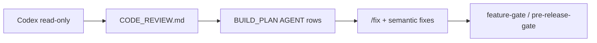

# Codex third-party review (FOSS opt-in)

OpenAI Codex as a **read-only** reviewer. Repairs run through Cursor Agent (`/fix`, expanded `/prerelease` / `/ship`) — Codex never writes patches or pushes.

## Used by

| Entry | Behavior |
|-------|----------|
| `/codex-review` | Local review → gitignored `CODE_REVIEW.md` → BUILD_PLAN Critical/High rows |
| `/prerelease` | Runs autofix → optional Codex → `/fix` → hard `pre-release-gate` |
| `/ship` | Runs `/prerelease` first (then `/push` → `/regress`) — one simple release command |
| CI example | [`.github/workflow-examples/codex-review.yml`](../.github/workflow-examples/codex-review.yml) |

## Local setup

1. Install the [Codex CLI](https://developers.openai.com/codex/)
2. Set `OPENAI_API_KEY` in the environment (never commit it)
3. Run `/codex-review` or include it via `/prerelease` / `/ship`

If the key or CLI is missing during `/prerelease` / `/ship`, the agent prints `SKIP: Codex review (no key/CLI)` and continues — release is not blocked by optional Codex.

## GitHub Actions (opt-in)

The example workflow is **outside** `.github/workflows/` so CI never auto-runs it:

1. Copy `.github/workflow-examples/codex-review.yml` → `.github/workflows/codex-review.yml`
2. Add repository secret `OPENAI_API_KEY`
3. Optionally mark the job as a required status check (human choice; not default)

The job posts a sticky PR comment, uploads a `CODE_REVIEW.md` artifact, and uses `permission-profile: ":read-only"`.

Download an artifact locally:

```bash
gh run download <run-id> -n codex-code-review
```

## Contract

- Prompt: [`.github/codex/prompts/review.md`](../.github/codex/prompts/review.md)
- Schema: [`.github/codex/schemas/findings.json`](../.github/codex/schemas/findings.json)
- Markdown template: [`CODE_REVIEW.md.example`](../CODE_REVIEW.md.example) (`Source`: `codex-ci` | `codex-local` | `audit`)
- Renderer: `python3 scripts/codex-findings-to-markdown.py -i findings.json -o CODE_REVIEW.md`

`CODE_REVIEW.md` is gitignored.

## Repair handoff



| Path | Use |
|------|-----|
| Codex review (CI/local) | Third-party findings only |
| Cursor `/fix` | Mechanical + semantic repair after AGENT steps |
| Multi-stack `feature-autofix.sh` | Format/lint writers (Biome, ruff, cargo fmt, gofmt) |
| Bugbot Autofix | Commercial only — see `docs/CURSOR_COMMERCIAL_ACTIVATION.md` |

## Spend control

- Keep the workflow under `workflow-examples/` until you opt in
- Prefer `workflow_dispatch`-only if PR triggers are too costly
- Do not chain Codex into every `/maintain` run (peer to `/audit`, not forced)

## Related

- [`CURSOR_CLI.md`](CURSOR_CLI.md) — Cursor CLI headless (separate key)
- [`CURSOR_INTEGRATIONS.md`](CURSOR_INTEGRATIONS.md)
- [`BATCH_COMMANDS.md`](BATCH_COMMANDS.md) — `/ship` → `/prerelease`
