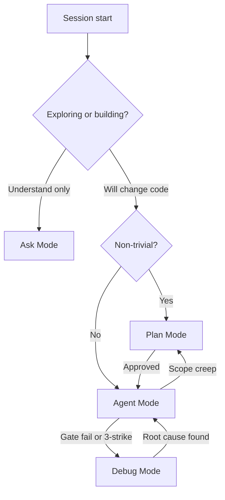

# Cursor Modes

> Router for Cursor **Ask**, **Plan**, **Agent**, and **Debug** modes. Distinct from Bootstrap/Reference **repo mode** in [`START_HERE.md`](START_HERE.md).

## Mode table

| Mode | When | Artifact | Do not use for |
|------|------|----------|----------------|
| **Ask** | Read-only exploration, architecture questions, index lookup | [`TEMPLATE_INDEX.json`](../TEMPLATE_INDEX.json), [`KNOWLEDGE_BASE.md`](../KNOWLEDGE_BASE.md) | Editing files |
| **Plan** | Non-trivial work: features, ADRs, parallel scope, schema changes | BUILD_PLAN row + mandatory `### Critique` | Mechanical lint fixes |
| **Agent** | Approved plan execution, `[AGENT]` BUILD_PLAN rows, gate autofix | [`watch-agent-gates.sh`](../scripts/watch-agent-gates.sh) | Unapproved architecture |
| **Debug** | Unknown root cause: CI red, flaky tests, 3-strike failures | Runtime logs + KB + [`FOR_AGENTS.md`](FOR_AGENTS.md) Failure Playbook | Pre-release checklists |

Full BUILD_PLAN owner labels (`AGENT`/`HUMAN`/`ADB`/`AUTO`) are orthogonal — see [`BUILD_PLAN.md`](../BUILD_PLAN.md).

## Trivial vs non-trivial

| Signal | Mode | Example in this repo |
|--------|------|----------------------|
| Read-only question | **Ask** | "How does `watch-agent-gates.sh` work?" |
| ≤3 files, no schema/API change, gate autofix | **Agent** | `feature-autofix.sh` pass; KB doc typo |
| New feature container, ADR, parallel scope | **Plan** | Sprint 2 `docs/features/{name}.md` row |
| Same fix failed 3× or CI red, unknown cause | **Debug** | Lighthouse flake (KB-004); Playwright hang (KB-005) |
| Mid-task architecture pivot | **Plan** | Shared type change during feature work |

If uncertain, default to **Plan** and note "uncertain trivial" for human correction.

## When to switch

| From | To | Trigger |
|------|-----|---------|
| Ask | Plan | User says "implement" or "build" |
| Ask | Agent | Trivial fix confirmed by rubric |
| Plan | Agent | Plan approved ("execute the plan") |
| Agent | Debug | Gate exit 1 after autofix; CI red; flaky repro |
| Agent | Plan | Schema change; scope expanded; file outside feature container |
| Debug | Agent | Root cause confirmed; fix approach agreed |
| Debug | Plan | Fix requires architectural change |
| Any | Ask | Exploratory question mid-session |

Do not debug in Plan Mode. Do not edit in Ask Mode.

## Prompt shortcuts

| Entry | Mode | See [`PROMPT_LIBRARY.md`](../PROMPT_LIBRARY.md) |
|-------|------|--------------------------------------------------|
| 18 | Ask | Explore / architecture question |
| 19 | Plan | Feature or ADR plan |
| 20 | Debug | Defect investigation |
| 21 | Agent | Approved BUILD_PLAN execution |
| 3 | Agent | Pre-release audit (not Debug) |

Pre-release audit: [`INITIALIZATION_PROMPT.md`](INITIALIZATION_PROMPT.md) §7a. Defect triage: §7b.

## Batch commands

Slash commands in `.cursor/commands/` load recipes when you type `/audit`, `/bootstrap`, etc. **`/audit` ≠ Debug Mode** — audit is a full repo review; use `/debug` or Debug Mode for defect investigation.

| Audience | Doc |
|----------|-----|
| Humans (first time) | [`docs/help/BATCH_COMMANDS.md`](help/BATCH_COMMANDS.md) |
| Agents / maintainers | [`docs/BATCH_COMMANDS.md`](BATCH_COMMANDS.md) |

Bare words (`audit`) also work via `.cursor/rules/batch-commands.mdc`; prefer `/` menu when bare words fail.
