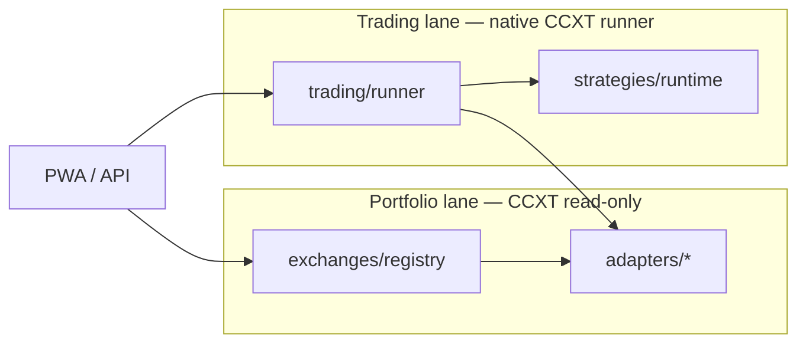

# Exchange Integration Roadmap

> **Status:** Exchange program complete (S13–S20 AGENT) · **Engine:** Native CCXT runner (ADR-0010) · **Human gates:** H-030, H-031, H-032
> **Related:** [`docs/NATIVE_TRADING.md`](NATIVE_TRADING.md) · [`docs/LOCAL_DEV.md`](LOCAL_DEV.md) · [`BUILD_PLAN.md`](../BUILD_PLAN.md)

## Goal

1. **Portfolio (worldwide):** Aggregate read-only balances across all CCXT-supported CEXs via a registry-driven adapter layer.
2. **Bot trading (phased):** Native CCXT order runner — US-accessible CEXs first (S15–S17), then major worldwide venues (S18–S20).
3. **Security:** Trade+query API keys only; dry-run default; per-exchange go-live gates (H-010/H-028).

**Non-goals:** Robinhood/PayPal without algo APIs; custodial SaaS; auto-withdraw; Freqtrade dependency (removed S15 CM-4).

---

## Two-lane architecture



| Lane | Technology | Scope |
|------|------------|--------|
| **Portfolio** | CCXT `fetch_balance` + tickers | All registry venues (worldwide CCXT CEXs) |
| **Trading** | Native runner + strategy runtime | **Complete:** 9 US + worldwide venues (S13–S20) |

Registry v6 drives portfolio and trading for all nine venues. See [`docs/RUNBOOK.md`](RUNBOOK.md) § Multi-venue trading ops.

---

## Exchange catalog

### Tier A — US trading MVP (S13–S15)

| CCXT ID | Brand | Portfolio | Bot trading | Notes |
|---------|-------|-----------|-------------|-------|
| `kraken` | Kraken | ✅ | ✅ MVP | USD pairs; rate limits R-001 |
| `binanceus` | Binance.US | ✅ | ✅ S15 | **Not** `binance.com` for US |

### Tier B — US portfolio (S13–S14)

| CCXT ID | Brand | Portfolio | Bot trading |
|---------|-------|-----------|-------------|
| `coinbaseadvanced` | Coinbase Advanced | ✅ S14 | ✅ S16 |
| `gemini` | Gemini | ✅ S14 | ✅ S16 |
| `bitstamp` | Bitstamp | ✅ S17 | ✅ S19 |
| `cryptocom` | Crypto.com | ✅ S17 | ✅ S19 |

### Tier C — Worldwide portfolio + Phase 1 trading (S14 / S18)

| CCXT ID | Brand | Portfolio | Bot trading |
|---------|-------|-----------|-------------|
| `binance` | Binance | ✅ S14 | ✅ S18 P1 |
| `bybit` | Bybit | ✅ S14 | ✅ S18 P1 |
| `okx` | OKX | ✅ S14 | ✅ S18 P1 |

Registry v6 sets `worldwide_trading_phase: 2`. Venues flag `us_restricted: true` — live trading requires `WORLDWIDE_TRADING_ACK=1` plus per-exchange go-live.

### Tier D — Complete (S19–S20) ✅

Exchange program Tier D deliverables (H-032 still required for **live** worldwide trading):

| Deliverable | Sprint | Status |
|-------------|--------|--------|
| Phase 2 US trading (`bitstamp`, `cryptocom`) | S19 | ✅ |
| Multi-venue arbitrage detector (informational) | S19 | ✅ |
| N-exchange ops runbook + worldwide ack workflow | S20 | ✅ |
| CM-6 scale gate (9+ venues sync + trading status) | S20 | ✅ |

Additional worldwide CEX venues beyond the current nine remain **H-032** gated and out of scope until founder approval.

### Out of scope

| Venue | Reason |
|-------|--------|
| DEX / on-chain | S12 `onchain.py` lane — separate from CEX |
| US-blocked retail venues | Operator responsibility; registry flags `us_restricted` |

---

## Module layout

```
config/exchanges.registry.json
src/trendalgo/exchanges/
  registry.py
  base.py
  scheduler.py          # CM-6 staggered sync
  adapters/
    kraken.py
    binanceus.py
    ...
src/trendalgo/trading/
  runner/                 # CM-1 native engine
    dry_run.py
    live.py
  backtest/native_adapter.py
src/trendalgo/strategies/runtime/   # CM-2, CM-4 ports
```

**Env pattern:**

```bash
KRAKEN_API_KEY=...
BINANCEUS_API_KEY=...
# Trade + query only — never Withdraw
```

---

## Sprint plan (S13–S20)

| Sprint | Focus | Human gate |
|--------|--------|------------|
| **S13** | Registry, Kraken refactor, Binance.US portfolio | H-030 |
| **S14** | Worldwide portfolio (generic CCXT) + Tier B US | — |
| **S15** | Native runner US MVP + **CM-1/2/4/7** + FT removal | H-031 |
| **S16** | All US CEX native trading | H-010 per venue |
| **S17** | US hardening + CM-3/6 | — |
| **S18** | Worldwide Phase 1 trading (binance/bybit/okx) | H-032 |
| **S19** | Phase 2 US trading + multi-venue arbitrage | — |
| **S20** | N-exchange ops hardening (runbook, CM-6 @ 9 venues) | — |

Detail: [`BUILD_PLAN.md`](../BUILD_PLAN.md) (active DEX S21–S24; exchange S13–S20 complete in [`COMPLETED_TASKS.md`](../COMPLETED_TASKS.md)).

---

## Critique mitigations (CM-1–CM-7)

| ID | Mitigation | Sprint |
|----|------------|--------|
| CM-1 | Phased native runner + S7 backtest adapter | S15–S16 |
| CM-2 | Strategy runtime contract (ADR-0010) | S15 |
| CM-3 | Walk-forward on native backtest | S17 |
| CM-4 | Remove Freqtrade; port keepers only | S15 |
| CM-5 | Scope cap S13–S20; H-030 | ongoing |
| CM-6 | Staggered sync + N-exchange load test | S14, S17, S20 |
| CM-7 | No `withdraw` in `trading/` | S15 |

---

## Human gates

| ID | Item | Tier | Blocks |
|----|------|------|--------|
| H-030 | Exchange program + native-only scope | soft | S13 |
| H-031 | ADR-0010 + approve FT removal | hard | S15 |
| H-032 | Worldwide bot trading phases | hard | S18 |
| H-034 | Local preview sign-off | soft | S13+ commits |

---

## Success criteria

- [x] Registry drives portfolio + trading; no hardcoded exchange list in UI
- [x] `binanceus` replaces global `binance` for US docs and env
- [x] Native runner dry-run E2E on Kraken + Binance.US (S15+)
- [x] Freqtrade fully removed (S15 CM-4)
- [x] Worldwide portfolio sync for ≥9 CCXT venues (S14–S20)
- [x] Phase 2 trading + informational arbitrage (S19)
- [x] N-exchange ops runbook + CM-6 validation at 9 venues (S20)
- [ ] H-030, H-031, H-032 approved (human gates — blocks **live** worldwide)

---

## Critique

| Concern | Assessment |
|---------|------------|
| Reinventing order lifecycle | CM-1 phased; reuse S7 backtest library |
| Worldwide scope creep | H-032 hard gate; S18–S20 phased |
| VPS sync load | CM-6 stagger; H-027 monthly |
| Wrong CCXT ID | Registry + CI grep |

**Recommendation:** Exchange program AGENT lane complete (S13–S20). Clear H-030–H-034 per [`docs/HUMAN_BACKLOG.md`](HUMAN_BACKLOG.md); next AGENT lane is **S21** DEX foundation (blocked on H-035).
